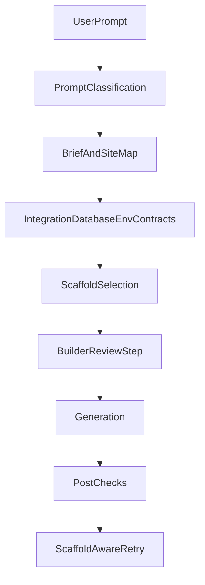

# Plan 8: World-Class Builder Phase 2 - Site Planning

> Archived on 2026-03-12 after planner `uiParts` persistence, raw chat reload
> restore, and removal of the stale client-side plan runner.

## Goal
Move more quality decisions before code generation starts.

This phase makes the system better than raw prompt-to-code by introducing
explicit planning for site structure, integrations, databases, env vars, and
scaffold strategy before the main generation pass begins.

## Current foundation

Relevant current systems:

- `src/lib/builder/promptAssistContext.ts`
- `src/lib/gen/agent-tools.ts`
- `src/lib/gen/orchestrate.ts`
- `src/lib/gen/scaffolds/`
- `src/lib/hooks/chat/post-checks.ts`
- `src/components/builder/UnifiedElementPicker.tsx`
- `src/app/api/templates/search/route.ts`
- `docs/architecture/engine-status.md`
- `old/docs-llm-egen-motor/scaffold-status-and-plan.md`

The repo already supports briefs, plan artifacts, clarification questions,
scaffold matching, and post-hoc route/env detection. This phase promotes those
features into a planning layer that shapes the build before code exists.

Also already in place:

- gallery template search and "start from template" flows exist today
- the remaining template-related opportunity is context-aware recommendation
  from builder/brief data, not rebuilding search from scratch
- earlier message-list performance work gives this phase headroom for richer
  `Build plan` cards and plan review UI

## Final implementation status (2026-03-12)

Substantial Phase 8 groundwork is now live:

- richer `PlanArtifact` output carries site type, pages, contracts, scaffold
  choice, and template recommendations
- plan mode works for both new and existing own-engine chats
- the builder renders a real `Build plan` review surface with blocker handling
  and `Godkänn plan och bygg`
- approval already flows into generation through
  `buildApprovedPlanExecutionPrompt(plan)`

The Phase 8 completion pass closed the last coherence gap:

- planner assistant messages now persist canonical `uiParts` in engine chat
  storage
- own-engine chat reload can restore the plan review surface from server data
- `usePlanExecution.ts` has been removed so approve -> build has one canonical
  owner
- v0 fallback remains explicitly out of scope for this phase and is documented
  as a separate limitation rather than a hidden gap

Any later work on v0 parity or broader planner orchestration should be treated
as new roadmap work, not as unfinished Plan 8 debt.

## Workstreams

### 1. Site-map and page-tree planning
Current issue:
- multipage needs are detected too late, often after generation

Implementation direction:
- extend the brief/spec format with:
  - site map
  - primary navigation
  - page intent per route
  - CTA flow per page
- build a lightweight site-map editor in the builder where users can confirm:
  - homepage only
  - standard company site
  - landing + about + services + contact
  - blog/doc/support structures

Primary code:
- `src/lib/builder/promptAssistContext.ts`
- `src/lib/gen/plan-schema.ts`
- `src/lib/gen/plan-review.ts`
- builder UI under `src/components/builder/`

### 2. Pre-generation contracts for integrations, databases, and env vars
Current issue:
- integration needs are still discovered too often after code is emitted

Implementation direction:
- extend `askClarifyingQuestion`, `suggestIntegration`, and `requestEnvVar`
  usage so the system can form a contract before generation
- add structured contract objects for:
  - data persistence required or not
  - database provider chosen or unresolved
  - auth/payment/integration provider chosen or unresolved
  - required env vars
  - mocked vs persisted data mode

Primary code:
- `src/lib/gen/agent-tools.ts`
- `src/lib/gen/orchestrate.ts`
- `src/app/api/v0/chats/stream/route.ts`
- `src/app/api/v0/chats/[chatId]/stream/route.ts`
- `src/components/builder/ProjectEnvVarsPanel.tsx`

### 3. Multipage preflight
Current issue:
- route problems are caught by post-check after generation, not before

Implementation direction:
- add prompt analysis that classifies:
  - one-page marketing site
  - small brochure site
  - content-heavy site
  - app shell
- generate a route plan before the main build starts
- include that route plan in scaffold selection and system prompt assembly

Primary code:
- `src/lib/gen/orchestrate.ts`
- `src/lib/builder/build-intent.ts`
- `src/lib/gen/scaffolds/matcher.ts`
- `src/lib/hooks/chat/post-checks.ts`

### 4. Scaffold-aware retry
Current issue:
- repair loops fix code quality, but they do not adapt the scaffold strategy when
  a scaffold choice was wrong

Implementation direction:
- classify failure reasons:
  - too many missing routes
  - layout mismatch
  - app-vs-site mismatch
  - scaffold import drift
- if the failure reason points to wrong scaffold choice, retry with:
  - simpler scaffold
  - better-matched scaffold family
  - explicit route plan
- persist retry reason so the system can learn later

Primary code:
- `src/lib/gen/scaffolds/matcher.ts`
- `src/lib/gen/orchestrate.ts`
- `src/lib/gen/stream/finalize-version.ts`
- `src/lib/hooks/chat/post-checks.ts`
- `src/lib/db/services/version-errors.ts`

### 5. Builder review step before build
Current issue:
- the system can already ask questions, but there is no strong review surface for
  confirming the plan before generation

Implementation direction:
- add a `Build plan` card in the builder that shows:
  - chosen scaffold
  - intended pages
  - intended integrations
  - env/database assumptions
  - open blockers
- allow the user to approve or edit the plan before generation starts
- where useful, attach optional gallery-template recommendations derived from
  brief/context data, while keeping scaffold choice as the runtime source of
  truth

Primary code:
- `src/lib/gen/plan-review.ts`
- `src/components/builder/MessageList.tsx`
- `src/components/builder/BuilderHeader.tsx`
- plan artifact rendering surfaces

## Planning flow

## Deliverables

- expanded site-map capable brief/spec shape
- pre-generation contract model for integrations and data
- multipage preflight route planning
- scaffold-aware retry rules
- builder review surface for planned build state

## Acceptance criteria

- the system can explicitly decide one-page vs multi-page before generation
- integration/database/env ambiguity is surfaced as contract data, not mostly as
  post-hoc detection
- scaffold selection is visible and reviewable before build
- repair loops can change scaffold strategy when failure patterns justify it

## Recommended build order

1. Expand brief/spec shape with site-map and contract fields.
2. Add prompt classification and multipage preflight.
3. Surface the plan in the builder for approval.
4. Extend retry logic to become scaffold-aware.
