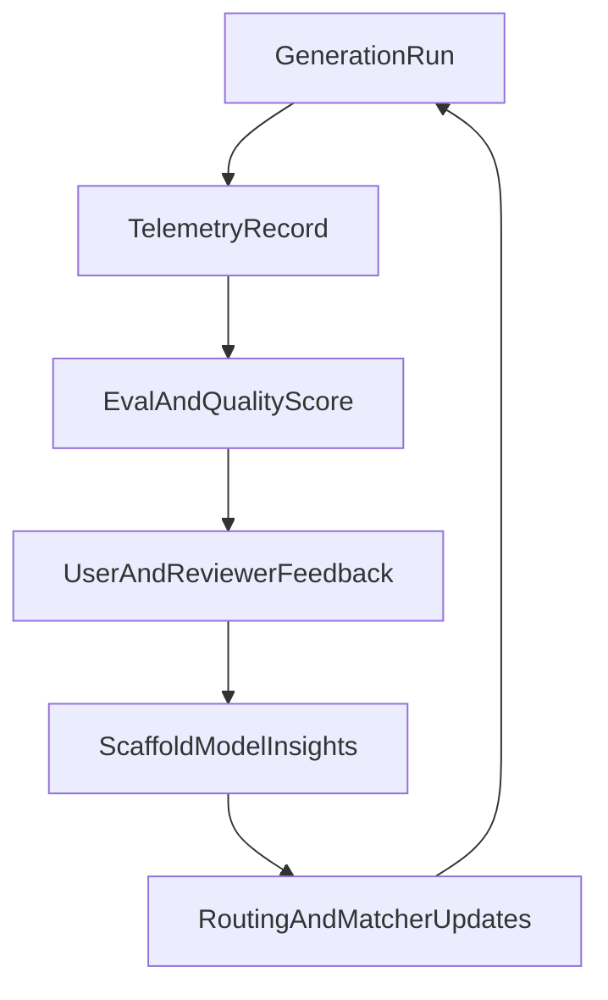

# Plan 10: World-Class Builder Phase 4 - Learning And Moat

**Status:** LEVERERAT — all 6 workstreams delivered 2026-03-18.
Remaining: production validation (live generation telemetry check, feedback
widget QA, eval:gate run, download build test). Scaffold scoring thresholds
will be tuned once real telemetry data accumulates.

## Goal
Build the systems that make Sajtmaskin better over time and harder to copy.

This phase is about turning runtime outcomes into product intelligence:
telemetry, evals, scaffold learning, user feedback, and collaboration flows that
compound rather than reset between generations.

## Current foundation

Relevant existing systems:

- `src/lib/gen/eval/`
- `src/lib/gen/eval/render-telemetry.ts`
- `src/lib/db/services/version-errors.ts`
- `src/lib/db/chat-repository-pg.ts`
- `src/app/api/analytics/route.ts`
- `src/lib/db/services/analytics.ts`
- `docs/architecture/engine-status.md`
- `src/lib/hooks/chat/useAutoFix.ts`

The repo already persists important slices of runtime truth. The gap is not data
existence, but turning that data into selection, routing, ranking, and feedback
loops.

Important boundary:

- generic site/pageview analytics already exist, but they are not version,
  scaffold, model, or retry aware
- do not treat the existing analytics pipeline as a substitute for the unified
  generation telemetry model in this phase

## Workstreams

### 1. Generation telemetry model — LEVERERAT

**Delivered:** `generation_telemetry` table (22 columns) in Supabase, written
from `finalize-version.ts` on every generation (best-effort). Service layer:
`src/lib/db/services/generation-telemetry.ts`.

Primary code:
- `src/lib/db/schema.ts` — table definition
- `src/lib/db/services/generation-telemetry.ts` — CRUD + query
- `src/lib/gen/stream/finalize-version.ts` — write point

### 2. Scaffold and retry learning — LEVERERAT

**Delivered:** `scaffold-scoring.ts` computes compositeScore per scaffold from
telemetry (success rate, feedback, retry rate). `matcher.ts` consumes
boost/penalty for generic defaults. `scaffold-aware-retry.ts` uses historical
success rate for retry path selection.

Primary code:
- `src/lib/gen/scaffolds/scaffold-scoring.ts` — scoring engine
- `src/lib/gen/scaffolds/matcher.ts` — consumes scores
- `src/lib/gen/scaffolds/scaffold-aware-retry.ts` — retry integration

### 3. Feedback loops from the builder — LEVERERAT

**Delivered:** `VersionFeedback.tsx` — thumbs up/down + problem categories
(wrong style, structure, content, integration, preview). API route at
`/api/v0/chats/[chatId]/versions/[versionId]/feedback`. Feedback linked to
telemetry via `userFeedback` field.

Primary code:
- `src/components/builder/VersionFeedback.tsx` — UI
- `src/app/api/v0/chats/[chatId]/versions/[versionId]/feedback/` — API
- `src/lib/db/services/generation-telemetry.ts` — enrichment

### 4. Collaboration and approval primitives — LEVERERAT

**Delivered:** `version_comments` and `version_approvals` tables in Supabase.
`collaboration.ts` service with CRUD. API routes for comments, approval, and
collaboration summaries. `VersionCollaboration.tsx` UI with comment thread and
approval flow. `VersionHistory.tsx` indicators (amber dot, green check, comment
badge).

Primary code:
- `src/lib/db/schema.ts` — table definitions
- `src/lib/db/services/collaboration.ts` — service layer
- `src/components/builder/VersionCollaboration.tsx` — UI
- `src/components/builder/VersionHistory.tsx` — indicators

### 5. Phase-aware model routing — LEVERERAT

**Delivered:** `phase-routing.ts` — planner gets `gpt-4.1-mini`, verifier gets
`gpt-4.1`, generator gets the full user-selected tier. Plan-mode and fixer
integrated with phase routing. Telemetry records routing summary per generation.

Primary code:
- `src/lib/models/phase-routing.ts` — routing logic
- `src/lib/models/catalog.ts` — 4 canonical tiers
- `src/lib/models/selection.ts` — tier resolution

### 6. Eval suite as product guardrail — LEVERERAT

**Delivered:** 15 benchmark prompts covering coffee-shop, dashboard, portfolio,
blog, pricing, auth, ecommerce, restaurant, agency, settings, booking,
multi-page, saas-dashboard, content-blog, and consultant. Baseline comparison
with regression detection. CLI runner: `npm run eval:suite`, `eval:gate` (CI),
`eval:baseline`. First baseline: 14/15 PASS, 95% avg score.

Primary code:
- `src/lib/gen/eval/runner.ts` — benchmark runner
- `src/lib/gen/eval/checks.ts` — quality checks
- `src/lib/gen/eval/baseline.ts` — save/load/compare

## Learning loop

## Deliverables — all delivered 2026-03-18

| Deliverable | Status | Key artifact |
|---|---|---|
| Unified generation telemetry schema | LEVERERAT | `generation_telemetry` table, 22 cols |
| Scaffold performance scoring | LEVERERAT | `scaffold-scoring.ts` |
| Structured builder feedback capture | LEVERERAT | `VersionFeedback.tsx` + API |
| Collaboration and approval primitives | LEVERERAT | `version_comments` + `version_approvals` + UI |
| Phase-aware model routing | LEVERERAT | `phase-routing.ts` |
| Benchmarked eval suite | LEVERERAT | 15 benchmarks, baseline: 14/15 PASS |

## Remaining production validation

- [ ] Generate a site and verify `generation_telemetry` rows appear in DB
- [ ] Test the feedback widget in a live builder session
- [ ] Run `npm run eval:gate` against the saved baseline
- [ ] Download a site, run `npm install && npm run build` outside the repo
- [ ] Tune scaffold scoring thresholds once real telemetry accumulates
