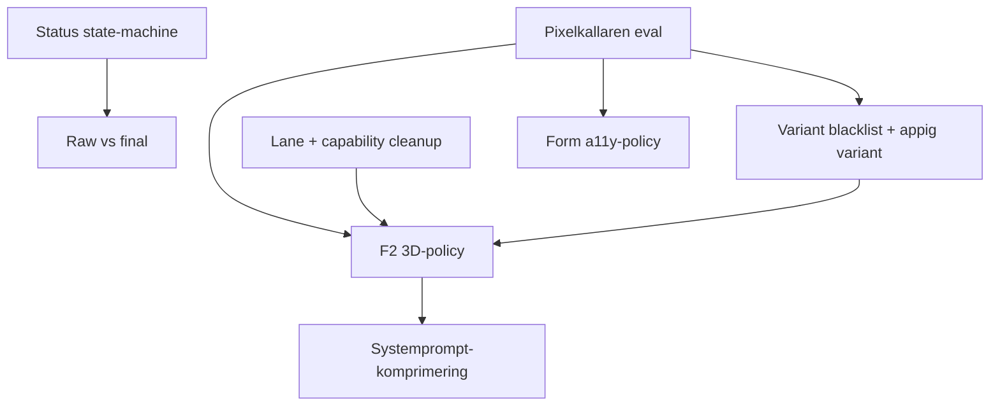

> Status: Archived
> Not current architecture.
> Do not use as runtime guidance.
> Replaced by: [Eval documentation](../../../evals/README.md)

# Pixelkällaren-eval och uppföljning av LLM-flöde-bugfix-koreografin

> **Parkerad 2026-05-01:** Den aktuella orienteringen bor i [LLM-pipelinen](../../../architecture/llm-pipeline.md). Den här filen bevarar Pixelkällaren som eval-fixture/scope. Gate för återaktivering: en konkret eval-runner/baseline eller en PR som explicit implementerar gaming/appig variant, F2 3D-policy eller form-a11y-regel.

Konsoliderad uppföljning efter master `fbeb9321a` (rewire-before-stub, direct iframe nav, qualityTarget-rank, inspector unavailable-200 och reviewfixar levererade). Innehåller:

1. Pixelkällaren-prompten som **eval-fixture / regressionstest** för 2026-04-28-fixarna.
2. Historiska spår i relation till [LLM-pipelinen](../../../architecture/llm-pipeline.md): versionstatus, lane separation/capability cleanup, variant-/3D-policy och systemprompt-komprimering.
3. Två nya spår som inkom från extern review-summary: **"appig"-variant** och **form-a11y-policy**.

## Kontext

Två faser har levererats på master:

| Commit | Innehåll |
|---|---|
| `8ab3b9df5` | "städa status- och preview-edgecases" — tog in rewire-before-stub, direct iframe nav, qualityTarget-rank, inspector unavailable-200 och diagnostik-summary-städ |
| `fbeb9321a` | Reviewfixar (cache-guard på inspector unavailable-200, collision-test på rewire-before-stub) + scope-doc + `.cursor/commands/explore.md` |

Det som **inte** levererades: status state-machine + raw/final, lane separation + capability cleanup, variant blacklist, F2 3D-policy och systemprompt-komprimering.

## Pixelkällaren — eval-fixture

Källa: extern agent-summary 2026-04-28. Prompten är **F2-säker** (ingen Stripe, ingen R3F), kräver tydliga a11y-attribut, och har en designkategori ("appig" gaming) som inte fångas väl av befintliga scaffold-varianter.

### Full prompt

```text
Skapa en riktigt appig och modern webbapp för en tv-spelsbutik som heter Pixelkällaren.

Det ska kännas som en premium spelbutik/app, inte som en vanlig broschyrhemsida.
Designen ska vara mörk, neonig och energisk med tydlig gaming-känsla:
dashboards, kort, badges, filter, produktlistor, kampanjer och app-liknande
navigation.

Bygg två sidor:
1. Startsida / butikssida med hero, featured games, konsolkategorier,
   topplista, nyheter, kampanjkort och tydlig CTA.
2. Login-sida för medlemmar med e-post, lösenord, kom ihåg mig och glömt
   lösenord.

Viktigt:
- Gör startsidan riktigt stark och detaljerad.
- /login får gärna vara enklare om systemet bygger max en sida först, men
  den ska finnas som route.
- Använd appig layout: sidebar eller sticky topbar, filterchips, cards,
  status badges, search bar, tabs och tydliga hover-effekter.
- Använd mörk bakgrund, neon-accenter, glass/panel-känsla och
  gaming-inspirerad typografi.
- Inga riktiga betalningar, inga externa SDK:er, ingen Stripe, ingen databas.
- Checkout får bara vara UI-demo: varukorgsknapp, pris, rabattbadge och
  "Gå till kassan"-CTA.
- Använd inga riktiga 3D-bibliotek som three.js eller @react-three/fiber.
  Om du vill skapa djup, använd CSS, gradients, faux-3D, glow och animationer.
- Alla formulärfält ska ha id, name, label och autocomplete där det passar.
- Respektera prefers-reduced-motion.
- Målet är att sidan ska se ut som en riktig spelbutiks-app med hög
  designkvalitet.
```

### Kortare variant (för smoke-test)

```text
Skapa en mörk, neonig och riktigt appig tv-spelsbutik som heter Pixelkällaren.
Den ska kännas som en premium gaming-app med produktkort, filterchips,
topplistor, kampanjer, search bar, badges och sticky navigation. Bygg
startsida + /login. Ingen riktig betalning, bara checkout-UI-demo. Ingen
three.js/R3F; använd CSS, glow, gradients och faux-3D. Alla formulärfält
ska ha id/name/label. Gör startsidan visuellt stark, detaljrik och responsiv.
```

### Vad prompten ska bevisa

| Spår | Bevis |
|---|---|
| Rewire-before-stub | Om LLM importerar `@/components/three-canvas` ska autofix rewira till `-shell` (om den finns) — men ännu hellre: prompt + dossier-policy ska få LLM att inte importera Three alls |
| Route navigation | Klick på `/login` i route-selector ska ladda `/login` (inte startsidan) |
| QualityTarget-rank | "premium gaming-app", "hög designkvalitet" → `qualityTarget: premium`. Inheritance får inte sänka det |
| Inspector unavailable-200 | Network-panelen ska inte visa röda 502 under preview-warmup |

### Förväntat misslyckande på dagens master

| Mätning | Förväntat värde idag | Förväntat värde efter variant-/3D-/prompt-spåren |
|---|---|---|
| Variantval | corporate-grid (krockar med "appig gaming") | gaming/dashboard-variant |
| 3D-deps i package.json | three + @react-three/fiber + drei (inte begärda) | Inga R3F-deps |
| `id/name/label` på login-form | Saknas på vissa fält | Alla fält klara |
| Total init-tid | ~9 min | ~3-4 min |
| Autofix-count | 25-40 | <10 |

### Hur fixturen körs

1. **Manuell test (säkraste):** Skicka prompten i builder-UI på en ren chat, observera generationslogg + version-zip. Jämför mot tabellen ovan.
2. **Automatisk eval (senare):** Lägg in prompten i `evals/runs/pixelkallaren-2026-04-28.json` och kör `npm run eval:run`. Kräver att eval-runnern kan klassa "appig"/"neon"/"id-name-label" som mätbara dimensioner.

## Spår 1 — Versionstatus state-machine

**Insikt från extern review:** vokabuläret `current | superseded | failed | verifying | promoted | repair_available | draft` är klart och kan läggas direkt på en pure helper.

| Mål | Innehåll |
|---|---|
| Pure helper | `resolveVersionDisplayState({ releaseState, verificationState, serverVerify, isLatest })` i `src/lib/db/engine-version-lifecycle.ts` returnerar enum |
| UI-konsumtion | [`src/components/builder/VersionHistory.tsx`](../../../../src/components/builder/VersionHistory.tsx) `lifecycleLabel`/`lifecycleTooltip` läser enum |
| Tooltip korrekthet | "Verifierar" visas BARA om `serverVerify.run === true && outcome === undefined`. När `policy === "design_preview_skip_verify"`: label är "Klar (utan server verify)" |
| Tester | Tabell-driven snapshot per enum-värde + tooltip |

**Risk:** Medel — central UI-state. Mitigeras av pure helper + tabell-driven test.

## Spår 2 — Raw vs final i chatten

**Bevis:** `version-803b0845 (1).zip` visade trasig TSX i chatten medan finala filer typecheckade. Användare tror final kod är trasig.

| Mål | Innehåll |
|---|---|
| Märkning | Stream-block märks "Rå modell-output (förbereds)" eller döljs bakom debug-toggle |
| Code-flik | Pekar alltid på sparad version, inte stream |
| Filer | `src/components/builder/MessageList.tsx` + CodeProject-render |

**Risk:** Låg-medel.

## Spår 3 — Lane separation + capability cleanup

| Del | Beskrivning |
|---|---|
| C1 (existing plan) | [`2026-04-27-followup-vs-autorepair-lane-collision.md`](../2026-04-27-followup-vs-autorepair-lane-collision.md) — auto-repair får inte starta inom user-followup-fönster |
| C2 | Capability diff på follow-up: "ta bort 3D" rensar `visual-3d` + dossiers + deps |

**Bevis:** logg från 2026-04-28 visar `dossiers_selected.byCapability: { "visual-3d": ["three-fiber-canvas"] }` på follow-ups som INTE bad om 3D.

## Spår 4 — Variant blacklist + ny "appig"-variant

| Del | Beskrivning |
|---|---|
| D1a | Variant `corporate-grid` får inte väljas när brief har `darkMode: true`, `tone: ["rockig", "gaming", "neon", "editorial"]`, eller styleKeywords matchar `mörk|dark|moody|gritty|neon|gaming` |
| D1b (NY från extern review) | Skapa ny variant: `landing-page/gaming-neon` eller `dashboard/app-premium`. Signature motif: dark + neon accents + sticky navigation + filterchips + glass panels + hover-effekter |
| D1c | Embedding-pick scoras lägre när variant-purpose explicit konfliktar med brief-tone |
| Glossary | Ny term: `tone_blacklist` per variant |

**Filer:**
- `src/lib/gen/orchestrate/scaffold-variant-resolver.ts`
- `config/scaffold-variants/landing-page/gaming-neon.json` (ny)
- `config/scaffold-variants/landing-page/corporate-grid.json` (lägg `excludeWhen`)

## Spår 5 — F2 3D-policy

| Del | Beskrivning |
|---|---|
| D3a | F2 (`previewPolicy: fidelity2`): emit `capability: faux-3d` istället för `visual-3d` när brief eller prompt nämner 3D/animation |
| D3b | `three-fiber-canvas` dossier markeras som F3-only |
| D3c | Faux-3d-dossier nytt: CSS gradients + glow + perspective transforms + framer-motion |

**Filer:**
- `src/lib/gen/orchestrate/...` (capability resolution)
- `data/dossiers/soft/three-fiber-canvas/` → F3-only
- `data/dossiers/soft/faux-3d/` (ny)

## Spår 6 — Systemprompt-komprimering

Total: 78–98k chars per follow-up. Subcommits per sektion (eval-baseline-gated).

1. Element preservation rule + Build intent: dedup
2. Variant-block: korta från ~25 punkter till topp-5
3. Current File Contents-tabell: max 8 + topp-3 critical
4. Static core: audit varje fragment via eval

## Spår 7 (NY) — Form a11y-policy

**Insikt från extern review:** "Alla formulärfält ska ha id, name, label och autocomplete" — det är en återkommande regel som borde vara prompt + autofix.

| Lager | Fix |
|---|---|
| Core Rules / form-rule | "Every `<input>/<select>/<textarea>` must have stable `id` and `name`. Labels use `htmlFor`. Use `autoComplete` where applicable." |
| Scaffold login example | Säkerställ att existerande login-form i `landing-page` scaffold följer regeln |
| Optional autofix | Om återkommer ofta: `form-a11y-fixer` som fyller `name` från `id` eller tvärtom |

**Glossary:** ny term `form_a11y_policy`.

## Sequencing



- **Eval-fixturen körs först** — ger baseline för designspår.
- Statusspåren kan köras parallellt med variant-/3D-spåren.
- Systemprompt-komprimering är slutspår — kräver eval-baseline.

## DoD per leverans

| Krav | Bevis |
|---|---|
| `npx tsc --noEmit` | 0 errors |
| Riktade vitest | grön |
| ReadLints | 0 errors på ändrade filer |
| Pixelkällaren-eval mätningar (om relevant) | Före/efter-rapport i leveranssammanfattning |
| Origin-check `0 0` | Bevisat i commit-meddelande |
| Glossary uppdaterad | Vid ny term |

## Vad denna plan medvetet INTE gör

- Inte rör annan agents pågående C/D-närscope (repair-prune-gate / diagnostik-summary).
- Inte aktiverar tool calls i runtime (det är `llm-tools-builder-spar.md`).
- Inte sänker static-core utan eval-stöd.
- Inte tar bort `visual-3d`/`three-fiber-canvas`-dossier — bara F3-gating.

## Definition of done för denna scope-doc

- Användaren har bekräftat eller justerat spårordningen.
- Pixelkällaren-eval körd minst en gång (manuellt) och baseline dokumenterad.
- Spår 1–7 har egna implementation-plans i `docs/plans/active/` eller är inarbetade i existerande planer.
