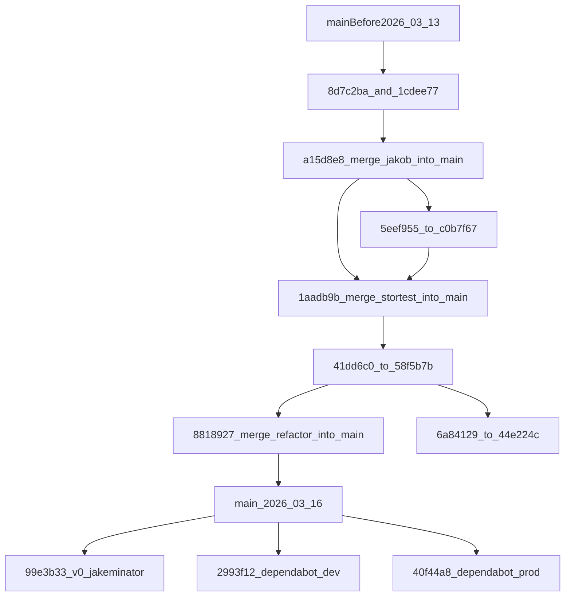

# Branch Map: 2026-03-13 to Now

Detta ar en fokuserad karta over brancher och sammanslagningar som syns i
historiken fran 2026-03-13 till nu, med tyngdpunkt pa `jakob`, `stortest`,
`Refactor` och main-linjen.

## Mermaid overview



## Readable timeline

### Mainline

- `547a414` - Add slash triggers for orchestrator runs
- `5d988e1` - Simplify orchestrator startup commands
- `8d7c2ba` - stream/tool-call/finalize improvements
- `1cdee77` - preview gating and autofix diagnostics
- `68edd81` - regression sweep after `jakob`
- `a15d8e8` - merge `jakob` into `main`
- `1aadb9b` - merge `stortest` into `main`
- `8818927` - merge `Refactor` into `main`
- `77bf6fc` - D-ID webhook parsing fix
- `99e3b33` - `v0/jakeminator0-935c1784`
- `acd4844`, `a8b9b86`, `979ce83`, `bf42977`, `6700b5e`

### Jakob path

- Historiksparet kulminerar i merge `a15d8e8`
- Viktiga commits:
  - `8d7c2ba`
  - `1cdee77`
  - `68edd81`
- Reflog visar ocksa checkout-spor via `622febf` och mergebas runt `2f9a2bd`

### Stortest path

- Reflog visar ett separat lokalt spar runt:
  - `5eef955`
  - `51ee7ea`
  - `e00fbde`
  - `c0b7f67`
- Branchsparet mynnar ut i merge `1aadb9b`

### Refactor path

- Synlig branch i dagens repo: `Refactor`
- Viktiga commits:
  - `41dd6c0` - split preview-modulen
  - `933e0bf` - refactor runtime finalization
  - `36645d8` - characterization tests for runtime stream routes
  - `bcedbca` - docs cleanup and historical moves
  - `58f5b7b` - latest visible tip
- Mergad till main via `8818927`

### Additional side branches in the same window

- `cursor/d-id-avatar-testrutt-68de`
  - `6a84129`
  - `44e224c`
  - merged into `Refactor` via `a33d682`
- `v0/jakeminator0-935c1784`
  - visible at `99e3b33`
- Dependabot branches visible at current tip:
  - `2993f12`
  - `40f44a8`

## Raw graph excerpt

```text
* 6700b5e (main) vsd dsds
* bf42977 Sync env config: add avatar preview targets, remove FIGMA_ACCESS_TOKEN
* 979ce83 Add avatar OpenClaw bridge mode
* a8b9b86 Document quality tiers, autofix classification, and decryption fix in canonical docs
* acd4844 Classify autofix reasons, add quality tiers, fix decryption leak
* 99e3b33 (v0/jakeminator0-935c1784) Switch D-ID avatar to iframe embed using share URL
* 77bf6fc Fix D-ID webhook payload parsing and non-fatal email errors
*   8818927 Merge pull request #44 from Jakeminator123/Refactor
|\
* \   1aadb9b Merge pull request #41 from Jakeminator123/stortest
|\ \
* \ \   a15d8e8 Merge pull request #40 from Jakeminator123/jakob
|\ \ \
| * \ \   efca6e5 Merge origin/main into jakob.
| |/ / /
|/| | |
* | | | 2f9a2bd Jakob (#38)
| | * 58f5b7b (Refactor) parsning av DID web hook
| | * bcedbca Refactor documentation structure and remove obsolete files
| | * 36645d8 Add runtime stream route characterization tests
| | * 933e0bf Refactor runtime finalization and add dev log viewer
| | * 41dd6c0 Split preview.ts monolith into preview/ module directory
| | * c0b7f67 cfdecde
| * 4d6e61c Normalize docs buckets and Cursor ignore hygiene.
| * e00fbde Fix Swedish diacritics in preview and OpenClaw UI.
| * 51ee7ea Polish preview diagnostics and autofix flow.
| * 5eef955 Harden own-engine preview fidelity and diagnostics.
|/
* 68edd81 Fix six regression areas from the jakob branch sweep
* 1cdee77 Harden preview gating and autofix diagnostics.
* 8d7c2ba Fix stream tool-call buffering, finalize-version materialization, and post-check autofix
```
