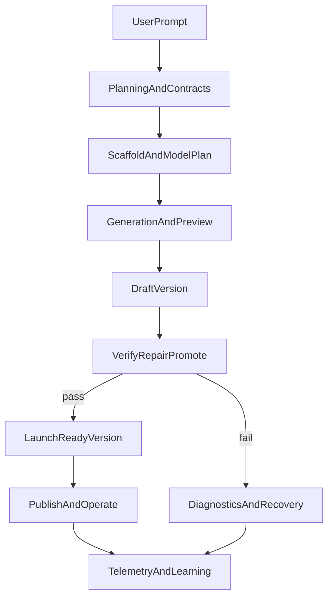

# Plan 6: World-Class Builder Roadmap

**Status as of 2026-03-18:**
- Phase 7 (Trust & Launch): **COMPLETED** — archived
- Phase 8 (Site Planning): **COMPLETED** — archived
- Phase 9 (SMB Growth): **COMPLETED** — archived
- Phase 10 (Learning & Moat): **LEVERERAT ~90%** — all code delivered, remaining: production validation

This roadmap is effectively complete. Future work branches into a new
separation/independence roadmap (Plan 17).

## Goal
Translate the strategic `World Class Builder` plan into active repository
documentation that can be implemented in phases without losing focus.

This roadmap assumes that the current own-engine stack, scaffold system,
project-settings work, and post-check pipeline remain the base. The next leap is
not "more raw generation", but a tighter product loop from prompt to trusted,
launch-ready company site.

## Why this plan exists
The repository now has:

- strong scaffold coverage in `src/lib/gen/scaffolds/`
- prompt assist, plan execution, and clarification infrastructure
- env-var and integration visibility in the builder
- provisional-state and post-check plumbing

The biggest remaining gaps are trust, preview fidelity, site planning,
launch-readiness, and long-term learning from generation outcomes.

## Completed groundwork from archived plans

Archived plans `11` through `13` already delivered useful baseline work:

- leaner Next.js/icon bundling and general config hygiene
- faster deploy and analytics request paths
- cheaper shared message-row rendering in builder surfaces

Those items reduce execution risk for the roadmap below, but they do not replace
the core Phase `1` to `4` work. The roadmap sequence remains:

`07` -> `08` -> `09` -> `10`

## Phase documents and status

| Phase | Plan | Status |
|---|---|---|
| 1 — Trust & Launch | `avklarat/07-world-class-builder-phase-1-trust-launch.md` | **COMPLETED** |
| 2 — Site Planning | `avklarat/08-world-class-builder-phase-2-site-planning.md` | **COMPLETED** |
| 3 — SMB Growth | `avklarat/09-world-class-builder-phase-3-smb-growth.md` | **COMPLETED** |
| 4 — Learning & Moat | `avklarat/10-world-class-builder-phase-4-learning-moat.md` | **LEVERERAT** (production validation remaining) |

All four phases were executed in order 07 -> 08 -> 09 -> 10 across multiple
orchestrator runs between 2026-03-13 and 2026-03-18.

## Product sequence

## Success criteria

- The builder becomes a place where users can trust what they see.
- The generation engine becomes more guided before code exists, not only after.
- Generated company sites become easier to publish, measure, edit, and improve.
- The platform starts learning from actual outcomes instead of treating each run
  as isolated.
