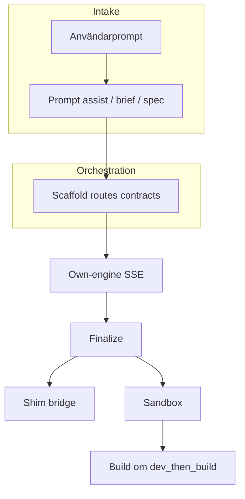
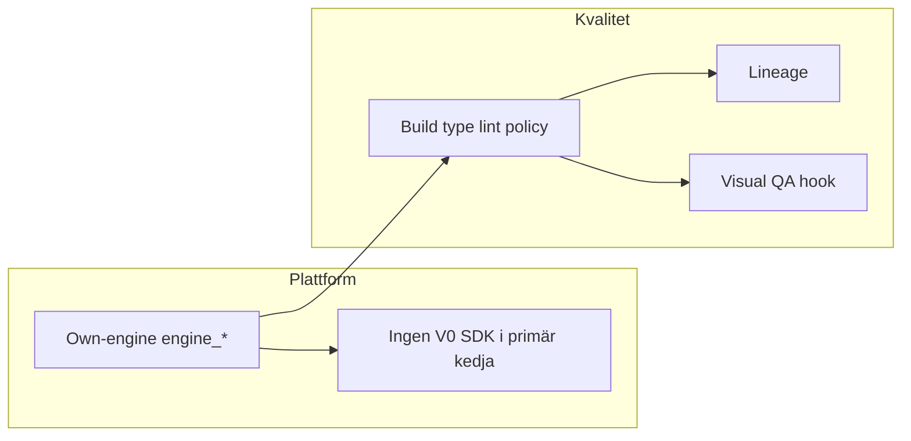

# Konsoliderad plan v2: Own-engine som plattform + kvalitet och spårbarhet

**Arkiverad plan** (2026-03-30). Operativ backlog och status: [`../active/PROJECT-STATE-AND-DIRECTION.md`](../active/PROJECT-STATE-AND-DIRECTION.md); städlista (arkiverad): [`./POST-EPIC-CLEANUP.md`](./POST-EPIC-CLEANUP.md). Denna fil behålls som **historik + checklist-referens**; lita på git-historik för detaljer som redan är införlivade. LLM-review-spår (runbook Del B: B1–B4) är **stängt**: [`./LLM-PIPELINE-MILESTONE-AND-REVIEW-RUNBOOK.md`](./LLM-PIPELINE-MILESTONE-AND-REVIEW-RUNBOOK.md).

## Varför en plan

De två tidigare planerna berör **samma produktkedja** men olika dimensioner:

| Dimension | Fokus |
|-----------|--------|
| **Plattform / V0** | Sajtmaskin ska **äga** generering och preview via **own-engine** (`engine_*`, stream, finalize, sandbox). V0-mapp, **v0-sdk** och **V0 Platform API** (`V0_API_KEY`) ska bort eller ersättas så att primärflödet inte längre blandar in extern V0-leverantör. |
| **Kvalitet / LLM** | Höja ribban från “valid preview” till **verifierad** output: build/type/lint-policy, bättre felobservation, prompt-lineage, förberedelse för visuell/innehålls-QA — utan att kasta befintlig orchestration/scaffold/finalize-arkitektur. |

**Koppling:** V0-avveckling gör **en enda sanning** i kod och API lättare att resonera om; kvalitetsarbetet får **bättre effekt** när allt går via own-engine och `files_json`. Sandbox/iframe-kedjan är **gemensam referens** för båda ([`preview-deploy.md`](../../architecture/preview-deploy.md), [`generation-stream.ts`](../../../src/lib/providers/own-engine/generation-stream.ts)).

---

## Gemensamma principer (gäller hela konsoliderade planen)

1. **`/api/v0/` i URL:er** = Sajtmaskins **HTTP API version 0**, inte V0 Platform. Se [`.cursor/rules/terminology.mdc`](../../../.cursor/rules/terminology.mdc).
2. **Sandbox-preview (tier 2)** ≠ **produktionsdeploy** — håll isär i UI och dokumentation.
3. **Shim (tier 1)** är **brygga/fallback** medan sandbox bootar eller vid fel; **sandbox-URL** är målpreview när den finns (inte “shim först som strategi”).
4. **Deterministiska grindar före fler fria LLM-anrop** — LLM-reparation när en gate faller.
5. **Default branch** i aktuellt repo: **`master`** (korrigera docs som felaktigt säger `main` om det förekommer).

---

## Terminologi-låsning (skärpt 2026-03-28)

I denna plan får `v0` bara användas i tre betydelser:

1. **`v0-templates`** — builderns katalogsystem och datakälla från v0.app.
2. **`/api/v0/*`** — HTTP API-versionering eller compat-präglad route-yta.
3. **Naming debt** — historiska symboler eller filnamn som fortfarande finns kvar men inte beskriver den kanoniska motorn.

Allt annat ska beskrivas som:

- **own-engine**
- generation / generation package
- scaffold / template references
- quality gate
- sandbox preview
- repair loop

**Konsekvens:** låt inte kvarvarande route-paths eller legacy-symboler smitta språkbruket i nya planer, kommentarer eller implementation.

---

## Del A — Plattform: own-engine som ägare, minska V0-beroende

### A.0 Terminologi och kedjeverifiering

- Lås in att team/agenter följer terminologi (V0-mapp vs SDK vs API vs HTTP v0).
- Verifiera kedjan: **chat → POST stream → finalize → `startSandboxPreview` → `sandbox_url` → iframe**; dokumentera luckor om tier 2 uteblir (credentials, `previewBlocked`, gates, klient-sync — spår [`preview-deploy.md`](../../architecture/preview-deploy.md)).

### A.0b Små tighteningar levererade 2026-03-28

- **Sandbox-policy centraliserad:** quality gate återanvänder nu `isSafeRelativePath` och `resolveSandboxTemplateGitUrl` från `src/lib/mcp/runtime-url.ts`.
- **Template-kataloggräns förstärkt:** externa konsumenter använder en stabil barrel i `src/lib/templates/index.ts`.
- **Bildpolicy synkad:** genererad `next.config` vitlistar inte längre hosts som prompten förbjuder i scaffold-kedjan.

Detta betyder att nästa plattformssteg inte ska uppfinna nya lager, utan fortsätta kapa naming debt och compat-ytor konservativt.

### A.1 Inventering `src/lib/v0/` — AVKLARAT

`src/lib/v0/`, `src/lib/v0.ts` och `v0-sdk` är borttagna. Kvarvarande `v0`-namn i repot är naming debt (symboler, DB-fält, payload-nycklar) — se `terminology.mdc` tre-kategori-modellen. Kontrakts- och DB-omdöpningar (t.ex. `v0ChatId`, `v0_*` kolumner) kräver migrationsplan och hör till en separat fas.

### A.2 HTTP-lager: stäng V0 API-vägar

- Ta bort fallback i `GET api/v0/chats/[chatId]` som anropar `v0.chats.getById`; engine/tenant-baserat svar, annars 404.
- Routes med `assertV0Key`: engine-only eller 410/501 där lämpligt.
- Webhooks: `api/webhooks/v0` — ta bort eller ersätt med Vercel-relevant om det är enda behovet.

### A.3 Mall, registry, zip utan V0 API

- `api/template`, `api/download`, `api/v0/chats/init-registry`: ersätt med scaffold + `files_json` / DB eller avveckla tills ersättning finns.

### A.4 Ta bort v0-sdk — AVKLARAT

`v0-sdk`, `src/lib/v0.ts` och `V0_API_KEY` är borttagna ur runtime (2026-03-27).

### A.5 Builder och klient

- Minska `v0ProjectId` / `isV0StyleChatRecord` / `v0-preview-priority`; copy i t.ex. `ProjectEnvVarsPanel` ska tala **own-engine/projektbegrepp** där det är sant.
- Behandla kvarvarande filer och symboler som `v0Stream.ts` och `fallback.ts` som **compat/naming debt**, inte som kanoniska namn för motorn.

### A.6 Databas (valfritt, egen PR)

- Legacy `v0_*` vs `engine_*` — migrera eller read-only efter att API inte skriver legacy.

### A.7 Tester och dokumentation

- Uppdatera mocks (`route.test.ts` m.fl.), `AGENTS.md`, `preview-deploy.md`: own-engine → sandbox → iframe som huvudspår.

**Risk:** Brytning om mall/zip/registry tas bort innan ersättning finns — sekvensera A.2–A.3 före A.4.

---

## Del B — Kvalitet: sandbox, grindar, lineage, QA

### B.0 Kedjan ska läsas i tre lager

1. **Automatiskt planlager** — prompt, deep brief, contracts, route plan, scaffold och retrieval ska mynna ut i ett **enda generation-underlag**.
2. **Mekaniskt/deterministiskt lager** — merge, baseline, deterministiska fixar, artefaktbyggande och quality gates ska vara den tekniska sanningen.
3. **Riktat LLM-reparationslager** — får bara aktiveras efter att det mekaniska lagret fallerat och kan ge exakt felkontext.

**Konsekvens:** nya LLM-steg ska inte läggas till “ovanpå allt” förrän fan-in och det deterministiska lagret är tydliga.

### Verifikation av extern kritik (kort)

- **`dev_only` default:** [`runtime-url.ts`](../../../src/lib/mcp/runtime-url.ts) — `SAJTMASKIN_SANDBOX_PREVIEW_MODE` default → ingen `npm run build` i sandbox utan `dev_then_build`.
- **Typecheck:** [`project-scaffold.ts`](../../../src/lib/gen/project-scaffold.ts) — `lint` finns; **`typecheck`-script** saknas i mallen (rimligt tillägg).
- **Sandbox-policy:** helperdrift mellan quality gate och preview-runtime är minskad genom delade helpers i `runtime-url.ts`; återstår främst fortsatt konsolidering av policy och outputhantering.
- **Bildpolicy:** prompt och genererad scaffold är nu alignade; återstår främst renderad visual QA.

### B.1 P0 — Högst impact

| Åtgärd | Riktning |
|--------|----------|
| Preview-policy | `dev_then_build` (eller tydlig ENV/tier-default) där “klar” ska inkludera build-signal |
| Typecheck i scaffold + ev. sandbox-steg | `npm run typecheck` (`tsc --noEmit`) |
| Lint som gate | Inte bara script i `package.json` — kör och rapportera strukturerat |
| Loggsnitt | Install/build/readiness vid fel (koppla till chat/version där möjligt) |
| Pinna sandbox git-bas | Fast commit/tag eller fork — dokumentera |

### B.2 P1

- Ett explicit **generation package** som fångar prompt, brief, scaffold, contracts, route plan, template references och retrieval i en enda fan-in.
- Dependency repair vid resolverfel (allowlist, patch `package.json`, retry, logga).
- Serverstyrd repair-loop: quality gate ska ge strukturerad felkontext till riktad autofix utan klientberoende huvudlogik.
- Visuell QA **v0**: kontrakt/hook efter sandbox (screenshot + JSON-kritik + ev. patch-task).
- Innehålls-QA: heuristik mot brief (lorem, tomma CTA).

### B.3 P2

- **Prompt lineage** per version (original → orchestrerad → brief/spec → scaffold → källor → hash).
- **Drift-check** mot brief efter generering.
- **Persistens av repair-historik:** lagra vad som triggade respektive reparationspass och vad som ändrades.

---

## Flöden (översikt)

### Nuvarande (förenklad)



### Målbild (plattform + kvalitet)



---

## En sammanhållen arbetsordning

Rekommenderad **sekvens** (justera vid team-beroenden):

1. **A.0** Terminologi + kedjeverifiering (+ ev. `verify-branch-docs`).
2. **A.0b + A.5** Små plattformstighteningar: sandbox-policy, template-gräns, naming debt, compat-spår.
3. **B.2 först inom kvalitet:** generation package och tydlig fan-in.
4. **B.1 + B.2** Preview-policy, typecheck/lint, strukturerad felkontext och serverstyrd repair-loop.
5. **B.2–B.3** Visual QA med screenshots, lineage och repair-persistens.
6. **A.3–A.7** Fortsatt mall/zip/compat-städ, builder-copy, tester och docs i takt med låg-riskfönster.

---

## Instruktion till implementerande agent (Cursor / IDE)

- Implementera i **små PR:er** med tydlig rollback för preview-policy.
- Läs befintliga gränssnitt i `finalize-version`, `finalize-preflight`, `generation-stream` innan nya steg läggs in.
- Nya LLM-anrop **sist** — efter misslyckade grindar.
- Uppdatera tester nära `stream/route.test.ts`, sandbox-preview.

---

## Konsoliderad checklista (todo-IDs)

_Plattform / V0_

- [x] `terminology-lock-in` — Följ `terminology.mdc`
- [x] `verify-own-engine-chain` — Dokumentera kedja och luckor tier 2
- [x] `sandbox-policy-centralization` — Quality-gate och preview delar centrala sandbox-helpers
- [x] `template-catalog-boundary` — Stabil extern importyta via `@/lib/templates`
- [x] `audit-lib-v0` — Klassificera A/B/C, flytta B/C
- [x] `remove-http-v0-fallback` — GET chat, assertV0Key-vägar
- [x] `replace-template-registry-zip` — Engine + DB, ingen `downloadVersion`
- [x] `remove-v0-sdk` — Paket + env rensning
- [ ] `builder-cleanup` — v0ProjectId, preview-priority, copy (naming debt — deferred). *Sandbox kanon vs shim i API/versionval/quality-tier levererat 2026-03-30; `isLegacyMappedChatRecord`.*
- [x] `deploy-clarity` — Sandbox vs deploy i UI/docs
- [ ] `schema-migration-optional` — Separat PR legacy vs engine (deferred)

_Kvalitet / LLM_

- [x] `verify-branch-docs` — main vs master i docs
- [x] `p0-preview-policy` — dev_then_build / SSE build-steg
- [x] `p0-scaffold-typecheck` — Script + sandbox (typecheck + build + lint i quality-gate)
- [x] `p0-sandbox-logs` — Loggsnitt vid fel
- [ ] `p0-pin-template` — Sandbox git-bas (deferred)
- [x] `p1-generation-package` — kanonisk fan-in: `GenerationInputPackage` + `computeLineageHash()` (`src/lib/gen/generation-input-package.ts`, `orchestrate.ts`, stream-routes)
- [x] `p1-dep-repair` — ERESOLVE-loop (dep-completer implementerad)
- [x] `p1-server-owned-repair` — `server-verify` efter finalize, quality-gate → strukturerad felkontext → capped repair (default server, klientfallback); se `PROJECT-STATE-AND-DIRECTION.md` §10
- [x] `p1-visual-qa-contract` — Hook efter sandbox (visual-qa.ts, bakom feature-flag)
- [ ] `p2-lineage` — prompt_lineage per version (deferred)
- [x] `p2-image-policy` — next.config vs prompt alignade

---

## Agent 2 av 2 — implementeringsprompt (historisk)

_Planen ligger i `avklarat/`; använd inte detta block som primär agentinstruktion._ Börja från [`../active/PROJECT-STATE-AND-DIRECTION.md`](../active/PROJECT-STATE-AND-DIRECTION.md) och kanoniska arkitekturdocs. Flera mål nedan är redan levererade — se checklistan ovan och PROJECT-STATE §10 innan du duplicerar arbete.

**Historisk prompt** (behålls som referens):

```text
Arbeta utifrån den arkiverade planen i `docs/plans/avklarat/CONSOLIDATED-own-engine-platform-and-quality-v2.md` och den aktuella backlogen i `docs/plans/active/PROJECT-STATE-AND-DIRECTION.md`.

Du är agent 2 av 2.
Agent 1 har redan gjort den första konservativa own-engine-tighteningen:
- quality-gate återanvänder centrala sandbox-helpers från `src/lib/mcp/runtime-url.ts`
- template-katalogen har en stabil barrel i `src/lib/templates/index.ts`
- genererad bildpolicy är synkad med promptreglerna

Ditt uppdrag är INTE att fortsätta plattformsstädning brett.
Ditt uppdrag är att strama upp LLM-/repair-kedjan ovanpå den renare strukturen.

Mål:
1. Gör fan-in tydlig: ett kanoniskt generation package eller motsvarande struktur före prompt/generation.
2. Gör quality-gate -> repair mindre klientberoende och mer serverägd.
3. Förbättra exakt felkontext till autofix/repair-flödet.
4. Behåll deterministiska fixar som första linje; använd riktad LLM-repair bara när exakt felkontext finns.
5. Förbered lineage och renderad visual QA utan att bygga en lös agentloop.

Hårda regler:
- Beskriv motorn som `own-engine`, inte `v0`.
- `v0-templates` är ett isolerat katalogsystem; rör inte det om det inte krävs direkt.
- `/api/v0/*` är route-yta/versionering; skapa inte nya parallella API-ytor om det inte är absolut nödvändigt.
- Rör inte DB-/payload-fält som `v0ProjectId`, `v0ChatId` eller andra migrationskänsliga legacy-fält.
- Skapa inte nya docs-filer i onödan.
- Commita inte.
- Om något kräver större migrering eller korsar tillbaka in i plattformsstädning: lämna tydlig notering i stället för att gissa.

Fokusera i denna ordning:
1. Inventera nuvarande fan-in i `orchestrate.ts`, `system-prompt.ts`, `route-plan.ts`, `pre-generation-contracts.ts`.
2. Inför minsta rimliga “generation package”-yta eller motsvarande enhetlig struktur.
3. Gå igenom quality-gate/autofix-kedjan: `quality-gate/route.ts`, `useAutoFix.ts`, `buildAutoFixPrompt()`, relevanta helpermoduler.
4. Förbättra strukturerad felkontext och capped repair utan att bygga full regeneration-loop.
5. Om tid/risk tillåter: lämna en liten seam för lineage eller renderad visual QA, men bara om den är låg risk.

Bra filer att börja i:
- `src/lib/gen/orchestrate.ts`
- `src/lib/gen/system-prompt.ts`
- `src/lib/gen/stream/finalize-version.ts`
- `src/app/api/v0/chats/[chatId]/quality-gate/route.ts`
- `src/lib/hooks/chat/useAutoFix.ts`
- `src/lib/hooks/chat/helpers.ts`
- `src/lib/gen/autofix/pipeline.ts`
- `src/lib/gen/autofix/validate-and-fix.ts`

Leverera tillbaka:
- liten till medelstor diff
- exakt vad som ändrades
- vilka delar som nu är tydligare i kedjan
- öppna risker / medvetet orörda områden
```

---

## Historik

- **v2 (denna fil):** Konsolidering av LLM-kvalitetsplan och V0/own-engine-plattformsplan.
- Tidigare källor borttagna (LLM-flöde förbättringsplan, V0-plattform avvecklingsplan) — finns i git-historik.
