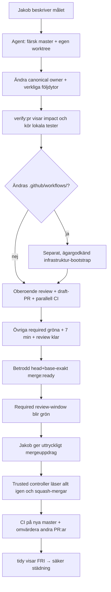

# Från lokal agent till master

Det här är människoguiden. Maskinvärden finns i
[`config/agent-workflow.json`](../../config/agent-workflow.json) och verifieras
av `npm run workflow:contract`.



## Det enkla arbetssättet för Jakob

1. Beskriv vad du vill ändra. Du behöver inte välja branch, tester eller
   dokumentlista själv.
2. Agenten hämtar live `master`, kontrollerar överlappande PR:er, skapar en egen
   worktree/branch och visar vilka owners och följdytor som träffas.
3. Agenten ändrar, regenererar, testar, gör oberoende review och öppnar en
   draft-PR. Varje ny commit skapar en ny canonical CI-körning; dess
   serverbundna `WorkflowRun.created_at` startar om sjuminutersgolvet.
4. Agenten pausar bara när ett riktigt ägarbeslut behövs eller när ändringen kan
   innebära dataförlust, security/cross-tenant-risk eller ett väsentligt större
   scope. Vanliga test-, docs- och Backoffice-följder ska agenten hantera.
5. När exakt PR-head är grön och genomgången får du en kort riskrapport. Säg då
   uttryckligen att den får mergas; controllern gör en sista livekontroll och
   squash-mergar. Otydliga formuleringar räknas inte som mergeuppdrag.

Skyddade ytor betyder alltså **extra bevis, inte förbjudet område**. Om en
produktändring påverkar ett strict schema, en policy, Sajtmaskins Backoffice
eller dokumentation ska de verkliga följdytorna ändras i samma PR. Om rapporten
visar `declared-only` eller en manuell validator ska agenten redovisa det öppet;
det får inte beskrivas som runtime-låst.

## Start och verifiering

```bash
npm run hooks:install       # en gång per clone; idempotent och worktree-delad
npm run verify:pr -- --plan  # visa vad diffen påverkar
npm run sync:derived         # skriv om genererade projektioner vid behov
npm run verify:pr            # PR-ready-kontroll före push
```

`verify:pr` jämför med färsk `origin/master`. Det läser control-plane-registren
och Backoffice domain-map samt deduplicerar hårda validators. Okända eller
oägda filer får både runtime- och full verifiering; `preview-host/**` får också
paketets egna grindar. Protected paths är tillåtna men får den fulla lokala
profilen och ska följas genom owner → konsument/validator → schema/Backoffice →
genererad projektion/docs. Det ändrar inte tracked sourcefiler. Underkommandon kan däremot
uppdatera lokala gitignorerade cacheartefakter, exempelvis `.eslintcache` och
validatorcache; kontrollera därför tracked diff, inte en helt orörd arbetsmapp.

## Flera agenter utan statuskonflikter

Kandidatbrancher ska i första hand ändra sin kod och sina lokala tester, inte
slåss om delade statusytor som `BUG-SWARM-BACKLOG.md`, canvas, planindex eller
genererade kontraktdokument. En utsedd integrationsagent gör en enda
reconciliation från senaste live `master`: porterar de verifierade ändringarna,
uppdaterar canonical owners och regenererar de delade projektionerna en gång.

Om två PR:er överlappar samma owner ska de mergas seriellt eller ersättas av en
ren integrations-PR. Efter varje merge hämtas live `master` igen och återstående
PR:ers faktiska diff, head-SHA, checks och reviewfynd omvärderas. En äldre
generated-/statusfil vinner aldrig en konflikt bara för att den redan låg i en
branch; källägaren på nya master vinner och projektionen regenereras.

Branchprefixen (`fix/`, `feat/`, `docs/`, `chore/`) kontrolleras både lokalt och
i den blockerande CI-grinden. Endast aktörer som uttryckligen finns i policyn,
för närvarande Dependabot, undantas.

Git-hooken är ett lokalt räcke, inte den yttersta sanningen: den installeras
idempotent och stoppar push om `verify:pr` är rött. CI kör samma kontrakt igen på
den pushade committen, så en saknad lokal hook kan inte göra en ogiltig PR grön.

När `quality`, `backoffice-tests`, `schema-drift`, `build`, Vercel och alla
reviewfynd är klara — medan `review-window` fortfarande väntar — posta först
`merge:ready — head-sha: <40 hex>, base-sha: <40 hex>, at: <UTC>, bugkoll: <källa>, triage: <utfall>, P0/P1: 0`
som PR-kommentar och sätt sedan labeln `merge:ready`. Label-eventet läser
aktuell head och base-refens levande tip via GitHub. Båda måste matcha
kommentaren, compare/merge-base måste visa att head innehåller base-tipen och
kommentaren måste komma från PR-författaren eller en mänsklig repo-collaborator.
Först därefter blir den head-bundna required checken `review-window` grön.

När den är grön postar en mänsklig `OWNER`, `MEMBER` eller `COLLABORATOR` den
slutliga kommandoraden (PR-författarskap ensamt ger inte merge-mandat):

`merge:execute — head-sha: <40 hex>, base-sha: <40 hex>, at: <UTC>, bugkoll: <källa>, triage: <utfall>, P0/P1: 0`

Detta är den enda kanoniska agentmergen. `issue_comment` kör kod från default
branch. Controllern hämtar kommentaren via dess GitHub-id, läser live head,
base, checks, reviews och båda kommentarstyperna flera gånger med ett kort
settle-fönster och kräver oförändrad evidensfingerprint. Sedan läser den live
base/compare igen och gör en squash-merge med GitHubs expected-head-SHA.
Review-event-workflows får inte användas för denna token: deras YAML kommer
från PR:ens obetrodda merge-ref.

Reviews läses paginerat via GitHubs GraphQL-data, eftersom REST-listan inte har
reviewens serverbundna `updatedAt`. Både inskicknings- och senaste ändringstid
ingår i ordningen och evidensfingerprinten. Om en bot editerar ett gammalt
reviewinlägg med ett nytt fynd efter sign-off eller mergekommando blir mandatet
alltså stale även om review-ID:t är oförändrat.

Final merge använder inte checknamnet eller dess självvalda `external_id` som
behörighetsbevis. Alla GitHub Actions-workflows delar appidentitet, så den
betrodda controllern räknar om core-checkar, botstatus, live sign-off och
sjuminutersgolvet från den senaste serverbundna körningen av exakt
`.github/workflows/ci.yml` på eventet `pull_request`. Varje required check knyts
till sitt exakta jobb via GitHubs job-/check-run-URL och måste ha
serverreturnerade Actions-steg; en steglös custom check räknas inte som ett
core-jobb. Ett custom reviewkvitto som delar en annan workflows suite blir inte
ett jobb bara av den anledningen: controllern kräver en exakt jobb-/check-ID-
bindning och använder annars live review-state + review-ID. Tiden kommer från
WorkflowRun-resursens `created_at`, inte från ett
återanvänt checknamn. För varje jobbnamn väljs senaste attempt där just jobbet
kördes; ett partial rerun behåller därmed andra serververifierade jobb utan att
återanvända ett ersatt resultat. Ett dubblerat skyddat jobbnamn i något attempt
stoppar. För fork-PR:ar där GitHub lämnar PR-associationen tom krävs exakt
matchning mot live head-repository och branch;
oklar eller flerdubbel identitet stoppar. Vanliga `pull_request`-workflows får
inga skrivrättigheter; skrivande Dependabot-klassificering kör enbart
default-branch-kod och kan aldrig merga.

## Särskilt spår för workflow-infrastruktur

`.github/workflows/**` är trust root för hela grinden. Den vanliga
`review-window`- och `merge:execute`-controllern vägrar därför en PR där en fil
har nuvarande **eller tidigare** namn under den mappen. Det är det enda verkligt
manuella mergeundantaget, och ska inte blandas med en produktändring.

En sådan ändring görs i en separat PR: ägaren godkänner uttryckligen
infrastruktur-bootstrapen, agenten kör samma lokala verifiering, CI, oberoende
review och sjuminutersfönster, och den exakta head/base-paret läses om direkt
före en dokumenterad expected-head-squash-merge. Efteråt körs CI på nya master och övriga
öppna PR:ar omvärderas. Själva införandet av denna spärr är en engångs-bootstrap;
när den finns på master får ingen agent dölja en workflowändring bakom ett
vanligt mergekommando.

Den egna `trusted-pr-ai-review`-checkens namn är inte heller reviewbevis. Både
den levande state-kommentaren och dess publicerade review-ID måste binda till
exakt repo, PR och head; en stale eller omdöpt Actions-check räknas inte. Den
kontobaserade fallbacken använder ett separat tvåresursbevis: SHA-bunden review
plus PR-kommentar med review-ID. Båda måste komma från samma konfigurerade,
betrodda repository-actor och exakt live head.

Expected-head är en riktig CAS för head, men GitHubs merge-API saknar motsvarande
base-SHA-parameter. Därför måste native branch protection/ruleset dessutom
kräva att branchen är uppdaterad före merge. Controllern serialiserar merges och
minimerar racet med en sista base/compare-läsning, men en manuell webbmerge eller
bypass utanför den vägen har kvar base-racet om den native inställningen saknas.
Live-auditen 2026-08-24 visade att `Protect master` ännu hade
`strict_required_status_checks_policy=false`; rolloutens GitHub-inställningssteg
måste slå på strict innan det kvarvarande base-racet kan betraktas som stängt.

Native GitHub visar fortfarande required checks som namn + GitHub Actions-app,
inte som en kryptografiskt unik workflow-publicerare. Därför är manuell
webbmerge, generell API-merge och separat auto-merge inte agentvägar. Om UI:n i
framtiden också ska vara lika stark krävs en separat GitHub App-identitet eller
ett ruleset med required workflow; tills dess används bara `merge:execute`.

Repo-kontraktet som reserverar `review-window`-namnet och jobb-/stegbindningen
är defense-in-depth. De gör inte native UI kryptografiskt säkert, eftersom en
PR-ref kan försöka ändra både workflow och kontrakt före merge. Det är just
varför workflowfiler stoppas av den kanoniska controllern och UI/API-merge inte
är en godkänd agentväg.

Efter lyckad merge kör controllern base-invalideringen direkt och dispatchar
`ci.yml` samt `db-blob-sync-check.yml` på master. Det behövs eftersom en merge
med `GITHUB_TOKEN` normalt inte triggar nya push-workflows. Om någon av dessa
post-merge-åtgärder fallerar blir jobbet rött med
`POST_MERGE_VERIFICATION_FAILED`, men PR:n är redan terminalt mergad: kör då
base-invalidering och båda workflow-dispatcherna manuellt; försök aldrig merga
samma PR igen.

## Vad agenten ska redovisa

- canonical owners och eventuella `declared-only`-kontrakt,
- träffade Backoffice-sidor eller uttryckligt ”ingen träff”,
- schemas/policies och deras validators,
- körda tester samt kvarvarande risk,
- exakt branch, base-SHA och head-SHA.

Detaljerad roll-, git- och mergepolicy finns i `.cursor/rules/`; denna guide
ersätter äldre manuella checklistor och ska inte kopieras till fler filer.
