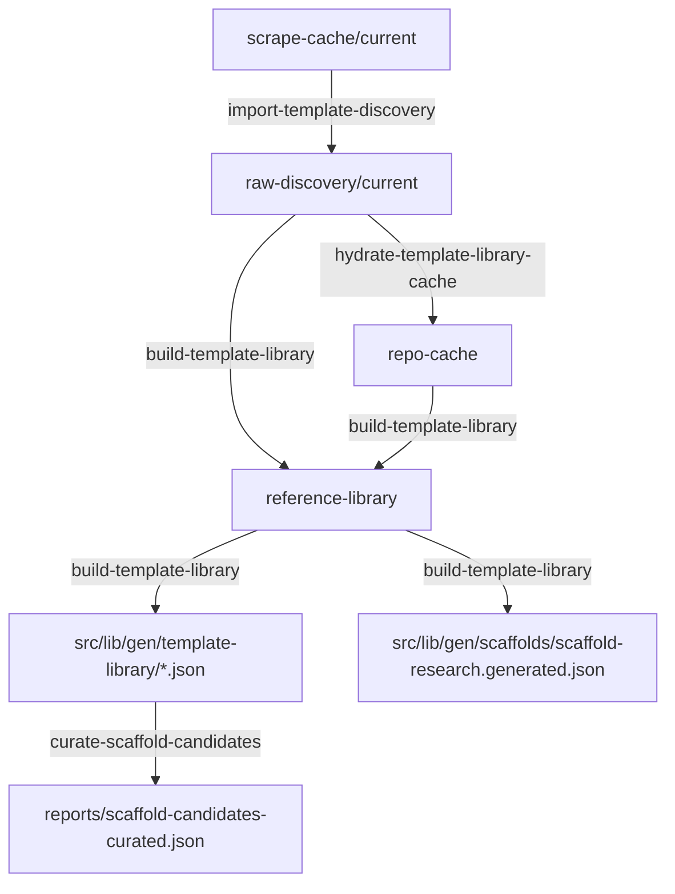

# External Template Pipeline Contract

**Status:** Legacy reference. The active runtime path is `scaffolds` +
`dossiers`; do not use this document as the source of truth for scaffold
selection, dossier validation, or current npm scripts. Keep it only for older
external-template research artifacts.

## Scope

This document records the historical external-template pipeline used to curate
Vercel template references and scaffold research metadata.

It covers:

- scrape intake
- canonical raw discovery
- repo cache hydration
- reference-library dossiers
- generated runtime artifacts
- validation expectations

It is specifically about **Vercel-mallar / externa referenser** and the
generated artifacts that come from that lane.

It does **not** describe:

- builderns `v0-mallar` under `src/lib/templates/*`
- runtime scaffold manifests under `src/lib/gen/scaffolds/*`

It does **not** redefine runtime scaffold manifests in
`src/lib/gen/scaffolds/`. Those remain documented in
[`scaffold-contract.md`](./scaffold-contract.md).

## Canonical locations

Mutable pipeline data lives under:

- `data/external-template-pipeline/scrape-cache/current/`
- `data/external-template-pipeline/raw-discovery/current/`
- `data/external-template-pipeline/repo-cache/`
- `data/external-template-pipeline/reference-library/`
- `data/external-template-pipeline/reports/`

Historical runtime/build-time generated artifacts lived under:

- `src/lib/gen/template-library/template-library.generated.json`
- `src/lib/gen/template-library/template-library-embeddings.json`
- `src/lib/gen/scaffolds/scaffold-research.generated.json`
- `src/lib/gen/scaffolds/scaffold-embeddings.json`

The `src/lib/gen/template-library/*` files and the old
`scripts/template-library/*` rebuild path were removed in the 2026-04-17
cleanup. Do not recreate these paths for current work; current runtime guidance
uses `src/lib/gen/dossiers/`, `data/dossiers/{hard|soft}/`, and scaffold
manifests under `src/lib/gen/scaffolds/`.

## Canonical command flow

Preferred orchestration:

```text
py scripts/template-library/full_template_refresh.py
```

Discrete steps, when you intentionally debug a stage:

1. `scripts/template-library/hamta_sidor_branch_emil.py`
2. `scripts/template-library/import-template-discovery.ts`
3. `scripts/template-library/hydrate-template-library-cache.ts`
4. `scripts/template-library/build-template-library.ts`
5. `scripts/embeddings/generate-template-library-embeddings.ts`
6. `scripts/embeddings/generate-scaffold-embeddings.ts`

## Data flow



## Canonical scrape record

Grouped `summary.json` / `summary-cleaned.json` records are expected to preserve
the fields from `RawTemplateRecord` in
`scripts/template-library/template-library-discovery.ts`.

Important fields:

- `template_url`
- `title`
- `description`
- `repo_url`
- `demo_url`
- `framework_match`
- `framework_reason`
- `artifact_tier`

## Validation rules

### Scrape intake

- `template_url` must be a non-empty Vercel template detail URL.
- `title` must be non-empty.
- `demo_url` must be either an absolute `http/https` URL or `null`.
- `repo_url` should be a normalized GitHub repository URL when available.
- `"#"` and other UI placeholders must never survive normalization as demo URLs.

### Raw discovery

- Input paths must be explicit or canonical; implicit multi-root fallback is not allowed.
- `sourcePath` metadata should be portable when the source is inside the workspace.
- Duplicate entries are deduped by category + template URL.

### Repo cache

- Repos are shallow clones only.
- Corrupt cache directories without `.git` must be repaired or cause a clear failure.
- Build should not silently fall back to unrelated legacy repo trees when cache is missing.

### Build outputs

- `template-library.generated.json` and `scaffold-research.generated.json` must be rebuilt from the same raw-discovery/cache input.
- Dossier manifests must only reference template IDs present in the generated catalog.
- `scaffold-candidates-curated.json` is curation-only, not runtime.

### Runtime artifacts

- Missing or unreadable generated catalog/scaffold-research artifacts should fail clearly outside tests.
- Embedding-vs-keyword retrieval strategy is an intentional search policy, not a hidden path fallback.
- `SAJTMASKIN_STRICT_GENERATED_ARTIFACTS=false` can relax these guards temporarily, but the default policy is strict outside tests.

## Historical production boundary

At the time of this legacy pipeline, production/runtime code relied on generated
artifacts under `src/lib/gen/` and internal scaffold manifests under
`src/lib/gen/scaffolds/`.

That old runtime did **not** read dossiers directly. Dossiers were first
condensed into:

- `src/lib/gen/template-library/template-library.generated.json`
- `src/lib/gen/scaffolds/scaffold-research.generated.json`

Current code no longer has the generated `template-library` catalog. Active
dossier architecture is documented in
[`docs/architecture/dossier-system.md`](../architecture/dossier-system.md).

It must **not** depend on:

- scrape-cache
- raw-discovery
- repo-cache
- dossier directories
- old local fallback roots such as `_sidor/` or sibling scrape caches
