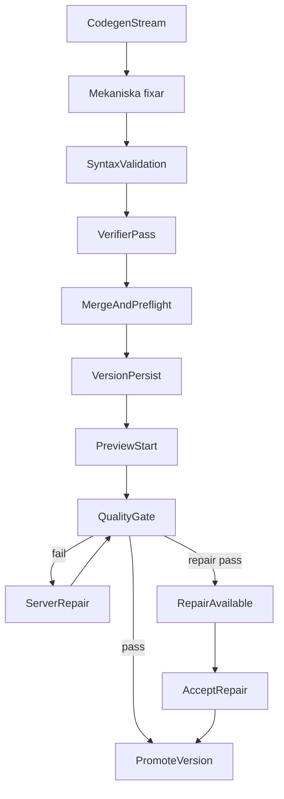

# Quality Gate

## Scope

Denna sida samlar den mänskligt läsbara kontraktsbilden för Sajtmaskins
quality gate: vilka checks som körs, var de körs, när de triggas och hur de
kopplas till preview, `server-verify` och repair.

Primära kodkällor:

- `src/lib/gen/verify/quality-gate-checks.ts`
- `src/lib/gen/verify/preview-quality-gate.ts`
- `src/lib/gen/verify/server-verify.ts`
- `src/lib/gen/verify/repair-loop.ts`
- `src/lib/db/chat-repository-pg.ts`
- `src/lib/gen/stream/post-finalize-policies.ts`
- `src/app/api/engine/chats/[chatId]/quality-gate/route.ts`
- `src/app/api/engine/chats/[chatId]/repair/route.ts`
- `src/app/api/engine/chats/[chatId]/accept-repair/route.ts`
- `src/lib/gen/stream/builder-stream-contract.ts`
- `preview-host/src/runtime.js`

Närliggande docs:

- `docs/schemas/preview-session-contract.md`
- `docs/architecture/fas3-preview-and-deploy.md`
- `docs/architecture/fas2-orchestration-and-build.md`

## Vad quality gate är

Quality gate är builderns samlingsnamn för verifieringar som kräver en riktig
Next-/Node-miljö och därför körs i preview-hostens isolerade verify-lane, inte
i samma workspace som den live dev-preview användaren ser i iframen.

Den svarar främst på frågan:

- Går det här projektet att installera, typechecka, linta eller bygga enligt
  den policy som gäller för den aktuella versionen?

Quality gate är alltså inte samma sak som:

- mekaniska fixar (deterministisk autofix)
- syntaxvalidering i finalize
- verifier-pass (hybrid: deterministiska checks + LLM-audit) — kör
  regex-/AST-baserade guards (t.ex. `undefined-jsx-symbol`,
  `motion-reduce-canvas-trap`, `motion-reduce-overlay-trap`) innan
  LLM-passet och matar eventuella blocking findings in i fixern
- live-previewns `npm run dev`

## Preview-lane vs verify-lane

| Lane | Syfte | Typisk körning |
|------|------|----------------|
| Preview-lane | Ge användaren snabb live-preview | `npm install` + `npm run dev` |
| Verify-lane | Bekräfta export-/buildbarhet och ge repair-underlag | `tsc`, ev. `eslint`, ev. `next build` |

Live-previewn kan därför vara redo eller starta samtidigt som quality gate
fortfarande kör i bakgrunden.

## Checks

Quality gate använder dessa check-id:n:

| Check | Kommando |
|------|----------|
| `typecheck` | `npx tsc --noEmit` |
| `lint` | `npx eslint . --max-warnings=20` |
| `build` | `npx next build` |

Definitioner finns i `src/lib/gen/verify/quality-gate-checks.ts`.

Verify-lane kan också returnera informativa install-signaler i `results[]`:

| Check | Meaning |
|------|----------|
| `install-cache-share` | Verify workspace återanvände (eller försökte återanvända) `node_modules` från live workspace via fingerprint-match |
| `install-peer-fallback` | Peer-konflikt upptäcktes och fallback med `--legacy-peer-deps` användes |

## Standardprofiler

Profilerna laddas från `config/ai_models/manifest.json` under
`qualityGateTiers` (via `getQualityGateTiersFromManifest()`), med nuvarande
defaultvärden:

| Profil | Checks | Var den används |
|--------|--------|-----------------|
| `DESIGN_PREVIEW_QUALITY_GATE_CHECKS` | `["typecheck", "build", "lint"]` | F2 quality gate (live-preview + bakgrunds-`server-verify` + repair re-check). Lint tillagd 2026-04-21. |
| `INTEGRATIONS_BUILD_QUALITY_GATE_CHECKS` | `["typecheck", "build", "lint"]` | F3 / promotion-flödet (`/finalize-design`). Lint tillagd 2026-04-21. |

`next build` ingår i båda lanes sedan 2026-04-20 (Tier S #7 /
`docs/plans/active/Kvarvarande-uppgifter.md` §1.5). F2-`build`-passet
fångar Next-runtime-fel som typechecket inte ser — broken imports,
runtime-crashes som compile:ar fint — *innan* preview-iframen renderar,
vilket undviker "blank HTML"-incidenter. Kostar ~5–20 s extra per
finalize och cirka +5–10 USD/mån i Fly-CPU. Default-fallback i
`src/lib/gen/verify/quality-gate-checks.ts` matchar manifestet, så
runtime kan inte tyst falla tillbaka till bara `typecheck`. För att
kostnadsbegränsa, sätt arrayen till `["typecheck"]` i miljöns manifest.

**Borttaget 2026-04:** `tier2`, `serverVerify`, `promotion`, `interactive`
konsoliderades till `designPreview` + `integrationsBuild`. Lint-laden
togs bort från background-verify tillfälligt (tysta lint-fail blockerade
verifiering utan att lägga värde), och åter-infördes 2026-04-21 med
`--max-warnings=20` så errors blockerar men warnings tolereras.
Bakgrundsgate:n är dock fortfarande fire-and-forget — se SAJ-28 +
`docs/plans/active/P34-blocking-lint-in-validate-and-fix.md` för plan att
lyfta lint till blockerande `validateAndFix`-passet.

## När quality gate körs

### 1. Asynkt efter finalize

Efter att `finalizeAndSaveVersion()` har sparat versionen kan
`resolvePostFinalizeServerVerifyDecision()` välja att trigga
`triggerServerVerification()`.

Detta händer inte alltid. Vanliga skäl att hoppa över:

- `verificationPolicy === "fast"`
- versionen är inte eligible
- `previewBlocked === true`
- `verificationBlocked === true`
- låg-risk-standardflöde utan starka signaler

### 2. Explicit via route

`POST /api/engine/chats/[chatId]/quality-gate`

Tar en `checks`-lista. Minst en check krävs.

### 3. Efter repair

Både `server-verify` och den explicita `repair`-routen kan re-köra quality gate
efter att en reparationsomgång har producerat nya filer.

## Hur quality gate förhåller sig till repair

Quality gate är i första hand en verifiering, men i dagens arkitektur används
den också som exakt felkälla för repair-lanen:

1. quality gate failar
2. feloutput (`typecheck`, `lint`, `build`) samlas
3. delad `runRepairLoop()` kör mekanisk fix + LLM-fix med samma policy för
   både `server-verify` och manuell `/repair`
4. warm repair försöker skicka bara trasiga filer (+ relevanta imports) till
   LLM-fixern när felmängden är lokal
5. quality gate re-körs för att avgöra om reparerad version blir `repair_available`

Det betyder att quality gate i nuläget är både:

- verifieringslager
- källa till repair-kontext

## Repair-accept (ingen tyst filersättning)

När post-repair quality gate passerar skrivs inte reparerade filer direkt över
`engine_versions.files_json`.

I stället:

1. reparerade filer sparas i `engine_versions.repaired_files_json`
2. versionen sätts till `verification_state = "repair_available"` med `repair_available_at`
3. stream kan skicka `version-repair-available` och versions-API visar `hasPendingRepair`
4. användaren applicerar fixen via `POST /api/engine/chats/[chatId]/accept-repair`
5. timeout-fallback kan auto-accepta efter `repairPolicies.repairAcceptTimeoutMinutes`

Detta gör serverreparation transparent i live-preview: fixen är en synlig,
explicit acceptpunkt i stället för en osynlig overwrite.

## Strukturerat repair-underlag (`errorManifest`)

`runRepairLoop()` använder `buildGroupedRepairErrorContext()` för att gruppera
fel per fil och prioritera utifrån importgraf:

- diagnostics extraheras från quality gate-output + syntaxfel
- grupperas till `RepairErrorManifest` (`file`, `importedByCount`, `dependsOn`, diagnostics)
- sorteras så hög-impact-filer hanteras först

Samma manifest sparas i verify/repair-loggarnas metadata (`errorManifest`) så
det går att se exakt vilket felunderlag repair-fasen jobbade med.

## Installstrategi i verify-lane

Verify-lane installerar nu i två steg:

1. kör normal install utan `--legacy-peer-deps`
2. bara vid detekterad peer-konflikt, kör fallback med `--legacy-peer-deps`

Samtidigt försöker verify-lane dela `node_modules` mellan live och verify
workspace när dependency fingerprint matchar, för att minska dubbla installer.

## Vad som blockeras och vad som bara varnar

I preflight-/preview-kontraktet finns en viktig skillnad:

- **blocking errors** kan stoppa preview eller verification
- **non-blocking quality warnings** ska inte stoppa preview

Typiska blocking-fall:

- `code_structure_failure`
- `dependency_install_failure`
- `env_config_missing`

Typiska icke-blockerande quality warnings:

- SEO-signaler
- analytics-varningar
- vissa scaffold-/kvalitetssignaler

SEO-varningar ska alltså inte tolkas som att quality gate blockerar previewn.

## Relation till andra steg i pipeline

Quality gate ligger efter finalize/persist och efter preview-start-handoff i den
större builder-kedjan:

## Dokumentationsstatus

Quality gate finns redan dokumenterad, men utspritt:

- `docs/schemas/preview-session-contract.md` — verify-lane och API-kontrakt
- `docs/architecture/fas3-preview-and-deploy.md` — runtimebild, tier-2 vs verify-lane
- `docs/architecture/fas2-orchestration-and-build.md` — relation till finalize och `server-verify`

Den här sidan finns för att ge en enda sammanhållen ingångspunkt.
