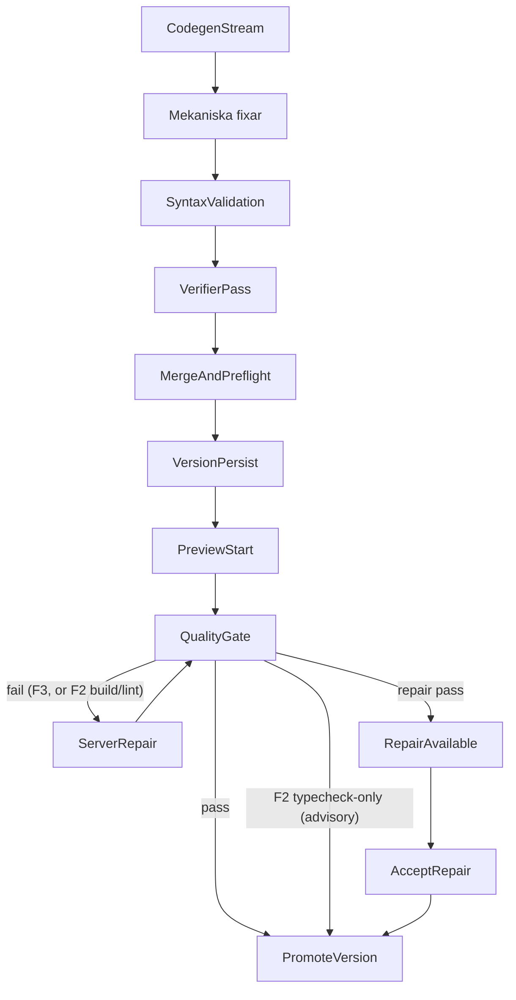

# Quality Gate

## Scope

Denna sida samlar den mänskligt läsbara kontraktsbilden för Sajtmaskins
quality gate: vilka checks som körs, var de körs, när de triggas och hur de
kopplas till preview, `server-verify` och repair.

Primära kodkällor:

- `src/lib/gen/verify/quality-gate-checks.ts`
- `src/lib/gen/verify/preview-quality-gate.ts`
- `src/lib/gen/verify/server-verify.ts`
- `src/lib/gen/verify/repair-loop.ts`
- `src/lib/db/chat-repository-pg.ts`
- `src/lib/gen/stream/post-finalize-policies.ts`
- `src/app/api/engine/chats/[chatId]/quality-gate/route.ts`
- `src/app/api/engine/chats/[chatId]/repair/route.ts`
- `src/app/api/engine/chats/[chatId]/accept-repair/route.ts`
- `src/lib/gen/stream/builder-stream-contract.ts`
- `preview-host/src/runtime.js`

Närliggande docs:

- `docs/schemas/preview-session-contract.md`
- `docs/architecture/llm-pipeline.md` § FAS 3
- `docs/architecture/llm-pipeline.md` § FAS 2

## Vad quality gate är

Quality gate är builderns samlingsnamn för verifieringar som kräver en riktig
Next-/Node-miljö och därför körs i preview-hostens isolerade verify-lane, inte
i samma workspace som den live dev-preview användaren ser i iframen.

Den svarar främst på frågan:

- Går det här projektet att installera, typechecka, linta eller bygga enligt
  den policy som gäller för den aktuella versionen?

Quality gate är alltså inte samma sak som:

- mekaniska fixar (deterministisk autofix)
- syntaxvalidering i finalize
- verifier-pass (hybrid: deterministiska checks + LLM-audit) — kör
  regex-/AST-baserade guards (t.ex. `undefined-jsx-symbol`,
  `r3f-client-boundary`, `navigation-placeholder-actions`,
  `motion-reduce-canvas-trap`, `motion-reduce-overlay-trap`) innan
  LLM-passet och matar eventuella blocking findings in i fixern
- live-previewns `npm run dev`

## Preview-lane vs verify-lane

| Lane | Syfte | Typisk körning |
|------|------|----------------|
| Preview-lane | Ge användaren snabb live-preview | `npm install` + `npm run dev` |
| Verify-lane | Bekräfta export-/buildbarhet och ge repair-underlag | `tsc`, ev. `eslint`, ev. `next build` |

Live-previewn kan därför vara redo eller starta samtidigt som quality gate
fortfarande kör i bakgrunden.

## Checks

Quality gate använder dessa check-id:n:

| Check | Kommando |
|------|----------|
| `typecheck` | `npx tsc --noEmit` |
| `lint` | `npx eslint . --max-warnings=20` |
| `build` | `npx next build` |

Definitioner finns i `src/lib/gen/verify/quality-gate-checks.ts`.

Verify-lane kan också returnera informativa install-signaler i `results[]`:

| Check | Meaning |
|------|----------|
| `install-cache-share` | Verify workspace återanvände (eller försökte återanvända) `node_modules` från live workspace via fingerprint-match |
| `install-peer-fallback` | Peer-konflikt upptäcktes och fallback med `--legacy-peer-deps` användes |

## Standardprofiler

Profilerna laddas från `config/ai_models/manifest.json` under
`qualityGateTiers` (via `getQualityGateTiersFromManifest()`), med nuvarande
defaultvärden:

| Profil | Checks | Var den används |
|--------|--------|-----------------|
| `DESIGN_PREVIEW_QUALITY_GATE_CHECKS` | `["typecheck"]` | F2 quality gate (live-preview + bakgrunds-`server-verify` + repair re-check). Slimmad 2026-04-23. |
| `INTEGRATIONS_BUILD_QUALITY_GATE_CHECKS` | `["typecheck", "build", "lint"]` | F3 / promotion-flödet (`/finalize-design`). Lint tillagd 2026-04-21. |

**2026-04-23 förändring av F2-lanen.** `build` och `lint` togs bort från
F2 på VMn eftersom motsvarande pass nu körs pre-VM i Sajtmaskin-backendens
Node-process (`src/lib/gen/preview/warm-typecheck.ts` +
`src/lib/gen/preview/warm-eslint.ts`) via en varm scaffold-cache. De
passen matar LLM-fixer-loopen med samma diagnostik och kan laga felen
innan filerna ens skickas till preview-host. F2 på VMn behåller bara
`typecheck` som billigt skyddsnät (fail-open om warm-cachen är kall).
Gav ~5–20 s snabbare finalize + cirka -5–10 USD/mån i Fly-CPU. F3
(`INTEGRATIONS_BUILD_QUALITY_GATE_CHECKS`) är oförändrad eftersom
integrations-bygget måste producera en valid Next build.

Revert: sätt `qualityGateTiers.designPreview` till
`["typecheck", "build", "lint"]` i `config/ai_models/manifest.json` om
du behöver VM-build-skyddsnätet igen (t.ex. vid debug av Next-runtime-fel).

### F2 render-first: typecheck-only är advisory (#330, 2026-07-02)

I F2 (`lifecycle_stage !== "integrations"`) failar ett **typecheck-only**-fel
inte längre versionen. `next dev` kör JS oavsett TS-typfel, så previewn
renderar — därför behandlas typfelet som **advisory**.

**Regelägare (single source of truth):** `isTypecheckOnlyAdvisory()` i
`src/lib/gen/verify/quality-gate-checks.ts`. Båda gate-vägarna använder samma
predikat så de aldrig är oense:

- **Klientvägen** `POST .../quality-gate` promotar versionen (fortfarande via
  `assertPromoteAllowed`) och svarar
  `{ passed: true, vmGatePassed: false, designAdvisory: true, advisoryChecks: ["typecheck"] }`
  i stället för `failVersionVerification`. Vid transient promote-fel
  (`promoteError`/`promoteGuardUnavailable`) följer `designAdvisory` med i
  svaret så klienten inte auto-reparerar en advisory ändå.
- **Bakgrundsvägen** `triggerServerVerification` (`server-verify.ts`) speglar
  regeln: advisory → `promoteVersion` FÖRSÖKS FÖRE terminal-emit, och
  `version.verifier.done`-utfallet härleds från om promotionen faktiskt tog
  (`advisoryPromoted`). En promote-no-op (lease-takeover/guard/DB) emitterar
  INGEN terminal bus-händelse — terminal bus-`failed` är sticky i
  `reconcileTerminalDbState`, så en förhastad `failed` skulle pinna en falsk
  röd status även efter att versionen promotats någon annanstans. Bussen
  lämnas snurrande; DB-`passed` uppgraderar den, watchdog är backstop.
- `post-checks.ts` kör **ingen** auto-repair-loop (`passed: true` +
  explicit `!data.designAdvisory`-grind).
- Diagnostiken bevaras: summary-loggen blir `warning` (ej `error`) och
  typecheck-raden loggas under `quality-gate:typecheck-advisory`.

**Falsk-grön-skydd** (varför detta inte blir tyst grön):

- Bara F2. F3 (`integrations`) kör alltid full `typecheck + build + lint` hårt.
- Bara när **varje** failande check är `typecheck`. Ett `build`- eller
  `lint`-fel (t.ex. build-origin-repair, `forceBuildCheck`) failar hårt som förr.
- **Bara advisory-safe diagnostik:** tsc-koder för trasig modul-/export-
  resolution (TS2304/TS2305/TS2307/TS2552/TS2613/TS2614/TS1361/TS2300/TS2440 —
  `RENDER_RISK_TS_CODES`) bryter även `next dev` i runtime och failar hårt.
  Oparsebar tsc-output (inga TS-koder) failar också hårt (fail-closed).
  Advisory gäller alltså bara semantiska typfel (TS2322, TS2339, TS7006, …)
  som `next dev` bevisligen renderar igenom.
- `verifier`/promote-guard (`assertPromoteAllowed`) förblir blockerande —
  `diagnosticOnly`-läget i server-verify advisory-promotar aldrig.
- Att sidan *över huvud taget* renderar ägs uppströms av finalize-preflight
  (`buildPreviewHtml` + home-route-gate) — en version som inte kan rendera
  når aldrig advisory-promote.
- `vmGatePassed: false` bevaras så ingen konsument läser advisory som
  solid-grön build, och båda vägarna emitterar `version.degraded
  {typecheck_advisory}` så status-projektionen visar "klar med varningar"
  (aldrig solid grön). Chat-panelen visar "Godkänd med varningar (typecheck
  advisory)" i amber. Durabelt: promotade radens `verification_summary` bär
  advisory-texten + `warning`-raden i `engine_version_error_logs`.

**Borttaget 2026-04:** `tier2`, `serverVerify`, `promotion`, `interactive`
konsoliderades till `designPreview` + `integrationsBuild`. Lint-laden
togs bort från background-verify tillfälligt (tysta lint-fail blockerade
verifiering utan att lägga värde), och åter-infördes 2026-04-21 med
`--max-warnings=20` så errors blockerar men warnings tolereras.
Bakgrundsgate:n är dock fortfarande fire-and-forget — se SAJ-28 +
`docs/plans/archived/P34-blocking-lint-in-validate-and-fix.md` för plan att
lyfta lint till blockerande `validateAndFix`-passet.

## När quality gate körs

### 1. Asynkt efter finalize

Efter att `finalizeAndSaveVersion()` har sparat versionen kan
`resolvePostFinalizeServerVerifyDecision()` välja att trigga
`triggerServerVerification()`.

Detta händer inte alltid. Vanliga skäl att hoppa över:

- `verificationPolicy === "fast"`
- versionen är inte eligible
- `previewBlocked === true`
- `verificationBlocked === true`
- låg-risk-standardflöde utan starka signaler

### 2. Explicit via route

`POST /api/engine/chats/[chatId]/quality-gate`

Tar en `checks`-lista. Minst en check krävs.

### 3. Efter repair

Både `server-verify` och den explicita `repair`-routen kan re-köra quality gate
efter att en reparationsomgång har producerat nya filer.

## Hur quality gate förhåller sig till repair

Quality gate är i första hand en verifiering, men i dagens arkitektur används
den också som exakt felkälla för repair-lanen:

1. quality gate failar
2. feloutput (`typecheck`, `lint`, `build`) samlas
3. **deterministisk, diagnostik-driven import-repair körs FÖRST** (se nedan) på
   de exakta tsc-koderna innan någon LLM-fix
4. om gate:n passerar efter den deterministiska fixen promotas versionen utan
   ett enda LLM-anrop (`method: "deterministic"`, `llmPasses: 0`)
5. annars kör delad `runRepairLoop()` LLM-fix på **residuet** med samma policy
   för både `server-verify` och manuell `/repair`
6. warm repair försöker skicka bara trasiga filer (+ relevanta imports) till
   LLM-fixern när felmängden är lokal
7. quality gate re-körs för att avgöra om reparerad version blir `repair_available`

### Deterministisk import-repair före LLM

Källa: `src/lib/gen/verify/repair-loop/deterministic-import-repair.ts`
(anropas överst i `runRepairLoop()`).

Bakgrund (prod-telemetri 2026-06): av de versioner vars quality gate failade på
`tsc --noEmit` blev **noll** promotade. De dominerande felen är import-only och
har redan mekaniska ägare som körs blint i `runAutoFix()` — men de når ändå
gate:n eftersom de blinda heuristikerna är tvetydiga. tsc-diagnostiken namnger
exakt symbol + fil, vilket tar bort tvetydigheten. Pre-passen konsumerar
diagnostiken och dirigerar varje fall till rätt **befintlig** fixer:

| Kod | Felklass | Återanvänd fixer |
|---|---|---|
| TS2304 / TS2552 | saknad import (shadcn, Clerk-server, Stripe, lucide, Next) | `ts2304-known-import-fixer` |
| TS1361 | `import type { X }` använd som värde | `value-used-from-type-import-fixer` (med bekräftade symboler) |
| TS2440 | import krockar med lokal deklaration (self-import) | `fixImportedDeclarationConflicts` (path-medveten) |
| TS2300 | duplicerad identifierare | `duplicate-import-binding-fixer` + `duplicate-import-local-type-collision-fixer` |

Konservativ: bara dessa fem import-koder rörs. Logik-/typfel (TS2554, TS7006,
TS7009, generiska mismatchar) lämnas till LLM. shadcn∩lucide-tvetydiga namn
(t.ex. `Calendar`, `Toggle`) lämnas också till LLM. Stripe löses bara i
API-route-/route-handler-filer. Alla fixers är idempotenta.

**F2/F3-kontrakt (tier-3 SDK):** F2-guarden (`tier3-sdk-guard-fixer`) strippar
tier-3 backend-SDK-importer (`stripe`, `@clerk/nextjs/server`, …) i F2. Pre-passen
får därför INTE lägga tillbaka dem i F2 — det skulle kunna tyst-promota en F2-
version med förbjuden backend-import (promotion-gaten kör bara tsc/lint/build och
re-enforce:ar inte F2/F3). Pre-passen tar `previewPolicy` (trådad från
versionens `lifecycle_stage`: `integrations` ⇒ `fidelity3`) och löser tier-3-
moduler (enligt `isTier3SdkModule`) **endast** i F3. I F2/okänt lämnas de
residual så gaten blockerar. Icke-tier-3 (shadcn/lucide/next) är opåverkat.

Telemetri: `validate.tsc.import-repair` (handledCodes, fixCount, fixers) och
`validate.tsc.import-repair.resolved` (`llmSkippedBecauseResolved: true`) i
dev-loggen, så prod-analys kan se om autofix saknades, lagade eller orsakade
felet. `handledCodes` registrerar varje faktisk tsc-kod för sig — TS2552
("Cannot find name … Did you mean …") särskiljs från TS2304 även om båda löses
av samma known-import-fixer, så statistiken inte buntar ihop dem.

Det betyder att quality gate i nuläget är både:

- verifieringslager
- källa till repair-kontext

Finalize-pipeline använder dessutom `runLlmRepairGate()` med en per-finalize
`RepairLedger` för syntax/warm-tsc/warm-eslint, verifier, preflight,
home-route recovery och partial-file repair. Ledger dedupe:ar samma
`contentHash + diagnosticFingerprint + requiredFiles` inom samma finalize
scope även när felet dyker upp i en annan phase. `phase` loggas men ingår inte
i dedupe-nyckeln. Post-finalize `runRepairLoop()` för server-verify/manuell
repair ligger fortfarande utanför denna ledger och är ett separat hardening-spår.

## Repair-accept (ingen tyst filersättning)

När post-repair quality gate passerar skrivs inte reparerade filer direkt över
`engine_versions.files_json`.

I stället:

1. reparerade filer sparas i `engine_versions.repaired_files_json`
2. versionen sätts till `verification_state = "repair_available"` med `repair_available_at`
3. stream kan skicka `version-repair-available` och versions-API visar `hasPendingRepair`
4. användaren applicerar fixen via `POST /api/engine/chats/[chatId]/accept-repair`
5. timeout-fallback kan auto-accepta efter `repairPolicies.repairAcceptTimeoutMinutes`

Detta gör serverreparation transparent i live-preview: fixen är en synlig,
explicit acceptpunkt i stället för en osynlig overwrite.

### Base-bound accept (#265)

Sedan #265 lagras `repaired_files_json` som ett kuvert `{ v, baseFilesHash, files }`,
där `baseFilesHash` är SHA-256 av exakt det `files_json` repairen baserades på.
`saveRepairedFiles` binder skrivningen atomiskt till basen (`WHERE files_json = base`),
och `acceptRepair` + timeout-autoaccept vägrar promota om nuvarande `files_json`-hash
≠ `baseFilesHash` (en samtidig user-edit hann emellan) eller om payloaden är en legacy
plain-array utan bas-hash (fail-closed → användaren kör om repair). Promoteringen körs
dessutom under en aktiv-lease-grind (`engine_version_jobs`). Detta stänger
repair-vs-user-edit-clobbern (#260 P2 #5).

## Strukturerat repair-underlag (`errorManifest`)

`runRepairLoop()` använder `buildGroupedRepairErrorContext()` för att gruppera
fel per fil och prioritera utifrån importgraf:

- diagnostics extraheras från quality gate-output + syntaxfel
- grupperas till `RepairErrorManifest` (`file`, `importedByCount`, `dependsOn`, diagnostics)
- sorteras så hög-impact-filer hanteras först

Samma manifest sparas i verify/repair-loggarnas metadata (`errorManifest`) så
det går att se exakt vilket felunderlag repair-fasen jobbade med.

## Installstrategi i verify-lane

Verify-lane installerar nu i två steg:

1. kör normal install utan `--legacy-peer-deps`
2. bara vid detekterad peer-konflikt, kör fallback med `--legacy-peer-deps`

Samtidigt försöker verify-lane dela `node_modules` mellan live och verify
workspace när dependency fingerprint matchar, för att minska dubbla installer.

## Vad som blockeras och vad som bara varnar

I preflight-/preview-kontraktet finns en viktig skillnad:

- **blocking errors** kan stoppa preview eller verification
- **non-blocking quality warnings** ska inte stoppa preview

Typiska blocking-fall:

- `code_structure_failure`
- `dependency_install_failure`
- `env_config_missing`

Typiska icke-blockerande quality warnings:

- SEO-signaler
- analytics-varningar
- vissa scaffold-/kvalitetssignaler

SEO-varningar ska alltså inte tolkas som att quality gate blockerar previewn.

## Relation till andra steg i pipeline

Quality gate ligger efter finalize/persist och efter preview-start-handoff i den
större builder-kedjan:

### Promote-guard fail-closed-policy (false-green-härdning, B08)

`PromoteVersion`/`AcceptRepair` konsulterar `assertPromoteAllowed`
(`src/lib/db/promote-guard.ts`): en version får inte nå `promoted` medan
finalize-telemetrin (`generation_telemetry.quality_gate_result`) säger
`verifier_failed`/`preflight_failed`.

- **`/quality-gate`-routen failar closed men retrybar** vid läsfel: routen anropar
  guarden med `{ onReadError: "indeterminate" }`. Kan signalen inte läsas (DB-/guard-fel)
  → ingen promotion, men raden markeras **inte** terminalt `failed` (svar `passed:false` +
  `promoteError:true` + `promoteGuardUnavailable:true`, klienten kan retry:a). Detta stänger
  fail-open-hålet där ett telemetri-läsfel kunde promota en `verifier_failed`-version.
- **`shouldPromoteAfterRepair` promotar aldrig på tomma results:** när verify-lanen saknas
  (`!isQualityGateConfigured()`) returneras `promote:false`/`results:null` — en overifierad
  repair tolkas aldrig som grön.
- **Medvetet kvar (back-compat):** ett `null`-signal (ingen telemetri-rad: template-import,
  rollback-drafts, äldre rader) tillåter fortfarande promotion. Kanoniska
  `promoteVersion`/`acceptRepair` behåller default-fail-open på läsfel; routen opt:ar in i
  fail-closed via `onReadError`.

## Server-repair outcome metadata (Wave 5 hot-fix #3)

`buildServerRepairOutcomeMeta` i `src/lib/gen/verify/server-verify-log-meta.ts`
producerar `repair-outcome`-loggar med följande fält:

| Fält | Typ | Beskrivning |
|---|---|---|
| `method` | `"deterministic" \| "llm"` | Vilken repair-strategi som kördes |
| `llmPasses` | `number` | Antal LLM-fixer-anrop i loopen |
| `repaired` | `boolean` | True om gate passerade efter repair |
| `remainingErrors` | `number?` | Antal kvarvarande **esbuild-syntax**-fel — ej tsc/build |
| `remainingErrorsSource` | `"esbuild_syntax" \| "quality_gate"` | Vilken pass siffran kommer från (Wave 5) |
| `syntaxCleanGateFailed` | `boolean` | True när esbuild = 0 men typecheck/build fortfarande failar (Wave 5) |
| `earlyStopReason` | `"fixer_noop" \| "no_improvement" \| "time_budget_exceeded" \| null` | Varför loopen bröts |

**Varför detta finns:** Tidigare loggar visade "Kvarvarande fel: 0" samtidigt
som typecheck failade. Det beror på att `remainingErrors` läses från
`validateGeneratedCode` (esbuild parse), inte från quality-gaten. Wave 5
lade till `remainingErrorsSource` + `syntaxCleanGateFailed` så UI/loggar
kan disambigueras: "0 syntaxfel (esbuild) — men quality gate failar fortfarande".

## LLM-fixer incomplete-files-skydd (Wave 5 hot-fix #5)

`runLlmFixer` i `src/lib/gen/autofix/llm-fixer.ts` validerar varje returnerad
fil **före merge** med `validateCompleteFiles`. Filer som flaggas som ofullständiga
exkluderas från merge och rapporteras tillbaka i `FixerResult.incompleteFiles`:

| `reason` | Heuristik |
|---|---|
| `shrink_below_50pct` | Ny fil < 50 % av originalets längd (för originalfiler ≥ 200 tecken) |
| `ellipsis_or_rest_unchanged_tail` | Slutar med `// ...`, `/* rest unchanged */`, `// rest of the code unchanged` etc. |
| `unbalanced_delimiters` | `{` `(` `[` obalanserade (string/comment-aware räknare) |

Detta är klassen av bugg bakom historiska "missing `}`"- och "ButtonProps"-incidenter:
LLM:n returnerade en partial file som mergades direkt och korrumperade projektet
medan esbuild-passet senare rapporterade 0 fel.

## Dokumentationsstatus

Quality gate finns redan dokumenterad, men utspritt:

- `docs/schemas/preview-session-contract.md` — verify-lane och API-kontrakt
- `docs/architecture/llm-pipeline.md` § FAS 3 — runtimebild, tier-2 vs verify-lane
- `docs/architecture/llm-pipeline.md` § FAS 2 — relation till finalize och `server-verify`

Den här sidan finns för att ge en enda sammanhållen ingångspunkt.
