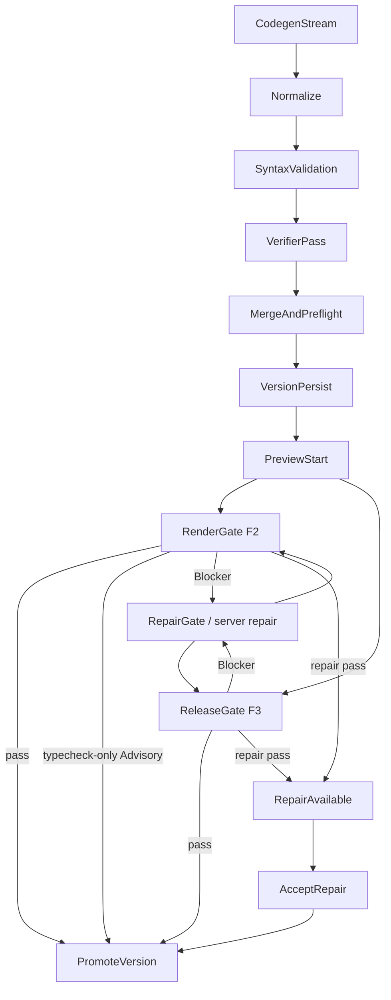

# RenderGate och ReleaseGate

## Scope

Denna sida samlar den mänskligt läsbara kontraktsbilden för Sajtmaskins
RenderGate (kod: `designPreview` quality gate) och ReleaseGate (kod:
`integrationsBuild` quality gate): vilka checks som körs, var de körs, när de
triggas och hur de kopplas till preview, `server-verify` och repair. Kodens
identifierare, telemetri-kategorier och DB-strängar heter fortsatt `quality
gate`, `designPreview`, `integrationsBuild`, `server-verify` och
`product_postcheck.*`; docs använder kanoniska begrepp och mappar till kodnamnen
vid behov.

Primära kodkällor:

- `src/lib/gen/verify/quality-gate-checks.ts`
- `src/lib/gen/verify/preview-quality-gate.ts`
- `src/lib/gen/verify/server-verify.ts`
- `src/lib/gen/verify/repair-loop.ts`
- `src/lib/db/chat-repository-pg.ts`
- `src/lib/gen/stream/post-finalize-policies.ts`
- `src/app/api/engine/chats/[chatId]/quality-gate/route.ts`
- `src/app/api/engine/chats/[chatId]/repair/route.ts`
- `src/app/api/engine/chats/[chatId]/accept-repair/route.ts`
- `src/lib/gen/stream/builder-stream-contract.ts`
- `preview-host/src/runtime.js`

Närliggande docs:

- `docs/schemas/preview-session-contract.md`
- `docs/architecture/llm-pipeline.md` § FAS 3
- `docs/architecture/llm-pipeline.md` § FAS 2

## Vad RenderGate / ReleaseGate är

RenderGate och ReleaseGate är builderns samlingsnamn för verifieringar som
kräver en riktig Next-/Node-miljö och därför körs i preview-hostens isolerade
verify-lane, inte i samma workspace som den live dev-preview användaren ser i
iframen.

De svarar främst på frågan:

- Går det här projektet att installera, typechecka, linta eller bygga enligt
  den policy som gäller för den aktuella versionen?

De är alltså inte samma sak som:

- Normalize (kod: url-expand + autofix + deterministisk import-repair)
- syntaxvalidering i finalize
- verifier-pass (hybrid: deterministiska checks + LLM-audit) — kör
  regex-/AST-baserade guards (t.ex. `undefined-jsx-symbol`,
  `r3f-client-boundary`, `navigation-placeholder-actions`,
  `motion-reduce-canvas-trap`, `motion-reduce-overlay-trap`) innan
  LLM-passet och matar eventuella Blocker-fynd in i RepairGate.
  LLM-fynd i import-/namnupplösningsklassen (`import-name-collision`,
  `build-*-import`) klassas som build-breaking (`isBuildBreakingFinding`)
  och gate:ar F2-verifiering; de force-promotas även från `quality`-
  till `blocking`-lanen om modellen felbucketar dem
- live-previewns `npm run dev`
- CapabilitySmoke (kod: `product_postcheck.*`) som gör capability-specifik
  DOM/render-smoke efter preview och rapporterar varningar/degradations

## Verifier-pass policy efter Normalize

Verifier-pass (hybrid: deterministiska guards + LLM-audit) styrs fortfarande
först av `resolveVerifierPassPolicy()`:

- light/fast follow-up och repair-pass kan fortfarande hoppa över verifiern
- env-/feature-flaggen `isVerifierPassEnabled()` respekteras
- `strict`, högre quality target, app-intent, heavy context och riskabla
  BuildSpec-scope kan fortfarande välja att köra verifiern

Efter det grundbeslutet används **riskklassad Normalize** i stället för
den tidigare volymtröskeln:

| Normalize-resultat | Verifier-beslut när grundpolicyn säger `run` |
|---|---|
| `safeFixCount > 0` och `riskyFixCount === 0` | Verifiern får hoppas över med reason `safe_fixes_only`. |
| `riskyFixCount > 0` | Verifiern körs med trigger/reason `risky_fixes`. |
| 3D-signal (`BuildSpec.capabilityFlags.signals` innehåller `needs3D`/`needsPhysics`, eller orchestration-capability `visual-3d`/`physics-3d`) | Verifiern körs; safe-only-skip används inte. |
| LLM-fix i validate-fasen (`validateAndFix` rapporterar `fixerUsed`/`llmFixCount > 0` — esbuild-syntaxfix eller warm-tsc/warm-eslint via RepairGate) | Verifiern körs med trigger `llm_fixes_in_validate`; safe-only-skip används inte. LLM-omskrivningar är risky per definition. Ren deterministisk import-repair med warm-tsc-kvitto blockerar däremot inte skippet. |
| Grundpolicyn säger `run: false` | Oförändrat: Fas 2 tvingar inte på verifiern på nya vägar. |

`FIXER_REGISTRY` är riskkällan (`risk: "safe" | "risky"`). Okända fixer-id:n
behandlas konservativt som `risky`.

### Normalize risk telemetry

Nya writers skriver `engine_version_error_logs` med category `autofix` och
`meta.event = "autofix_risk"`:

```json
{
  "event": "autofix_risk",
  "fixCount": 4,
  "safeFixCount": 3,
  "riskyFixCount": 1,
  "riskyFixerIds": ["local-symbol-import-fixer"]
}
```

`generation_telemetry.meta.autofix` bär samma riskfält. Historiska
`autofix_heavy_load`-rader skrivs inte längre, men läsare som
`scripts/db/control-stats.mjs` mappar dem som legacy-historik i äldre fönster.

## Preview-lane vs verify-lane

| Lane | Syfte | Typisk körning |
|------|------|----------------|
| Preview-lane | Ge användaren snabb live-preview | `npm install` + `npm run dev` |
| Verify-lane | Bekräfta export-/buildbarhet och ge repair-underlag | `tsc`, ev. `eslint`, ev. `next build` |

Live-previewn kan därför vara redo eller starta samtidigt som RenderGate/ReleaseGate
fortfarande kör i bakgrunden.

## Checks

RenderGate/ReleaseGate använder dessa kod-check-id:n:

| Check | Kommando |
|------|----------|
| `typecheck` | `npx tsc --noEmit` |
| `lint` | `npx eslint . --max-warnings=20` |
| `build` | `npx next build` |

Definitioner finns i `src/lib/gen/verify/quality-gate-checks.ts`.

Verify-lane kan också returnera informativa install-signaler i `results[]`:

| Check | Meaning |
|------|----------|
| `install-cache-share` | Verify workspace återanvände (eller försökte återanvända) `node_modules` från live workspace via fingerprint-match |
| `install-peer-fallback` | Peer-konflikt upptäcktes och fallback med `--legacy-peer-deps` användes |

## Standardprofiler

Profilerna laddas från `config/ai_models/manifest.json` under
`qualityGateTiers` (via `getQualityGateTiersFromManifest()`), med nuvarande
defaultvärden:

| Profil | Checks | Var den används |
|--------|--------|-----------------|
| `DESIGN_PREVIEW_QUALITY_GATE_CHECKS` | `["typecheck"]` | RenderGate för F2 (live-preview + bakgrunds-`server-verify` + repair re-check). Slimmad 2026-04-23. |
| `INTEGRATIONS_BUILD_QUALITY_GATE_CHECKS` | `["typecheck", "build", "lint"]` | ReleaseGate för F3 / promotion-flödet (`/finalize-design`). Lint tillagd 2026-04-21. |

**2026-04-23 förändring av F2-lanen.** `build` och `lint` togs bort från
F2 på VMn eftersom motsvarande pass nu körs pre-VM i Sajtmaskin-backendens
Node-process (`src/lib/gen/preview/warm-typecheck.ts` +
`src/lib/gen/preview/warm-eslint.ts`) via en varm scaffold-cache. De
passen matar RepairGate med samma diagnostik och kan laga felen
innan filerna ens skickas till preview-host. F2 på VMn behåller bara
`typecheck` som billigt skyddsnät (fail-open om warm-cachen är kall).
Gav ~5–20 s snabbare finalize + cirka -5–10 USD/mån i Fly-CPU. F3
(`INTEGRATIONS_BUILD_QUALITY_GATE_CHECKS`) är oförändrad eftersom
integrations-bygget måste producera en valid Next build.

Revert: sätt `qualityGateTiers.designPreview` till
`["typecheck", "build", "lint"]` i `config/ai_models/manifest.json` om
du behöver VM-build-skyddsnätet igen (t.ex. vid debug av Next-runtime-fel).

### F2 render-first: typecheck-only är Advisory (#330, 2026-07-02)

I F2 (`lifecycle_stage !== "integrations"`) failar ett **typecheck-only**-fel
inte längre versionen. `next dev` kör JS oavsett TS-typfel, så previewn
renderar — därför behandlas typfelet som **Advisory**.

**Regelägare (single source of truth):** `isTypecheckOnlyAdvisory()` i
`src/lib/gen/verify/quality-gate-checks.ts`. Båda gate-vägarna använder samma
predikat så de aldrig är oense:

- **Klientvägen** `POST .../quality-gate` promotar versionen (fortfarande via
  `assertPromoteAllowed`) och svarar
  `{ passed: true, vmGatePassed: false, designAdvisory: true, advisoryChecks: ["typecheck"] }`
  i stället för `failVersionVerification`. Vid transient promote-fel
  (`promoteError`/`promoteGuardUnavailable`) följer `designAdvisory` med i
  svaret så klienten inte auto-reparerar en Advisory ändå.
- **Bakgrundsvägen** `triggerServerVerification` (`server-verify.ts`) speglar
  regeln: Advisory → `promoteVersion` FÖRSÖKS FÖRE terminal-emit, och
  `version.verifier.done`-utfallet härleds från om promotionen faktiskt tog
  (`advisoryPromoted`, kodfält). En promote-no-op (lease-takeover/guard/DB) emitterar
  INGEN terminal bus-händelse — terminal bus-`failed` är sticky i
  `reconcileTerminalDbState`, så en förhastad `failed` skulle pinna en falsk
  röd status även efter att versionen promotats någon annanstans. Bussen
  lämnas snurrande; DB-`passed` uppgraderar den, watchdog är backstop.
- `post-checks.ts` kör **ingen** auto-repair-loop (`passed: true` +
  explicit `!data.designAdvisory`-grind).
- Diagnostiken bevaras: summary-loggen blir `warning` (ej `error`) och
  typecheck-raden loggas under `quality-gate:typecheck-advisory`.

**Falsk-grön-skydd** (varför detta inte blir tyst grön):

- Bara F2. F3 (`integrations`) kör alltid full `typecheck + build + lint` hårt.
- Bara när **varje** failande check är `typecheck`. Ett `build`- eller
  `lint`-fel (t.ex. build-origin-repair, `forceBuildCheck`) är Blocker som förr.
- **Bara Advisory-safe diagnostik:** tsc-koder för trasig modul-/export-
  resolution (TS2304/TS2305/TS2307/TS2552/TS2613/TS2614/TS1361/TS2300/TS2440 —
  `RENDER_RISK_TS_CODES`) bryter även `next dev` i runtime och failar hårt.
  Oparsebar tsc-output (inga TS-koder) failar också hårt (fail-closed).
  Advisory gäller alltså bara semantiska typfel (TS2322, TS2339, TS7006, …)
  som `next dev` bevisligen renderar igenom.
- `verifier`/promote-guard (`assertPromoteAllowed`) förblir Blocker — i F2
  blockerar verifierns build-breaking-klass (import-/namnupplösning m.m. via
  `isBuildBreakingFinding` → `verifier_failed`) medan produktkvalitetsfynd
  förblir Advisory; F3 blockerar alla verifier-blocking-fynd.
  `diagnosticOnly`-läget i server-verify Advisory-promotar aldrig.
- Att sidan *över huvud taget* renderar ägs uppströms av finalize-preflight
  (`buildPreviewHtml` + home-route-gate) — en version som inte kan rendera
  når aldrig Advisory-promote.
- `vmGatePassed: false` bevaras så ingen konsument läser Advisory som
  solid-grön build, och båda vägarna emitterar `version.degraded
  {typecheck_advisory}` så status-projektionen visar "klar med varningar"
  (aldrig solid grön). Chat-panelen visar "Godkänd med varningar (typecheck
  advisory)" i amber. Durabelt: promotade radens `verification_summary` bär
  Advisory-texten + `warning`-raden i `engine_version_error_logs`.

**Borttaget 2026-04:** `tier2`, `serverVerify`, `promotion`, `interactive`
konsoliderades till `designPreview` + `integrationsBuild`. Lint-laden
togs bort från background-verify tillfälligt (tysta lint-fail blockerade
verifiering utan att lägga värde), och åter-infördes 2026-04-21 med
`--max-warnings=20` så errors blockerar men warnings tolereras.
Bakgrundsgate:n är dock fortfarande fire-and-forget — se SAJ-28 +
`docs/plans/archived/P34-blocking-lint-in-validate-and-fix.md` för plan att
lyfta lint till blockerande `validateAndFix`-passet.

## När RenderGate / ReleaseGate körs

### 1. Asynkt efter finalize

Efter att `finalizeAndSaveVersion()` har sparat versionen kan
`resolvePostFinalizeServerVerifyDecision()` välja att trigga
`triggerServerVerification()`.

Detta händer inte alltid. Vanliga skäl att hoppa över:

- `verificationPolicy === "fast"`
- versionen är inte eligible
- `previewBlocked === true`
- F2-init utan preflight-fel och utan verifier-Blocker

Vanliga skäl att köra är F3 (`previewPolicy: "fidelity3"`), repair-pass,
icke-blockerande kvalitetsvarningar eller verifier-Blocker. Verifier-Blocker kan
köra diagnostic-only: findings syns, men promotion/reparation sker inte automatiskt.

### 2. Explicit via route

`POST /api/engine/chats/[chatId]/quality-gate`

Tar en `checks`-lista. Minst en check krävs.

### 3. Efter repair

Både `server-verify` och den explicita `repair`-routen kan re-köra RenderGate/ReleaseGate
efter att en reparationsomgång har producerat nya filer.

## Hur RenderGate / ReleaseGate förhåller sig till repair

RenderGate/ReleaseGate är i första hand verifiering, men i dagens arkitektur
används gate-output också som exakt felkälla för RepairGate:

1. RenderGate/ReleaseGate failar
2. feloutput (`typecheck`, `lint`, `build`) samlas
3. **deterministisk, diagnostik-driven import-repair körs FÖRST** (se nedan) på
   de exakta tsc-koderna innan RepairGate
4. om gate:n passerar efter den deterministiska fixen promotas versionen utan
   ett enda LLM-anrop (`method: "deterministic"`, `llmPasses: 0`)
5. annars kör delad `runRepairLoop()` via RepairGate på **residuet** med samma policy
   för både `server-verify` och manuell `/repair`. Loopens LLM-anrop går via
   `runLlmRepairGate()` (Fas 3, se "En repair-port" nedan) med
   ursprungsdiagnostiken (tsc-output inkl. TS-koder) som primära structured
   errors + prior-patch-noter vid pass > 0. Gate-class-failures (ursprunget
   var typecheck/build/lint, esbuild-syntaxen redan ren) bär LLM:ens edit
   vidare till final-gaten och får ETT andra pass inom samma `maxLlmPasses`-
   budget innan loopen ger upp — rena syntaxfel stannar som förut vid första
   syntax-rena passet
6. warm repair försöker skicka bara trasiga filer (+ relevanta imports) till
   RepairGate när felmängden är lokal
7. RenderGate/ReleaseGate re-körs enligt **samma-signal-kontraktet**
   (`resolveSameSignalGateChecks`): varje check som failade i ursprungsgaten
   måste passera igen (union med baslanen) innan versionen blir
   `repair_available`. Ett pass som lagar syntax men inte når
   ursprungssignalens pass rapporteras aldrig som lyckat
   (`syntax_clean_gate_failed`)

### Deterministisk import-repair före LLM

Källa: `src/lib/gen/autofix/deterministic-import-repair.ts`. EN delad
implementation, tre entrypoints:

- **server-repair:** anropas överst i `runRepairLoop()` på RenderGate/ReleaseGate-
  diagnostiken (som tidigare)
- **finalize normalize (Fas 1 kontrollflöde):** anropas i `validateAndFix()`
  (`autofix/validate-and-fix.ts`) när warm-tsc-passet failar — därefter körs
  warm-tsc EN gång till (inget loop, kostnadstak) och endast residuet går
  vidare till `runLlmRepairGate` (phase `warm-tsc`)
- **verifier-pass (prod-incident 2026-07-03):** `runVerifierPhase`
  (`finalize-version/verifier-phase.ts`) översätter `undefined-jsx-symbol`-
  Blockers till `Cannot find name 'X'`-diagnostik
  (`parseUndefinedJsxSymbolFinding`) och kör pre-passen INNAN
  `runLlmRepairGate` (phase `verifier`). Fixen bekräftas med en omkörning av
  den deterministiska `checkUndefinedJsxSymbols`-scannen; bara bekräftat lösta
  findings släpps (RAG-rad `fixer: deterministic-import-repair`,
  `result: fixed`) och residuet går till LLM-fixern. Utan detta lämnade en
  timeoutad LLM-repair trivialt fixbara imports (Link/Button/Badge) som
  Blockers och versionen failade verifieringen.

Bakgrund (prod-telemetri 2026-06/07): av de versioner vars RenderGate/ReleaseGate failade
på `tsc --noEmit` blev **noll** promotade, och 84 % av typecheck-felen är
importhantering. De dominerande felen är import-only och har redan Normalize-
ägare som körs blint i `runAutoFix()` — men de når ändå gate:n eftersom de
blinda heuristikerna är tvetydiga. tsc-diagnostiken namnger exakt symbol + fil,
vilket tar bort tvetydigheten. Pre-passen konsumerar diagnostiken och dirigerar
varje fall till rätt **befintlig** fixer:

| Kod | Felklass | Återanvänd fixer |
|---|---|---|
| TS2304 / TS2552 | saknad import (shadcn, Clerk-server, Stripe, lucide, Next) | `ts2304-known-import-fixer` |
| TS2304 (residual) | egen komponent/symbol som versionens egna filer exporterar (t.ex. `Reveal`) | `own-component-import-fixer` (named: unik-kandidat-injektorn; default: exakt en egen fil) |
| TS1361 | `import type { X }` använd som värde | `value-used-from-type-import-fixer` (med bekräftade symboler) |
| TS2440 | import krockar med lokal deklaration (self-import) | `fixImportedDeclarationConflicts` (path-medveten) |
| TS2300 | duplicerad identifierare | `consolidateReactImports` (react-överlapp, value-wins) → `duplicate-import-binding-fixer` → `duplicate-import-local-type-collision-fixer` |

Obligatoriskt eftersteg per fil som fick import-injektioner: react/same-module-
dedupe + kvitto — `consolidateReactImports`, sedan dubbelbindnings-pruning, och
om filen fortfarande bär **introducerade** dubbelbindningar eller nya parse-fel
revertas filens ändringar (diagnostiken förblir synlig för RepairGate). Ingen
fixer får lämna ifrån sig två import-statements som re-deklarerar samma lokala
bindning (stänger "smörsajt"-klassen: dubbel React-import → TS2300 →
webpack-krasch → preview-500).

Konservativ: bara dessa import-koder rörs. Logik-/typfel (TS2554, TS7006,
TS7009, generiska mismatchar) lämnas till RepairGate. Okända namn utan matchande egen
fil lämnas orörda (befintlig cross-file-checker/stub-hantering nedströms —
Normalize skapar inga nya tysta stubbar). shadcn∩lucide-krocknamn
(`Badge`, `Calendar`, `Table`, …) löses användningsmedvetet (M#badge1):
children/`variant=`/`asChild` ⇒ shadcn-komponenten, ikon-aktig självstängande
användning ⇒ lucide, oklart (t.ex. propp-lös `<Calendar />`) ⇒ lämnas till RepairGate.
Stripe löses bara i API-route-/route-handler-filer. Alla fixers är idempotenta.

**F2/F3-kontrakt (tier-3 SDK):** F2-guarden (`tier3-sdk-guard-fixer`) strippar
tier-3 backend-SDK-importer (`stripe`, `@clerk/nextjs/server`, …) i F2. Pre-passen
får därför INTE lägga tillbaka dem i F2 — det skulle kunna tyst-promota en F2-
version med förbjuden backend-import (promotion-gaten kör bara tsc/lint/build och
re-enforce:ar inte F2/F3). Pre-passen tar `previewPolicy` (trådad från
versionens `lifecycle_stage`: `integrations` ⇒ `fidelity3`) och löser tier-3-
moduler (enligt `isTier3SdkModule`) **endast** i F3. I F2/okänt lämnas de
residual så gaten blockerar. Icke-tier-3 (shadcn/lucide/next) är opåverkat.

Telemetri: `validate.tsc.import-repair` (handledCodes, fixCount, fixers,
cannotFindSummary) och `validate.tsc.import-repair.resolved`
(`llmSkippedBecauseResolved: true`) i dev-loggen, så prod-analys kan se om
autofix saknades, lagade eller orsakade felet. `handledCodes` registrerar
varje faktisk tsc-kod för sig — TS2552 ("Cannot find name … Did you mean …")
särskiljs från TS2304 även om båda löses av samma known-import-fixer, så
statistiken inte buntar ihop dem.

`cannotFindSummary` (stabilisering våg 1, M#imp1-arkeologi) redovisar
cannot-find-klassen per körning: `seenCodes` (distinkta TS2304/TS2552),
`resolvedNames` (`fil::namn` som fick import) och `residual` med `reason`
per namn — `tier3_gated` (resolvbar SDK men F2-gaten stoppade, t.ex.
Stripe/Resend i fidelity2), `ambiguous_shadcn_lucide` (kollision utan
usage-signal), `type_export_value_usage` (typ-only-export som `LucideIcon`
använd i VÄRDE-position — ingen import kan lösa det; modellen måste byta
till en riktig ikon, residualen går till LLM-fixern), `unknown_name` (finns
inte i någon mappning) eller `not_applied` (resolvad men injektionsguard
hoppade över — redan importerad, lokalt deklarerad, server-only-modul i
client-fil, self-import). Samma fält
emitteras på `verifier-pass.deterministic-import-fix` i finalize.
Repair-loopens event loggas även när INGET var fixbart (fixCount 0) så en
körning där alla kandidater gate:ades är observerbar i stället för tyst.

Det betyder att RenderGate/ReleaseGate i nuläget är både verifieringslager och källa till
repair-kontext, medan själva LLM-reparationen fortfarande går genom RepairGate.

### En repair-port: RepairGate (Fas 3)

**All LLM-repair går genom EN port:** `runLlmRepairGate()`
(`src/lib/gen/autofix/llm-repair-gate.ts`). `runLlmFixer` har exakt EN
produktions-callsite (inuti gaten) — vaktad av
`src/lib/gen/autofix/llm-fixer-callsite-guard.test.ts`. Det gäller både
finalize-lanes (syntax/warm-tsc/warm-eslint, verifier, preflight, home-route
recovery, partial-file, merged-syntax) och post-finalize `runRepairLoop()`
(server-verify, build-error-repair, manuell `/repair`).

`RepairLedger` dedupe:ar på
`scopeId:chatId:contentHash:diagnosticFingerprint:requiredFiles`:

- **Inom finalize:** en ledger per finalize-run (`repairScopeId` =
  `{targetVersionId|lineageHash|chatId}:{root|repair-N}`), samma fel i annan
  phase dedupe:as (`phase` loggas men ingår inte i nyckeln).
- **Över lanes (Fas 3):** finalize lämnar över sin ledger + scope via
  `FinalizeResult.repairLedger`/`repairScopeId` →
  `triggerServerVerification`/`triggerBuildErrorRepair` → `runRepairLoop`.
  Samma innehåll + samma diagnostik som redan LLM-lagats i finalize lagas inte
  igen i server-repair. Nyckeln innehåller `contentHash`, så legitima retries
  på NYTT innehåll blockeras aldrig.
- **Manuell `/repair`:** egen HTTP-invokation → fresh per-run ledger med scope
  `{versionId}:manual-repair` (dedupe skyddar identiska retries inom körningen).
- **Aborted-undantag:** ett avbrutet (timeout) försök blockerar inte den
  omedelbara reducerade-budget-retryn — bara fullbordade försök dedupe:ar.

### Base-aware tidig abort (Fas 3)

`runRepairLoop` tar `shouldAbortSuperseded` och kollar vid varje pass-start och
före slutverifieringen om versionen hunnit bli inaktuell (nyare version finns,
eller `files_json` avancerade förbi repair-basen). Om ja avbryts loopen med
`earlyStopReason: "superseded"` → outcome `superseded_by_newer_version`, i
stället för att jobba klart och få resultatet kastat av den bas-bundna saven.
Server-verify markerar då raden superseded (nyare version) eller re-verifierar
aktuella filer (files-advanced, samma väg som stale-base-no-op); leasen släpps
alltid via `finally`.

## Repair-accept (ingen tyst filersättning)

När post-repair RenderGate/ReleaseGate passerar skrivs inte reparerade filer direkt över
`engine_versions.files_json`.

I stället:

1. reparerade filer sparas i `engine_versions.repaired_files_json`
2. versionen sätts till `verification_state = "repair_available"` med `repair_available_at`
3. stream kan skicka `version-repair-available` och versions-API visar `hasPendingRepair`
4. användaren applicerar fixen via `POST /api/engine/chats/[chatId]/accept-repair`
5. timeout-fallback kan auto-accepta efter `repairPolicies.repairAcceptTimeoutMinutes`

Detta gör serverreparation transparent i live-preview: fixen är en synlig,
explicit acceptpunkt i stället för en osynlig overwrite.

### Base-bound accept (#265)

Sedan #265 lagras `repaired_files_json` som ett kuvert `{ v, baseFilesHash, files }`,
där `baseFilesHash` är SHA-256 av exakt det `files_json` repairen baserades på.
`saveRepairedFiles` binder skrivningen atomiskt till basen (`WHERE files_json = base`),
och `acceptRepair` + timeout-autoaccept vägrar promota om nuvarande `files_json`-hash
≠ `baseFilesHash` (en samtidig user-edit hann emellan) eller om payloaden är en legacy
plain-array utan bas-hash (fail-closed → användaren kör om repair). Promoteringen körs
dessutom under en aktiv-lease-grind (`engine_version_jobs`). Detta stänger
repair-vs-user-edit-clobbern (#260 P2 #5).

## Strukturerat repair-underlag (`errorManifest`)

`runRepairLoop()` använder `buildGroupedRepairErrorContext()` för att gruppera
fel per fil och prioritera utifrån importgraf:

- diagnostics extraheras från RenderGate/ReleaseGate-output + syntaxfel
- grupperas till `RepairErrorManifest` (`file`, `importedByCount`, `dependsOn`, diagnostics)
- sorteras så hög-impact-filer hanteras först

Samma manifest sparas i verify/repair-loggarnas metadata (`errorManifest`) så
det går att se exakt vilket felunderlag repair-fasen jobbade med.

## Installstrategi i verify-lane

Verify-lane installerar nu i två steg:

1. kör normal install utan `--legacy-peer-deps`
2. bara vid detekterad peer-konflikt, kör fallback med `--legacy-peer-deps`

Samtidigt försöker verify-lane dela `node_modules` mellan live och verify
workspace när dependency fingerprint matchar, för att minska dubbla installer.

## Blocker och Advisory

I preflight-/preview-kontraktet finns en viktig skillnad:

- **Blocker** kan stoppa preview, verification eller promote.
- **Advisory** ska synas i status/diagnostik men inte stoppa preview.

Typiska Blocker-fall:

- `code_structure_failure`
- `dependency_install_failure`
- `env_config_missing`

Typiska Advisory-fall:

- SEO-signaler
- analytics-varningar
- vissa scaffold-/kvalitetssignaler

SEO-varningar ska alltså inte tolkas som att RenderGate/ReleaseGate blockerar previewn.

## Relation till andra steg i pipeline

RenderGate/ReleaseGate ligger efter finalize/persist och efter preview-start-handoff i den
större builder-kedjan:



### Promote-guard fail-closed-policy (false-green-härdning, B08)

`PromoteVersion`/`AcceptRepair` konsulterar `assertPromoteAllowed`
(`src/lib/db/promote-guard.ts`): en version får inte nå `promoted` medan
finalize-telemetrin (`generation_telemetry.quality_gate_result`) säger
`verifier_failed`/`preflight_failed`.

- **`/quality-gate`-routen failar closed men retrybar** vid läsfel: routen anropar
  guarden med `{ onReadError: "indeterminate" }`. Kan signalen inte läsas (DB-/guard-fel)
  → ingen promotion, men raden markeras **inte** terminalt `failed` (svar `passed:false` +
  `promoteError:true` + `promoteGuardUnavailable:true`, klienten kan retry:a). Detta stänger
  fail-open-hålet där ett telemetri-läsfel kunde promota en `verifier_failed`-version.
- **`shouldPromoteAfterRepair` promotar aldrig på tomma results:** när verify-lanen saknas
  (`!isQualityGateConfigured()`) returneras `promote:false`/`results:null` — en overifierad
  repair tolkas aldrig som grön.
- **Medvetet kvar (back-compat):** ett `null`-signal (ingen telemetri-rad: template-import,
  rollback-drafts, äldre rader) tillåter fortfarande promotion. Kanoniska
  `promoteVersion`/`acceptRepair` behåller default-fail-open på läsfel; routen opt:ar in i
  fail-closed via `onReadError`.

## Server-repair outcome metadata (Wave 5 hot-fix #3)

`buildServerRepairOutcomeMeta` i `src/lib/gen/verify/server-verify-log-meta.ts`
producerar `repair-outcome`-loggar med följande fält:

| Fält | Typ | Beskrivning |
|---|---|---|
| `method` | `"deterministic" \| "llm"` | Vilken repair-strategi som kördes |
| `llmPasses` | `number` | Antal RepairGate-anrop i loopen |
| `repaired` | `boolean` | True om RenderGate/ReleaseGate passerade efter repair |
| `remainingErrors` | `number?` | Antal kvarvarande **esbuild-syntax**-fel — ej tsc/build |
| `remainingErrorsSource` | `"esbuild_syntax" \| "quality_gate"` | Vilken pass siffran kommer från (Wave 5) |
| `syntaxCleanGateFailed` | `boolean` | True när esbuild = 0 men typecheck/build fortfarande failar (Wave 5) |
| `earlyStopReason` | `"fixer_noop" \| "no_improvement" \| "time_budget_exceeded" \| "superseded" \| null` | Varför loopen bröts |
| `outcome` | `ServerRepairOutcome` | **Kanonisk outcome-enum (Fas 0)** — se nedan |

**Varför detta finns:** Tidigare loggar visade "Kvarvarande fel: 0" samtidigt
som typecheck failade. Det beror på att `remainingErrors` läses från
`validateGeneratedCode` (esbuild parse), inte från RenderGate/ReleaseGate. Wave 5
lade till `remainingErrorsSource` + `syntaxCleanGateFailed` så UI/loggar
kan disambigueras: "0 syntaxfel (esbuild) — men RenderGate/ReleaseGate failar fortfarande".

### Kanonisk repair-outcome-taxonomi (Fas 0)

`resolveServerRepairOutcome` (`src/lib/gen/verify/server-verify-log-meta.ts`) är
**en enda ägare** för både `meta.outcome` och loggmeddelandet. Både
`server-verify.ts` (`logRepairOutcome`) och `repair/route.ts` (`logRepair`)
bygger meddelandet härifrån — inga egna fritext-ternärer. `control-stats.mjs`
grupperar på `meta->>'outcome'` (query `serverRepairOutcomes`).

| `outcome` | Betyder |
|---|---|
| `repaired` | Gate passerade efter repair (samma-signal-kontraktet uppfyllt) |
| `syntax_clean_gate_failed` | esbuild rent, men typecheck/build failar |
| `syntax_errors_remain` | esbuild-syntaxfel kvar efter alla pass |
| `time_budget_exceeded` | Loopen bröts på wall-clock-budget |
| `superseded_by_newer_version` | Fas 3: tidig abort — versionen blev inaktuell under repairen (nyare version / `files_json` avancerade) |
| `no_improvement` | Loopen förbättrade inget (icke-tyst fallback) |
| `fixer_noop` | Fixern producerade ingen ändring (inkl. ledger-dedupad attempt) |
| `no_context` | Ingen actionable felkontext att repair:a |

**Gammal→ny-mappning** (fritext ersatt, inte parallellt namn):

| Gammal fritext | Ny `outcome` |
|---|---|
| `Server repair succeeded (…).` | `repaired` |
| `…syntax clean but quality gate still failing…` | `syntax_clean_gate_failed` (legacy-fritext) |
| `…N esbuild syntax errors remain…` | `syntax_errors_remain` |
| `…time budget exceeded…` | `time_budget_exceeded` |
| `…0 errors remain…` (route-loggen, gate failade ändå) | `syntax_clean_gate_failed` (**bugfix**) |

Historiska rader saknar `meta.outcome`; läsare (`control-stats`, backoffice)
bucketar dem som `(historisk/utan-outcome)`.

## Telemetri-fält: dossier-val & deploy-utfall (Fas 0)

`generation_telemetry` skrivs av `persist-telemetry.ts` + deploy-flödet:

| Fält / plats | Skrivs av | Läses av |
|---|---|---|
| `meta.selectedDossierIds` (`string[]`) | `persistTelemetryRecord` (endast när ≥1 dossier valdes) | `control-stats` (`dossierUsage`) |
| `deploy_result` (kolumn, t.ex. `production:ready` / `preview:queued` / `production:error`) | `recordDeployResultForVersion` från `POST /api/v0/deployments` (best-effort, senaste telemetri-raden för versionId) | `control-stats` (`deployOutcomes`), backoffice generation-history |

Ingen migration: `deploy_result`-kolumnen finns redan och dossier-val lagras i
befintlig `meta` (jsonb). Tomma dossier-listor skrivs inte → historiska rader
utan nyckeln = "ingen dossier".

## Telemetri-fält: ärlig `preview_success` (M#pv1)

`generation_telemetry.preview_success` (kolumn `boolean` nullable) är en
**tri-state** som betyder "svarade preview-runtimen?", inte "blockerade
preflighten previewn?". Semantiken ägs numera av två skrivare:

| Läge | Betyder | Skrivs av |
|---|---|---|
| `true` | Runtime-ready-kvitto: preview-host `/status` rapporterade `running: true` för versionens session (verifierad via `tryResumeTier2Runtime`/`fetchPreviewHostStatus`). | `recordPreviewRuntimeOutcomeForVersion` — stämplas vid kvittopunkterna: **`POST /preview-heartbeat` (normalvägen — klienten heartbeat:ar ~25 s medan iframen lever; routen verifierar kvittot med ETT host-`/status`-anrop innan stämpel, one-shot per version/instans via confirmed-cachen)**, `GET /preview-status` (running-grenen, suspect/recovery-vägen), `POST /preview-session` (resume-verifierad väg) och post-finalize (resume-verifierad start). |
| `false` | Bekräftat ingen fungerande preview: previewn blockerades (preflight/verifier) eller preview-sessionen kunde inte startas. | `persistTelemetryRecord` (preflight-block) + `recordPreviewRuntimeOutcomeForVersion` (start-fel i post-finalize) |
| `null` | Pending/obekräftat: en färsk boot köades men bekräftades aldrig, eller ingen preview kördes. | `persistTelemetryRecord` (default) |

**Monotont OCH atomiskt kontrakt** (en enda writer,
`recordPreviewRuntimeOutcomeForVersion`): monotoniteten sitter i själva
UPDATE-satsens `WHERE` (en enda villkorad sats, ingen förläsning — två racande
kvitton kan aldrig låta "sist committad vinner"): `true`-stämpel kräver
`preview_success IS DISTINCT FROM true` (`null→true`, `false→true` OK — senare
bekräftad boot vinner över tidigare startfel); `false`-stämpel kräver
`preview_success IS NULL` (endast `null→false`; en fördröjd `false` kan aldrig
skriva över en bekräftad `true`). Målraden (senaste telemetri-raden för
versionen) löses av en subquery i samma sats. Best-effort: kastar aldrig i het
väg; `GET /preview-status` schemalägger stämpeln via `after()` (post-response,
blockerar aldrig status-svaret) och writerns per-instans confirmed-cache gör
upprepade polls efter bekräftelse helt DB-fria. Stämplar bara när versionen är
knuten till sessionen (`/preview-status` kräver session↔version-match innan
running-grenen, och hostens `/status` re-verifierar versionId). Ingen ny
polling — alla stämpelpunkter hänger på befintliga anrop. Känt smalt kant-race
(kvittot binds till versionId, inte till innehållsrevisionen VM:en servar) är
loggat som P3 (M#pv4) i `BUG-SWARM-BACKLOG.md`.

**Varför:** preview-host `/preview/session/start` (+ `/update`) köar bootet och
svarar `201` **innan** `npm run dev` servar. Session-skapad ≠ runtime-överlevde.
Prod-bevis 2026-07-03: `preview_success=true` på verifier-blockerade versioner och
på en version vars dev-runtime dog i en EADDRINUSE/orphan-loop.

**Lifecycle-telemetrin följer samma semantik (runda 4):** post-finalize loggar
`kind: "preview_url_handoff"` för en köad boot (URL:en lämnad till klienten,
runtime EJ bekräftad — samma fält som `preview_ready` så latens-analys
fungerar) och reserverar `kind: "preview_ready"` för det resume-verifierade
kvittot — incident-tooling som läser `preview_ready` som "runtime uppe" får
inga falska gröna. `preview-ready`-**SSE:n** emitteras oförändrat i båda
fallen (den är klientens URL-handoff: `stream-handlers.ts` sätter iframe-URL
+ sessionsmetadata på den, och sync-JSON-fallbacks läser den) men bär nu det
ärliga fältet `runtimeConfirmed: boolean` (additivt i
`BuilderPreviewReadyPayload`).

**Gammal→ny-mappning** (ersatt semantik, inte parallellt fält):

| Gammalt värde (skrevs vid finalize) | Betydde | Ny semantik |
|---|---|---|
| `true` (`!hasPreviewBlockingPreflightErrors`) | "preflight blockerade inte previewn" — sattes FÖRE previewförsöket, ljög grönt | Skrivs inte längre vid finalize. `true` kräver nu ett runtime-ready-kvitto. |
| `false` (`hasPreviewBlockingPreflightErrors`) | preflight blockerade previewn | Oförändrat `false` (bekräftat ingen preview). |

**Läsare (redan tri-state-medvetna, ingen ny kolumn):**

- `scaffold-scoring.ts` (SAJ-49) och `scripts/db/scaffold-scores.mjs`
  exkluderar `null` (pending/infra-brus) och rankar bara bekräftade utfall.
- `scripts/db/control-stats.mjs` `telemetryTotals` skiljer
  `preview_ready` / `preview_failed` / `preview_pending` (tidigare buntades
  `null` in i `preview_not_ok`) och redovisar pre-cutoff-rader separat som
  `legacy_preview_flag`; `byScaffold.preview_ready` = bekräftat redo efter
  cutoff.
- Backoffice `generation_history._preview_label`: `ready` / `failed` /
  `pending`, och pre-cutoff `true` renderas som `legacy (preflight)` (läser
  radens `created_at`; cutoff-värdet dupliceras från `control-stats.mjs` med
  käll-pekare — oparsebar timestamp behandlas konservativt som legacy).

**Historiska rader — hård cutoff i aggregaten:** rader före semantik-cutoffen
(`PREVIEW_SUCCESS_SEMANTIC_CUTOFF = 2026-07-03T14:30:00Z` i
`scripts/db/control-stats.mjs` — satt EFTER förväntad merge+deploy av PR #377
med marginal; justeras framåt om deployen sker senare) bär gamla,
överoptimistiska `true`-värden. Ett 14-dagarsfönster som straddlar bytet
skulle annars rapportera exakt den false-green semantikbytet tar bort — därför
räknas pre-cutoff-rader ALDRIG in i `preview_ready`-KPI:n utan bucketas som
`legacy_preview_flag`. Fel-riktningen är medvetet konservativ: en
ny-semantik-rad som hamnar före cutoffen bucketas som legacy (underskattar
`preview_ready`, aldrig false-green). Ingen migration — semantiken bor i
skrivarna/läsarna, inte i kolumnen.

## Baslinje 2026-07-02 (Kontrollflöde-konsolidering, Fas 0)

Fryst referens för Fas 6-mätningen. 14-dagarsfönster t.o.m. 2026-07-02
(115 genereringar, 41 chattar). **OBS:** fönstret ligger mestadels *före*
render-first-bytet och dagens punktfixar (#346/#354/#356) — effekten mäts om
per våg, inte rakt mot dessa tal.

| Mätvärde | Baslinje | Mål (efter Fas 1–4) |
|---|---|---|
| RenderGate/ReleaseGate pass | 84 % | 90–93 % |
| Typecheck som first failure | 99 % av gate-fails | < 60 % |
| Importrelaterade TS-fel | 84 % av felträffar | < 35 % |
| Verifier skippad | 69 % (volymstyrd) | riskbaserad |
| Gate-failade räddade av repair | 1/28 (3,6 %) | > 25 % |
| Versioner som slutar failed | 38 % | < 25 % |

Källa: `scripts/db/control-stats.mjs` (14 d) + kodverifiering mot master 2026-07-02.

### Fas 6 mätavstämning

Den här toolingen äger bara jämförelse och syntetiska fixtures. Själva
prod-mätningen ägs av orkestratorn/ägaren, eftersom den kräver prod-snapshot
och databasåtkomst.

Kör avstämningen så här:

```bash
npm run env:pull:prod-snapshot
node scripts/db/control-stats.mjs --json --env=.env.vercel.production.pulled --days=14 --allow-insecure-ssl > /tmp/control-stats-current.json
npm run stats:compare -- --baseline scripts/observability/control-stats-baseline-2026-07-02.json --current /tmp/control-stats-current.json --md
```

Eval-sviten för de historiska import-/repair-klasserna är CI-buren via vanlig
Vitest och kan köras riktat med:

```bash
npx vitest run src/lib/gen/autofix/eval/
```

## RepairGate incomplete-files-skydd (Wave 5 hot-fix #5)

`runLlmFixer` (kod-legacy bakom RepairGate) i `src/lib/gen/autofix/llm-fixer.ts` validerar varje returnerad
fil **före merge** med `validateCompleteFiles`. Filer som flaggas som ofullständiga
exkluderas från merge och rapporteras tillbaka i `FixerResult.incompleteFiles`:

| `reason` | Heuristik |
|---|---|
| `shrink_below_50pct` | Ny fil < 50 % av originalets längd (för originalfiler ≥ 200 tecken) |
| `ellipsis_or_rest_unchanged_tail` | Slutar med `// ...`, `/* rest unchanged */`, `// rest of the code unchanged` etc. |
| `unbalanced_delimiters` | `{` `(` `[` obalanserade (string/comment-aware räknare) |

Detta är klassen av bugg bakom historiska "missing `}`"- och "ButtonProps"-incidenter:
RepairGate returnerade tidigare en partial file som mergades direkt och korrumperade projektet
medan esbuild-passet senare rapporterade 0 fel.

## Dokumentationsstatus

RenderGate/ReleaseGate finns redan dokumenterad, men utspritt:

- `docs/schemas/preview-session-contract.md` — verify-lane och API-kontrakt
- `docs/architecture/llm-pipeline.md` § FAS 3 — runtimebild, tier-2 vs verify-lane
- `docs/architecture/llm-pipeline.md` § FAS 2 — relation till finalize och `server-verify`

Den här sidan finns för att ge en enda sammanhållen ingångspunkt.
