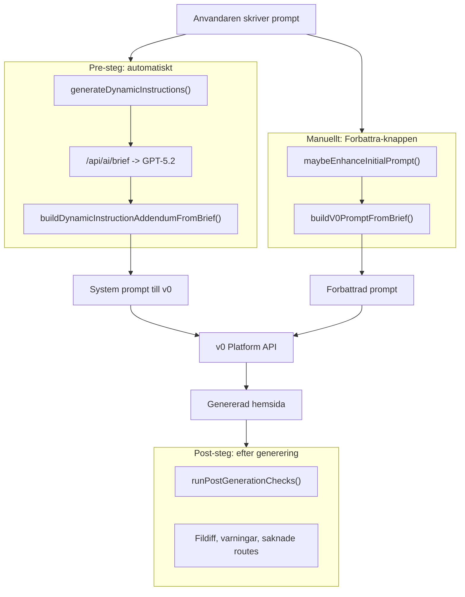

# Dynamisk prompt-guidning

## Bakgrund

Idag anvander `buildDynamicInstructionAddendumFromBrief()` i [src/lib/builder/promptAssist.ts](src/lib/builder/promptAssist.ts) (rad 510-514) **statiska konstanter** for motion, visuell identitet och kvalitetsribba. Oavsett om briefen sager "rosa, lekfull, hjartan" eller "svart, aggressiv, motorcyklar" far v0 exakt samma guidning:

```
"Pick a distinct font pairing (e.g., Inter + Space Grotesk)"
"Add tasteful hover states, scroll-reveal animations"
"Aim for a premium, layered look: cards with borders, soft shadows"
```

Det ar har den storsta forbattringen finns.

## Hur tools/agents fungerar idag

Tva saker hander **fore** v0-genereringen:




- **Pre-steget** (automatiskt): Genererar dynamiska instruktioner som blir systemprompt. Har ar dar de statiska konstanterna anvands.
- **Forbattra-knappen** (manuellt): Omskriver prompten till en battre v0-prompt. Anvander `buildV0PromptFromBrief()` som har sin egen hardkodade guidning.
- **Post-steget**: Kollar filforandringar, varningar etc. efter generering.

De "tool calls" du ser i chatmeddelanden (t.ex. `tool:model-info`, `tool:post-check`) ar **UI-metadata** -- inte exekverbara verktyg. De visar information i chatten.

## MCP-server for slutanvandare: AVRADES

v0:s Platform API konsumerar inte MCP-servrar. v0 tar emot `system` + `message` + `attachments`, inte MCP-resurser. Den befintliga MCP-servern (`sajtmaskin-mpc`) ar for dig i Cursor -- den exponerar dokumentation som du kan fraga om. Att bygga en MCP-integration for slutanvandare skulle innebara:

- Konvertera MCP-resurser till text som stoppas in i systemprompts (omvag)
- Underhalla en extra server for varje projekt
- Ingen direkt koppling till v0

**Enklare alternativ som redan finns:** Systemprompten + dynamiska instruktioner + briefen. Det ar dar forbattringen ska ske.

## Andringen: dynamiska guidningsfunktioner

### Steg 1: Skapa guidningsfunktioner (ny kod)

I [src/lib/builder/promptAssist.ts](src/lib/builder/promptAssist.ts), ersatt de statiska tilldelningarna (rad 510-514) med funktioner som tar briefens data som input:

```typescript
function resolveMotionGuidance(tone: string[], styleKeywords: string[]): string[] {
  const base = [...MOTION_GUIDANCE.detailed];
  if (tone.some(t => ["playful","fun","energetic"].includes(t.toLowerCase())))
    base.push("Use bouncy, playful micro-interactions and generous easing.");
  if (tone.some(t => ["professional","corporate","serious"].includes(t.toLowerCase())))
    base[0] = "Add restrained, professional motion: subtle fades and clean transitions.";
  if (styleKeywords.some(k => ["minimal","clean","simple"].includes(k.toLowerCase())))
    return base.filter(l => !l.includes("at least 2"));
  return base;
}
```

Liknande funktioner for:

- `resolveVisualIdentityGuidance(colorPalette, styleKeywords, tone)` -- anpassar bakgrundsguidning for morka vs ljusa teman, lekfulla vs strama stilar
- `resolveQualityBarGuidance(tone, styleKeywords)` -- justerar layoutvariationer baserat pa scope (one-pager vs multi-page)

### Steg 2: Anvand funktionerna i `buildDynamicInstructionAddendumFromBrief()`

I [src/lib/builder/promptAssist.ts](src/lib/builder/promptAssist.ts), rad 510-514, byt:

```typescript
// FORE (statiskt):
const motionGuidance = MOTION_GUIDANCE.detailed;
const visualIdentityGuidance = VISUAL_IDENTITY_GUIDANCE.detailed;
const richnessGuidance = QUALITY_BAR_GUIDANCE.detailed;

// EFTER (dynamiskt):
const motionGuidance = resolveMotionGuidance(tone, styleKeywords);
const visualIdentityGuidance = resolveVisualIdentityGuidance(colorPalette, styleKeywords, tone);
const richnessGuidance = resolveQualityBarGuidance(tone, styleKeywords);
```

### Steg 3: Extrahera brief-data som idag inte anvands

Runt rad 475, lagg till extraktion av styleKeywords och colorPalette som redan finns i briefen men inte anvands for guidning:

```typescript
const styleKeywords = asStringList(brief?.visualDirection?.styleKeywords);
const colorPalette = brief?.visualDirection?.colorPalette || {};
```

### Steg 4: Forbattra `buildDynamicInstructionAddendumFromPrompt()` (utan brief)

For fallet nar ingen brief genereras (shallow mode), kan `formatPromptForV0()` redan extrahera stilord. Anvand dessa for att valja `.compact` vs anpassad guidning.

## Filer som andras

- [src/lib/builder/promptAssist.ts](src/lib/builder/promptAssist.ts) -- Huvudfilen. Nya funktioner + uppdaterade anrop. De statiska konstanterna behalls som fallback/bas.

Ingen annan fil behover andras. Andringen ar isolerad till en fil.