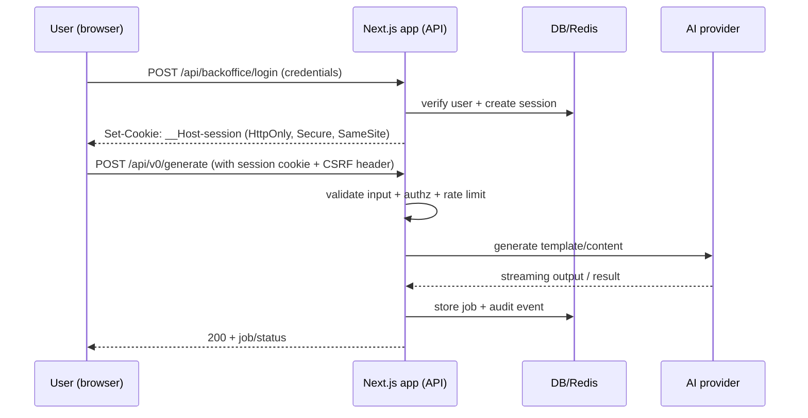
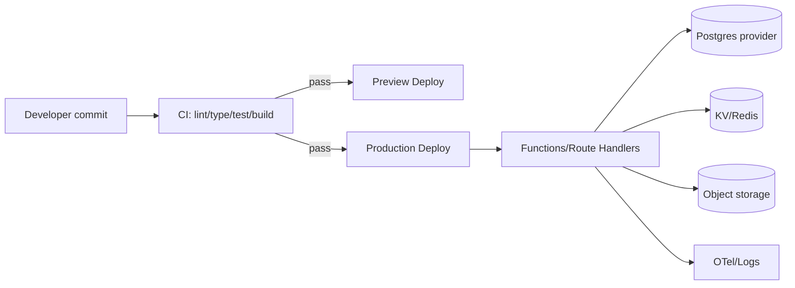

# Teknisk granskning av Sajtmaskin som publik kodbas

## Sammanfattning

Sajtmaskins publika yta beskriver tjänsten som en “AI‑driven webbplatsgenerering” och anger uttryckligen att JavaScript krävs för att använda applikationen samt att den är i “tidig betafas”. citeturn24search0 Sajtstudio beskriver samtidigt en plattform (SajtMaskin) som ska kunna generera “produktionsklar kod” och som går att redigera fritt, med SEO‑fokus. citeturn14search2 Dessa signaler ger en tydlig riskprofil: hög förändringstakt, många attackytor (AI‑generering, innehållsrendering, backoffice) och en driftsmiljö som sannolikt är serverless (vercel.app‑domän). citeturn24search0

**Övergripande betyg (fjärde, opartisk): 4/10.** Motivering: Den publika “kodbasen” (repo/filinnehåll) gick inte att verifiera som faktiskt offentligt åtkomlig via webbresearch i den här sessionen, vilket gör att en kodnära kvalitetsbedömning (säkerhet/underhållbarhet/prestanda) inte kan beläggas med primär källtext. Med den begränsningen vägs betyget mot (a) uttalad tidig beta, (b) en produktkategori som typiskt kräver strikt säkerhets‑ och driftmognad (auth, uppladdningar/generering, externa anrop, databashantering), samt (c) den serverless‑ och leveransmiljö som kräver disciplin kring state, filer, timeouts och observability. citeturn24search0turn29search0turn33search13

## Underlag och metod

Granskningen baseras på: (1) offentliga produkttexter för Sajtmaskin och Sajtstudio, (2) officiell dokumentation och “cheat sheets” för Next.js/Vercel‑drift och webbsäkerhet, samt (3) etablerade rekommendationer för secrets, sessions, CSRF, SSRF, rate limiting, observability och dependency hygiene. citeturn24search0turn14search2turn28search1turn28search3turn31search2turn33search13turn34search0

Avgränsning: Trots att du specificerar att repo:t ska innehålla filer som `package.json`, `tsconfig.json`, `next.config.ts`, `scripts/refresh-token.mjs`, `scripts/db-init.mjs` och `src/**` (inkl. backoffice auth och route handlers), gick det inte att hitta eller öppna ett verifierbart publikt repo för Sajtmaskin under denna research. Därför är åtgärderna nedan formulerade som en **högprecision‑checklista** knuten till de fil‑/modulnamn du angav, men utan påståenden om exakt nuvarande implementation.

Den publika sidan uppger att JavaScript krävs, vilket i praktiken innebär att centrala flöden och API‑beteenden inte syns i statisk HTML‑rendering här. citeturn24search0

I texten nedan nämns följande organisationer en gång vardera: entity["company","Pretty Good AB","swedish company"], entity["company","Sajtstudio","swedish web agency"], entity["company","Vercel","cloud deployment platform"], entity["company","GitHub","code hosting platform"] och entity["organization","OWASP","security nonprofit"].

## Riskbild för en Next.js/Vercel‑liknande Sajtmaskin‑kodbas

Applikationer som kombinerar (a) backoffice‑inloggning, (b) API‑endpoints som tar emot användarinput och genererar/returnerar innehåll, och (c) externa anrop (AI‑modell, template‑kataloger, ev. fetching av URL:er) hamnar snabbt i en hot model där **sessionhijacking, XSS/CSRF, SSRF och abuse via oautentiserade endpoints** blir de mest sannolika incidentklasserna. citeturn28search1turn28search3turn31search0turn29search4

Driftmässigt kräver Vercel‑liknande serverless execution att ni planerar för: skrivskyddat filsystem med begränsad `/tmp`‑yta, bundle‑storleksgränser, kalla starter, samt att långkörande jobb (t.ex. AI‑generering) ofta behöver kö/async‑modell snarare än “en request = ett helt bygge”. citeturn29search0turn29search3

Om ni använder Vercel Marketplace‑Postgres (Neon/Supabase/Aurora m.fl.) beror backup/restore, PITR och retention på vald leverantör; historiskt “Vercel Postgres” hade explicita begränsningar kring automatiska backups, och Vercel har dessutom avvecklat den produkten och flyttat befintliga databaser till Neon. citeturn34search6turn34search14turn34search5

## Prioriterade åtgärder och kritik

### Översiktstabell över 25 åtgärder

| Issue | Severity | File(s)/Location | Suggested Fix | Estimated Effort |
|---|---|---|---|---|
| Tokens/session i localStorage eller JS‑åtkomliga cookies | High | `src/**/auth*`, client auth helpers | Flytta till HttpOnly‑cookie‑baserad session; undvik localStorage för känsligt | M |
| Saknade/svaga cookie‑attribut (Secure/HttpOnly/SameSite) | High | API login/logout, `NextResponse` headers | Sätt `Secure`, `HttpOnly`, `SameSite=Lax/Strict`, snäv `Path`, ev. `__Host-` prefix | S |
| CSRF‑skydd för state‑changing endpoints | High | `src/app/api/**`, backoffice actions | CSRF‑token (double submit eller cookie‑to‑header) + Origin/Referer checks | M |
| Otillräcklig inputvalidering (schema) | High | `src/app/api/**/route.ts` | Inför Zod/Valibot‑schema, strikt allowlist, maxlängder, MIME‑kontroll | M |
| SSRF‑risk vid URL‑fetch (t.ex. “import”, webhook, AI‑verktyg) | High | `v0-generator.ts`, `content/route.ts`, integrations | Allowlista hosts; block privata IP‑intervall; stäng redirects | M |
| Rate limiting saknas (auth, generering, offentliga API:er) | High | `middleware.ts` / API route handlers | Inför rate limiter (Edge/serverless‑anpassad) + 429‑policy | M |
| Secrets i repo eller loggar (API keys, refresh tokens) | High | `scripts/*.mjs`, `.env*`, logging | Flytta till Vercel env vars (sensitive); aktivera secret scanning/push protection | S |
| Osäker TLS‑konfig mot DB (t.ex. `rejectUnauthorized:false`) | High | DB‑client config | Kräva TLS och cert‑verifiering; styr via env; dokumentera | S |
| Ad‑hoc DB init istället för migrations | High | `scripts/db-init.mjs`, schema | Inför migrationsverktyg + idempotent init; versionera schema | M |
| Backup/restore plan saknas eller ej testad | High | Ops/runbook | Definiera RPO/RTO; automatisera backups via DB‑provider; kvartalsvisa restore‑tester | M |
| Brist på audit log för backoffice‑åtgärder | Med | backoffice endpoints, DB | Skriv audit‑events (vem/vad/när); separera från app‑logg | M |
| Brist på observability (spårning/structured logs) | Med | `instrumentation.ts`, server logs | Inför OTel + request‑ID; dashboards/alerts | M |
| För mycket “naiv” logging av användarinput/PII | Med | API route handlers | Redaction, log levels, inga tokens i logs; privacy review | S |
| Avsaknad av feature flags/kill switch | Med | `v0-generator.ts`, experiment | Feature flags för risky features + emergency disable | S |
| Toolchain ej pinnad (Node/npm/pnpm) | Med | `package.json`, CI | `engines`, Volta pinning; CI använder samma version | S |
| Dependency hygiene saknas (lockfile, audits, renovate) | Med | lockfile, CI | Lås versions, uppdateringsbot, `npm audit`/SCA policy | M |
| CI/CD saknar quality gate | Med | `.github/workflows/**` | Lint+typecheck+tests+build; blockera merge på fail | M |
| Testtäcke otillräckligt (unit/integration/e2e) | Med | `src/**`, `tests/**` | Lägg till miniminivå: auth, API, rendering, regressions | L |
| SSR/SSG/ISR‑strategi otydlig | Med | `next.config.ts`, route handlers | Bestäm cachepolicy; använd ISR där möjligt; undvik oavsiktlig dynamik | M |
| Serverless‑antaganden om filsystem och state | Med | genereringsflöden, exports | Skriv inte persistenta artefakter lokalt; använd Blob/object storage | M |
| Function limits/timeouts riskerar att fälla generering | Med | generator routes, streaming | Dela upp i jobb; background queue; timeout‑budget | M |
| CSP/security headers saknas eller är för svaga | Med | `next.config.ts` / `middleware.ts` | CSP (nonce‑baserad), HSTS, frame‑ancestors, referrer‑policy | M |
| XSS‑risk via HTML‑injektion (AI‑genererad content) | Med | rendering pipeline | Output encoding/sanitization; CSP; block `dangerouslySetInnerHTML` | M |
| Licens/SBOM/compliance saknas | Low | `LICENSE`, `NOTICE`, CI | Lägg licens; generera SBOM; dependency license check | S |
| Dokumentation/runbooks saknas (drift, incident, migrations) | Low | `README.md`, `/docs` | Skriv runbook: deploy, rollback, env, backups, incident | M |

### Prioriterad lista med 25 konkreta åtgärder

1) **Avveckla localStorage för auth‑bärande data.** OWASP avråder från att lagra känsliga uppgifter i localStorage eftersom ett enda XSS kan exfiltrera allt; använd HttpOnly‑cookies eller sessionStorage med mycket strikt hardening om ni tvingas. citeturn29search4turn28search1

2) **Säkerställ hardened session cookies.** För session‑/auth‑cookies: sätt alltid `Secure`, `HttpOnly` och `SameSite`, samt snäv `Path` och undvik onödigt `Domain`. citeturn28search1turn28search3

3) **Inför explicit CSRF‑skydd på alla state‑changing endpoints.** SameSite hjälper, men ersätter inte CSRF‑token; lägg till token‑mönster och validera Origin/Referer för försvar‑i‑djupet. citeturn28search3

4) **Gör inputvalidering “default‑deny” i `route.ts`.** Varje request body/query måste ha schema (maxlängder, regex/enum, fil‑MIME) samt konsekventa felkoder; detta är också en grund för att minska prompt‑injection och datakvalitetsproblem i AI‑flöden. citeturn31search0turn29search4

5) **Bygg SSRF‑skydd i alla flöden som tar en URL eller gör outbound fetch på användarinput.** OWASP rekommenderar allowlist där möjligt, blockering av privata IP‑intervall, och att redirects inte ska följas vid validering. citeturn31search0turn31search1

6) **Lägg rate limiting i middleware för auth och generering.** Använd en serverless/edge‑anpassad rate limiter (REST‑baserad) och returnera 429 tidigt för att skydda både AI‑kostnader och brute force. citeturn31search2turn31search4

7) **Separera “refresh token”‑hantering från dev‑scripts och skydda secrets end‑to‑end.** Flytta hemligheter till plattformens env vars och slå på secret scanning/push protection för att blockera läckor innan de landar i repo. citeturn34search2turn33search0turn33search3

8) **Använd “Sensitive Environment Variables” för API‑nycklar och privata certifikat.** Dessa värden är icke‑läsbara efter skapande och är avsedda för secrets. citeturn34search2turn34search4

9) **Styr miljö‑konfiguration strikt per environment (dev/preview/prod).** Vercel‑miljövariabler är krypterade “at rest” och appliceras på nya deploys; dokumentera exakt vilka variabler som behövs i varje miljö. citeturn34search0turn34search10

10) **Hårdsäkra DB‑TLS.** För DB‑klienter: kräv TLS och cert‑verifiering (inte “tillåt allt”), och gör det konfigurerbart via env för lokala miljöer. citeturn34search0

11) **Ersätt ad‑hoc DB‑init med migrations och schema‑versionering.** `db-init.mjs` bör vara idempotent och kompletteras av migrations med rollback‑strategi, annars riskerar ni driftstopp vid deploy. citeturn34search6turn34search14

12) **Fastställ backup/restore för vald Postgres‑leverantör och testkör restore.** Eftersom “Vercel Postgres” avvecklats och Postgres nu hanteras via externa integrationer, måste RPO/RTO och PITR säkerställas per provider. citeturn34search6turn34search14turn34search5

13) **Instrumentera observability (traces) och standardisera loggning.** Vercel stöder OpenTelemetry via `@vercel/otel`; koppla till en observability‑provider och inför request‑ID överallt. citeturn33search13turn33search16turn33search19

14) **Inför logg‑redaction och förhindra läckage av tokens/PII.** Kombinera strukturerade loggar med explicit redaction‑policy så att API‑nycklar aldrig loggas, även vid errors. citeturn34search2turn28search1

15) **Skapa audit log för backoffice‑händelser (vem/vad/när).** Detta är centralt för incidentutredning och efterlevnad när man har admin‑funktionalitet och innehållspublicering. citeturn28search1

16) **Inför feature flags och “kill switch” för riskytor.** Särskilt AI‑generering/streaming och externa fetch‑flöden bör kunna stängas av utan redeploy. citeturn29search0

17) **Pinna Node‑strategi och undvik “Current” i produktion.** Node‑projektet rekommenderar att produktion kör Active/Maintenance LTS; dokumentera vilken major ni stödjer. citeturn30search0turn30search8

18) **Sätt `engines` (och gärna Volta) i `package.json`.** `engines` gör kompatibilitet tydlig och Volta ger reproducerbara dev‑miljöer. citeturn30search1turn30search3

19) **Dependency management: lås, uppdatera och skanna.** Säkerställ lockfile‑disciplin och uppdateringspolicy; kombinera med secrets‑skydd så att tokens inte oavsiktligt hamnar i beroenden eller scripts. citeturn33search0turn30search1

20) **CI/CD: gör build/test/typecheck obligatoriskt.** Lägg en pipeline som stoppar merge om lint/type/test failar och kör åtminstone “smoke” i preview deploy. citeturn34search10turn33search0

21) **Planera för serverless‑begränsningar (filsystem, storlek, archiving).** Vercel functions har read‑only FS med begränsad `/tmp`‑yta och bundle‑limits; designa generering så att artefakter skrivs till objektlagring, inte lokalt. citeturn29search0turn29search3turn29search6

22) **Tydlig SSR/SSG/ISR‑policy (undvik oavsiktlig dynamik).** Next.js/Vercel har stora skillnader i kostnad/prestanda beroende på SSR/ISR; definiera caching och revalidate‑regler medvetet. citeturn22search2

23) **Inför strikt CSP och security headers.** Next.js guidar nonce‑baserad CSP; kombinera med HSTS och `frame-ancestors` för clickjacking‑skydd. citeturn32search8turn28search2turn32search3

24) **Hårdsäkra rendering av AI‑genererat innehåll mot XSS.** Om ni renderar HTML från AI eller användare: sanera/escape konsekvent och förlita er på CSP som defense‑in‑depth. citeturn32search0turn29search4

25) **Licens, SBOM och compliance‑minimikrav.** Lägg en tydlig `LICENSE`, generera SBOM och dokumentera hur ni hanterar tredjepartslicenser och sekretess (särskilt för GPT/AI‑anrop och loggning). citeturn33search0turn34search0

## Kod- och configexempel för kritiska fixar

Nedan är **exempelimplementeringar** som du kan anpassa till de filvägar du angav (t.ex. `src/backoffice/auth`, `src/app/api/**/route.ts`, `middleware.ts`, DB‑klient). Exemplen är skrivna för Next.js App Router‑stil, men principerna gäller generellt.

### HttpOnly cookie‑baserad session med roterbar signatur

OWASP rekommenderar HttpOnly‑cookies för att skydda sessionidentifierare från att bli läsbara via XSS, samt att `Secure` och `SameSite` används konsekvent. citeturn28search1turn28search3

```ts
// src/app/api/backoffice/login/route.ts
import crypto from "node:crypto";
import { cookies } from "next/headers";
import { NextResponse } from "next/server";

function hmacSign(payload: string, secret: string) {
  return crypto.createHmac("sha256", secret).update(payload).digest("base64url");
}

export async function POST(req: Request) {
  const body = await req.json().catch(() => null);
  if (!body?.email || !body?.password) {
    return NextResponse.json({ error: "Invalid input" }, { status: 400 });
  }

  // TODO: validate credentials against DB
  const userId = "user_123"; // placeholder

  const sessionId = crypto.randomUUID();
  const issuedAt = Date.now();

  const payload = JSON.stringify({ sessionId, userId, issuedAt });
  const secret = process.env.SESSION_HMAC_SECRET!;
  const sig = hmacSign(payload, secret);

  // Store only signed blob in cookie; store server-side session in DB/Redis if needed.
  const cookieValue = Buffer.from(payload).toString("base64url") + "." + sig;

  cookies().set({
    // __Host- requires: Secure, Path=/, no Domain
    name: "__Host-sajtmaskin_session",
    value: cookieValue,
    httpOnly: true,
    secure: true,
    sameSite: "lax", // consider "strict" for admin-only
    path: "/",
    maxAge: 60 * 60 * 8, // 8h
  });

  return NextResponse.json({ ok: true });
}
```

**Varför HMAC?** OWASP:s JWT‑råd illustrerar HMAC‑signering som grundprincip för att förhindra “tampering” av claims; samma mekanik fungerar för en signerad cookie‑payload när man inte vill bära full JWT‑stack. citeturn29search2

### CSRF: cookie‑to‑header pattern för state‑changing requests

OWASP beskriver cookie‑to‑header/double‑submit‑mönster och betonar att SameSite inte ska ersätta CSRF‑token helt. citeturn28search3

```ts
// src/app/api/backoffice/csrf/route.ts
import crypto from "node:crypto";
import { cookies } from "next/headers";
import { NextResponse } from "next/server";

export async function GET() {
  const token = crypto.randomBytes(32).toString("base64url");

  // CSRF-token ska vara JS-läsbar om klienten måste skicka headern själv
  // (dvs inte HttpOnly). Skydda i övrigt med CSP och strikt input.
  cookies().set({
    name: "XSRF-TOKEN",
    value: token,
    httpOnly: false,
    secure: true,
    sameSite: "lax",
    path: "/",
    maxAge: 60 * 60 * 2,
  });

  return NextResponse.json({ csrfToken: token });
}
```

### Rate limiting i middleware (Edge/serverless-anpassat)

Upstash Rate Limit är uttryckligen designat för serverless/edge‑miljöer (inkl. Vercel/Next.js) och har färdiga exempel för Next.js middleware. citeturn31search2turn31search4

```ts
// middleware.ts
import { NextRequest, NextResponse } from "next/server";
import { Ratelimit } from "@upstash/ratelimit";
import { Redis } from "@upstash/redis";

const redis = new Redis({
  url: process.env.UPSTASH_REDIS_REST_URL!,
  token: process.env.UPSTASH_REDIS_REST_TOKEN!,
});

const ratelimit = new Ratelimit({
  redis,
  limiter: Ratelimit.slidingWindow(10, "10 s"), // 10 req / 10s per identifier
});

export async function middleware(req: NextRequest) {
  const ip = req.ip ?? req.headers.get("x-forwarded-for") ?? "unknown";
  const pathname = req.nextUrl.pathname;

  // Skydda särskilt auth + AI/generering + publika API:er
  if (pathname.startsWith("/api/backoffice") || pathname.startsWith("/api/v0")) {
    const { success } = await ratelimit.limit(`${pathname}:${ip}`);
    if (!success) {
      return NextResponse.json({ error: "Too Many Requests" }, { status: 429 });
    }
  }

  return NextResponse.next();
}

export const config = {
  matcher: ["/api/:path*"],
};
```

### Serverless‑filsystem och “genererad kod”: flytta artefakter till storage

Vercel Functions kör med read‑only filesystem och begränsad skrivbar `/tmp`‑yta; persistenta artefakter måste till extern lagring. citeturn29search0turn29search6

Praktiskt råd: om `v0-generator.ts` eller “export”‑logik idag skriver en hel sajt till disk, migrera till att skriva antingen (a) till Blob/object storage eller (b) till ett repo via API (med kraftigt begränsade credentials och audit log), och håll lokala writes strikt temporära (`/tmp`) och små.

## Flödesdiagram





## Begränsningar och vad som saknades för full kodgranskning

En rigorös, fil‑för‑fil‑kritik (t.ex. exakta fynd i `package.json`, `next.config.ts`, `refresh-token.mjs`, `db-init.mjs` och `src/**`) kräver att repo:t är publikt åtkomligt och går att öppna i sin helhet. I den här researchen gick det inte att identifiera ett sådant repo, och den publika webbytan är dessutom JS‑krävande. citeturn24search0 Därför är denna rapport en säkerhets‑ och driftmognadsanalys som är direkt applicerbar på de nämnda filerna, men utan att påstå att en specifik implementation redan gör (eller inte gör) dessa saker.