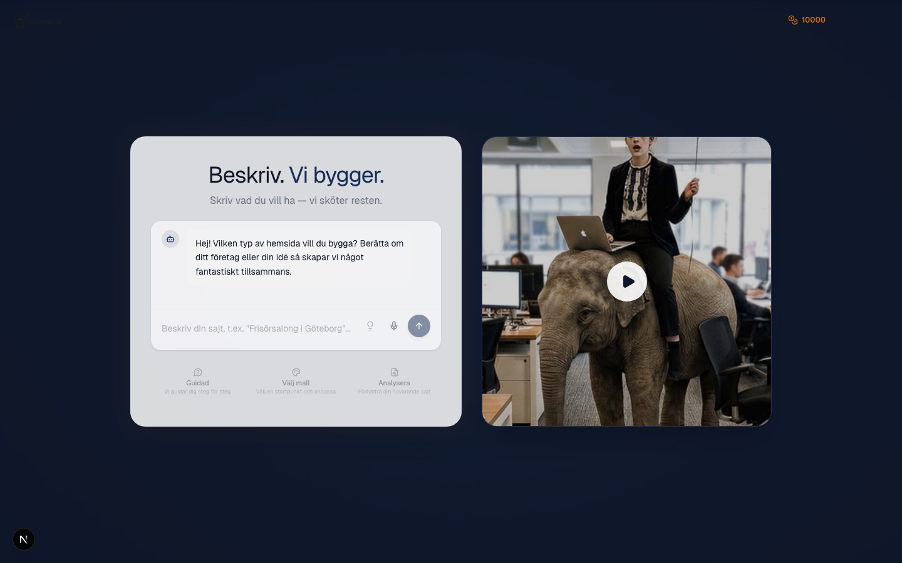
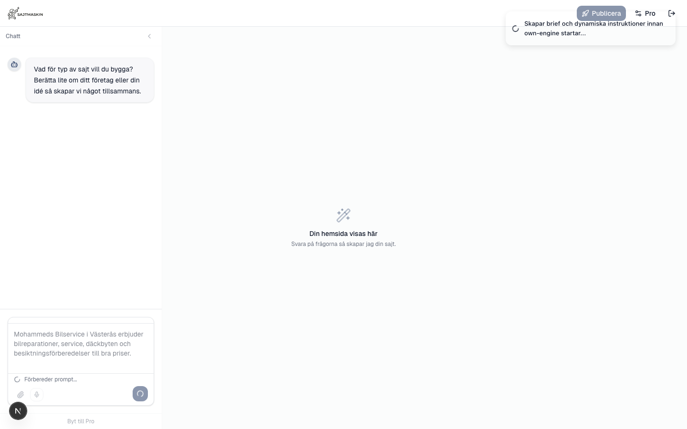
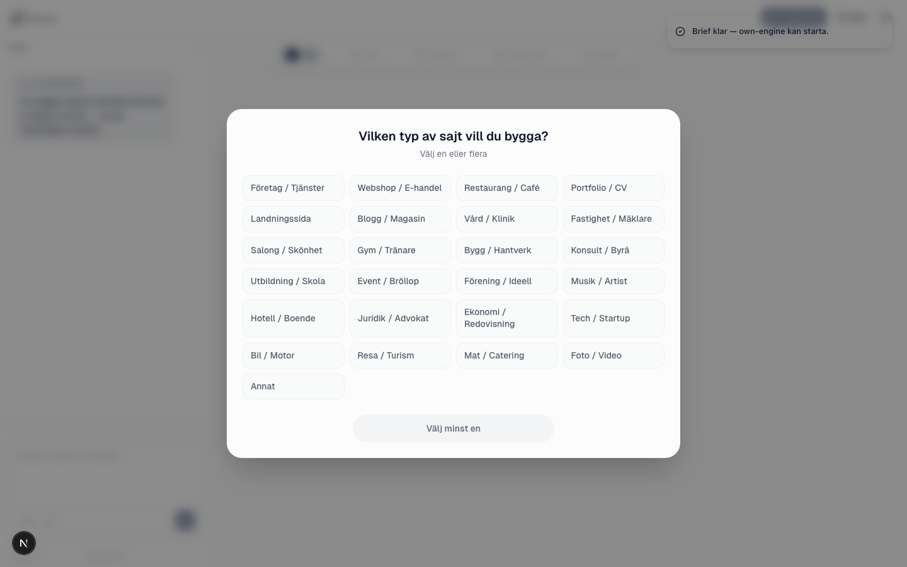
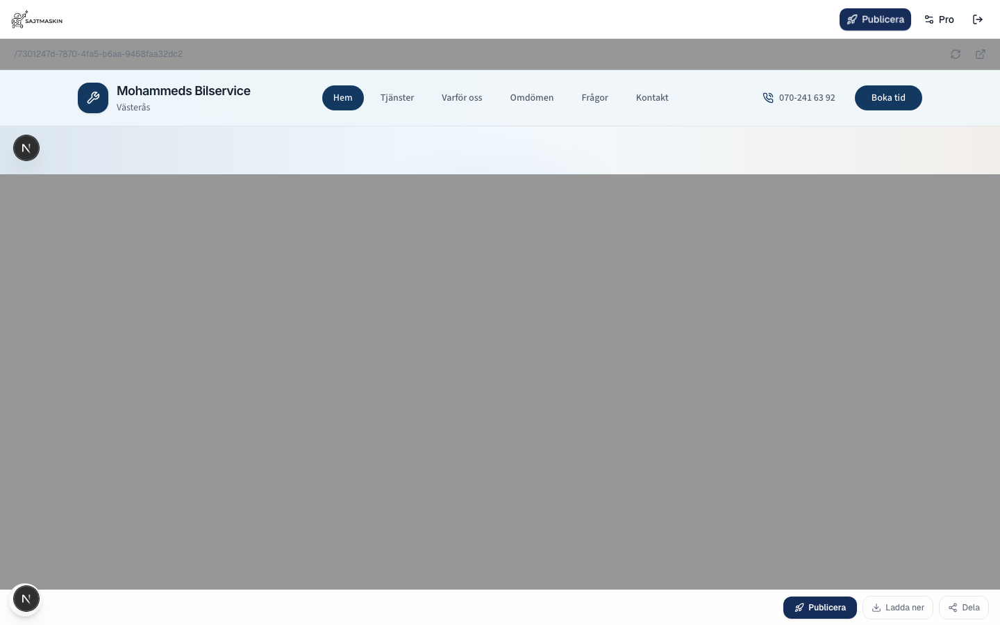
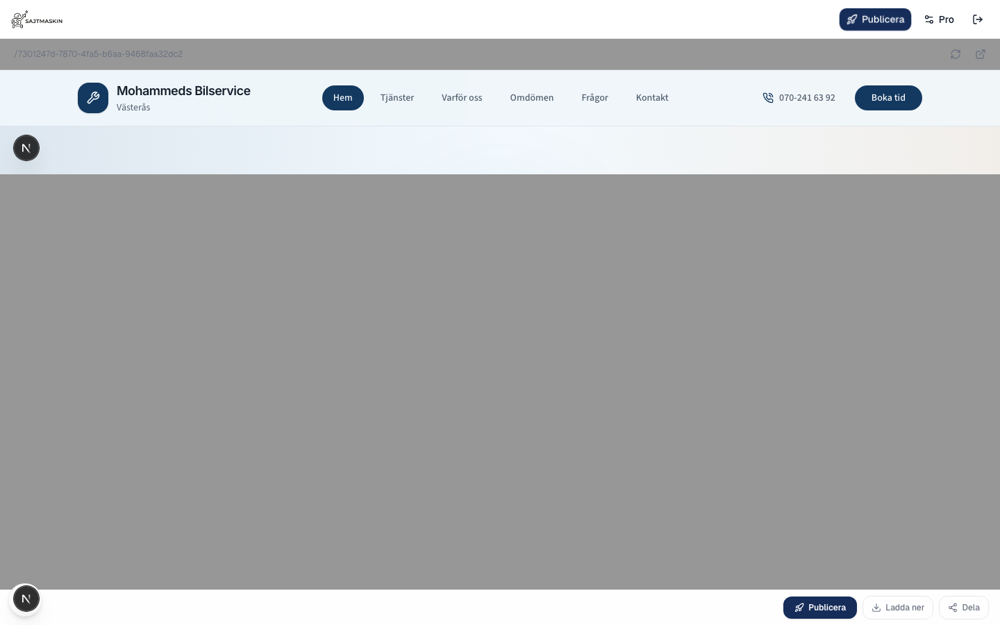
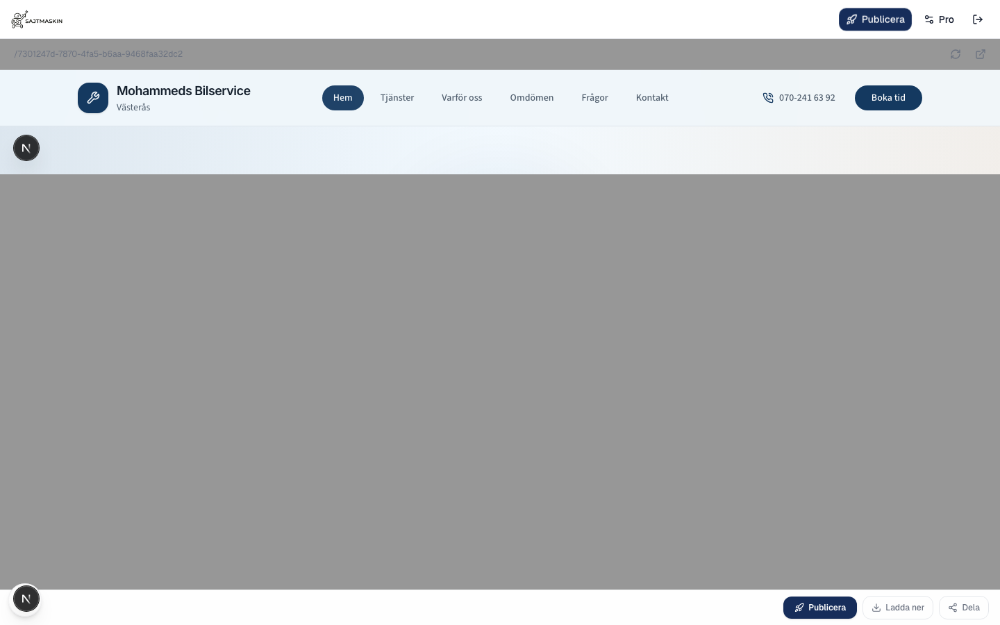
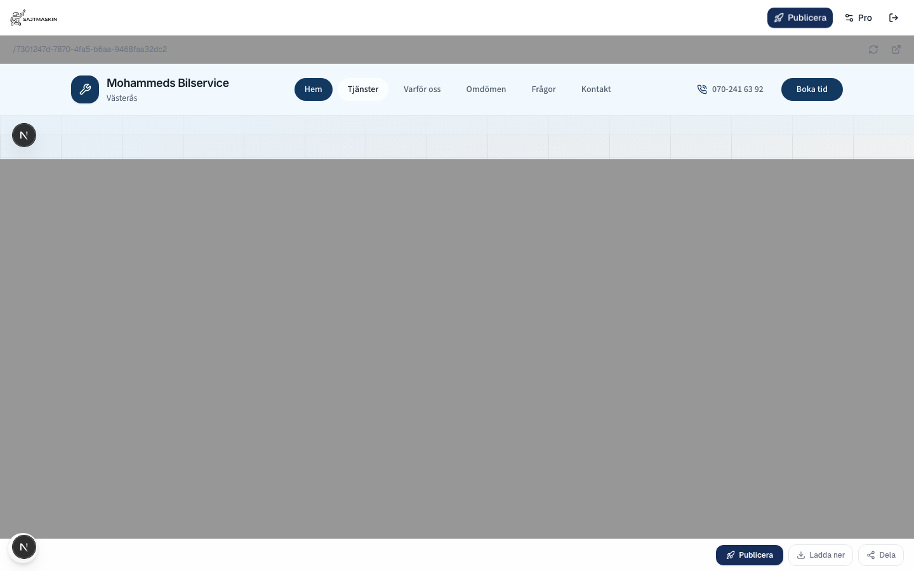
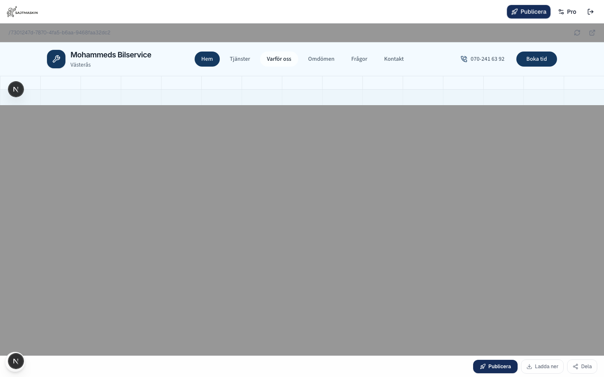
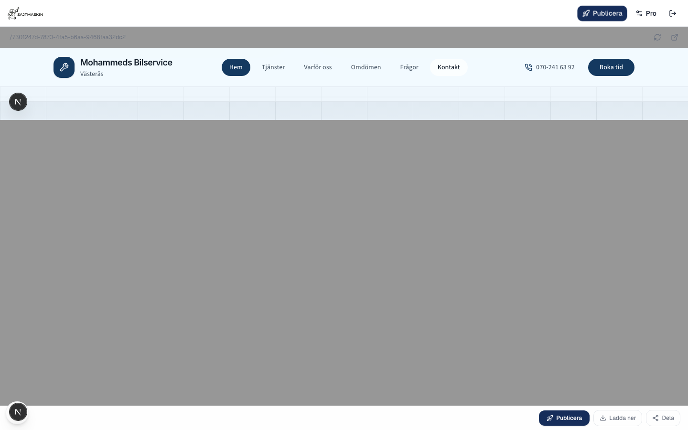

# Persona 4: Mohammed

**Business:** Bilverkstad i Västerås
**Knowledge:** Basic smartphone
**Authenticated:** Yes
**Duration:** 623s
**Score:** 100%
**Pages found:** 7

## Navigation links

- Hem → /7301247d-7870-4fa5-b6aa-9468faa32dc2#hem
- Tjänster → /7301247d-7870-4fa5-b6aa-9468faa32dc2#tjanster
- Varför oss → /7301247d-7870-4fa5-b6aa-9468faa32dc2#fordelar
- Omdömen → /7301247d-7870-4fa5-b6aa-9468faa32dc2#omdomen
- Frågor → /7301247d-7870-4fa5-b6aa-9468faa32dc2#fragor
- Kontakt → /7301247d-7870-4fa5-b6aa-9468faa32dc2#kontakt

## Quality Checks

- ✅ **iframe-accessible**: OK
- ✅ **swedish-characters**: Found å/ä/ö
- ✅ **no-english-body**: No English phrases
- ✅ **no-lorem-ipsum**: Clean
- ✅ **has-heading**: 1 H1(s)
- ✅ **has-cta**: Swedish CTA found
- ✅ **has-images**: 5 images
- ✅ **has-footer**: Footer present
- ✅ **has-navigation**: Nav present
- ✅ **content-density**: 1000 words
- ✅ **has-sections**: 6 sections
- ✅ **has-internal-links**: 29 links
- ✅ **has-contact-info**: Phone/email found
- ✅ **relevant-heading**: Heading: "Bilservice och reparationer i Västerås"

## Prompt Improvement Suggestions

_No improvements needed — prompt performed well_

## Screenshots

- 
- 
- 
- 
- 
- 
- 
- 
- 
- 
- 
- 
- 
- 
- 
- 
- 
- 
- 
- 
- 
- 
- 
- 
- 
- 
- 
- 
- 
- 
- 
- 
- 
- 
- 
- 
- 
- 
- 
- 
- 
- 
- 