# Persona 8: Björn

**Business:** Takläggeri i Norrköping
**Knowledge:** iPad only, 60 years
**Authenticated:** Yes
**Duration:** 806s
**Score:** 100%
**Pages found:** 7

## Navigation links

- Hem → /52e2987b-f945-401a-8bbb-c8c45033f8df#hem
- Tjänster → /52e2987b-f945-401a-8bbb-c8c45033f8df#tjanster
- Projekt → /52e2987b-f945-401a-8bbb-c8c45033f8df#projekt
- Om oss → /52e2987b-f945-401a-8bbb-c8c45033f8df#om-oss
- Frågor → /52e2987b-f945-401a-8bbb-c8c45033f8df#fragor
- Kontakt → /52e2987b-f945-401a-8bbb-c8c45033f8df#kontakt

## Quality Checks

- ✅ **iframe-accessible**: OK
- ✅ **swedish-characters**: Found å/ä/ö
- ✅ **no-english-body**: No English phrases
- ✅ **no-lorem-ipsum**: Clean
- ✅ **has-heading**: 1 H1(s)
- ✅ **has-cta**: Swedish CTA found
- ✅ **has-images**: 8 images
- ✅ **has-footer**: Footer present
- ✅ **has-navigation**: Nav present
- ✅ **content-density**: 1263 words
- ✅ **has-sections**: 8 sections
- ✅ **has-internal-links**: 26 links
- ✅ **has-contact-info**: Phone/email found
- ✅ **relevant-heading**: Heading: "Tak, fasad och plåtarbeten i Norrköping utförda med trygg ha"

## Prompt Improvement Suggestions

_No improvements needed — prompt performed well_

## Screenshots

- 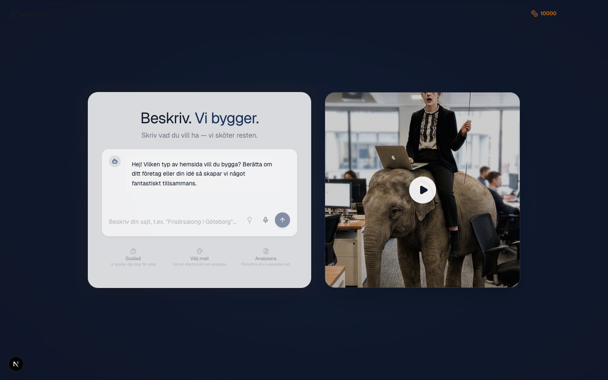
- 
- 
- 
- 
- 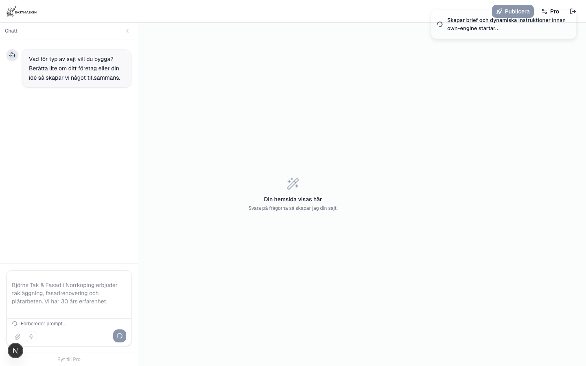
- 
- 
- 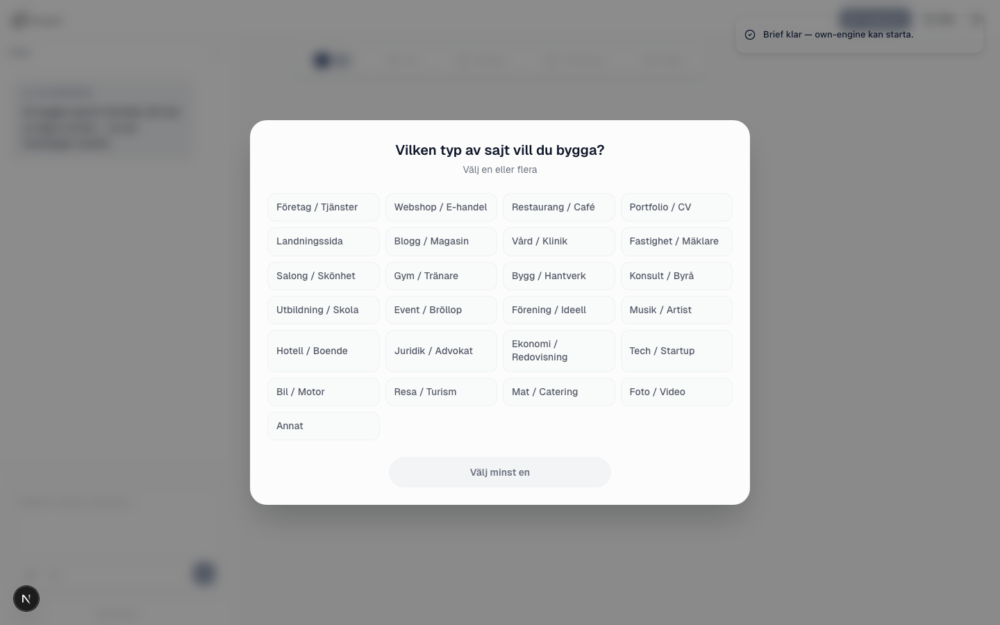
- 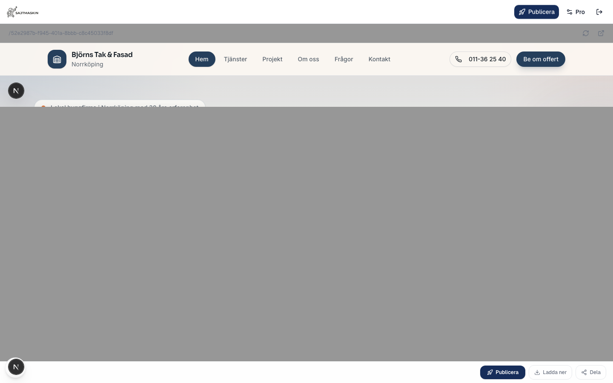
- 
- 
- 
- 
- 
- 
- 
- 
- 
- 
- 
- 
- 
- 
- 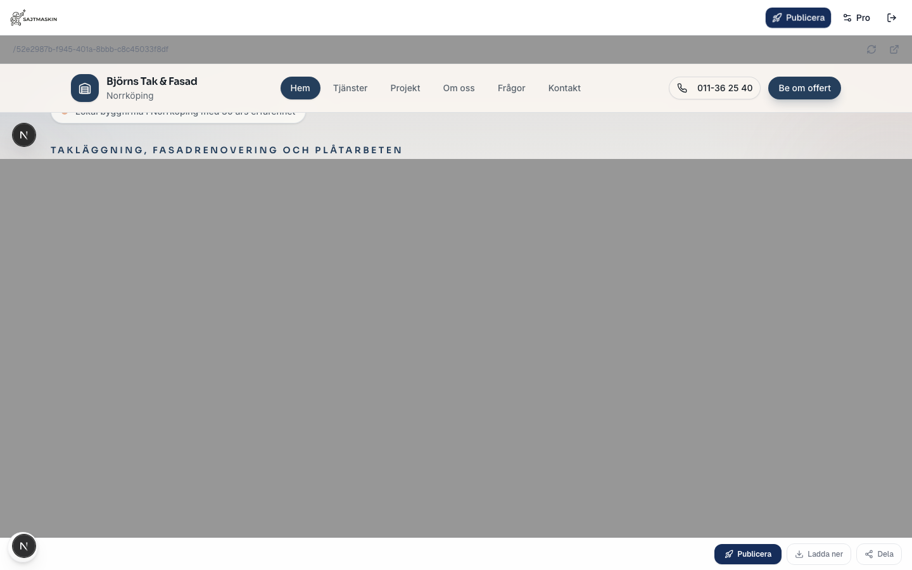
- 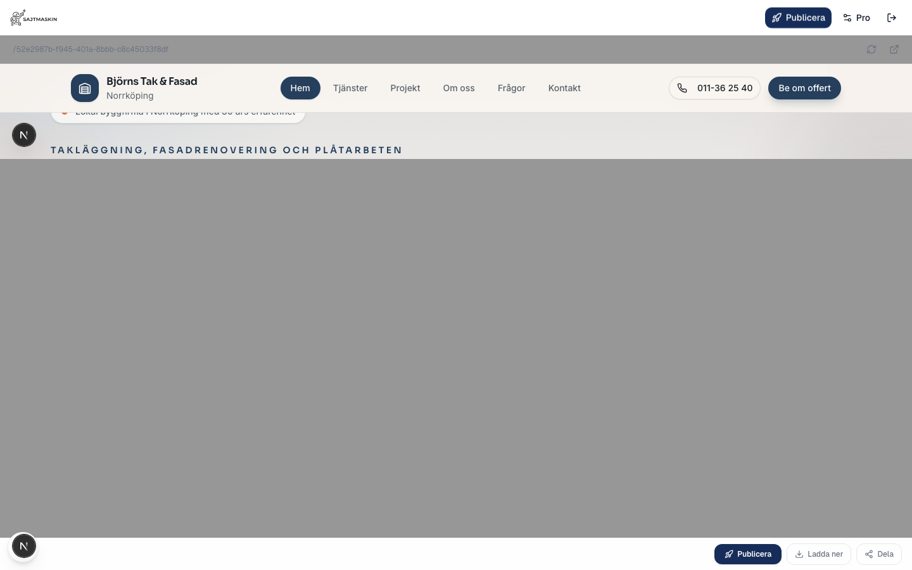
- 
- 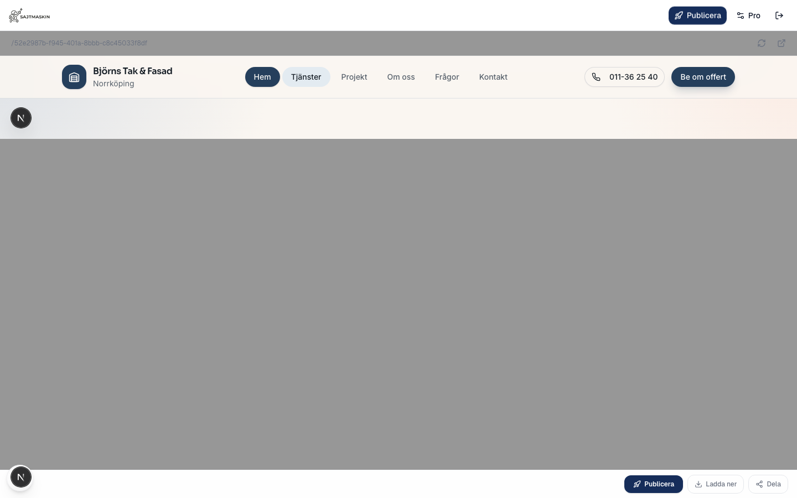
- 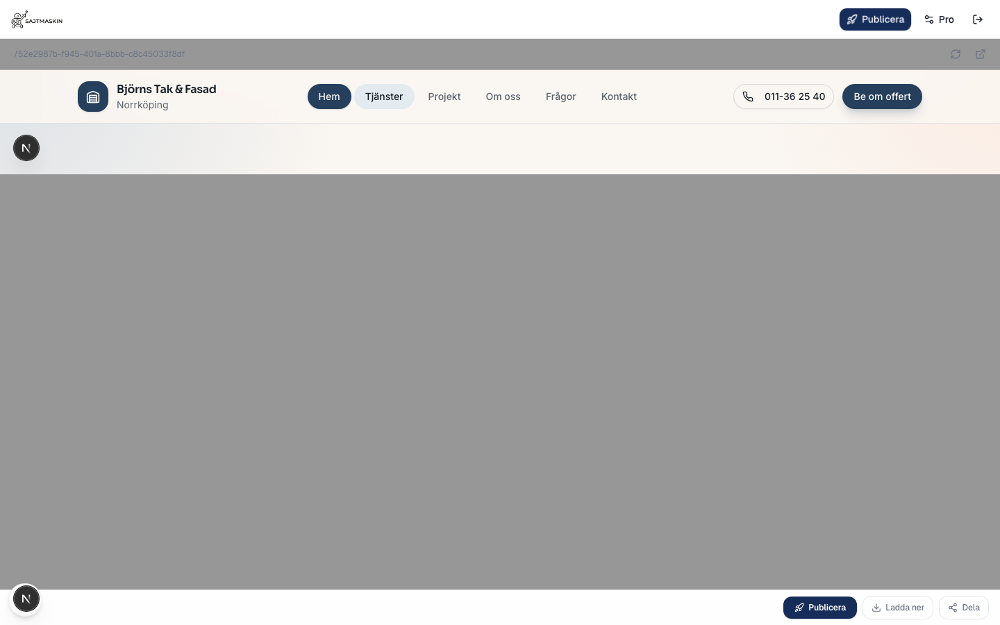
- 
- 
- 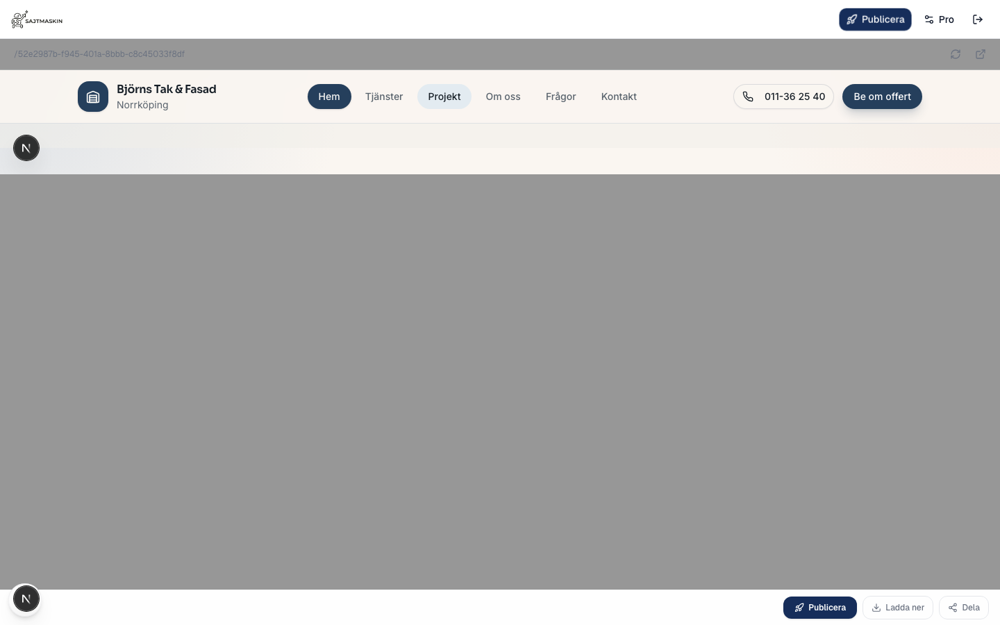
- 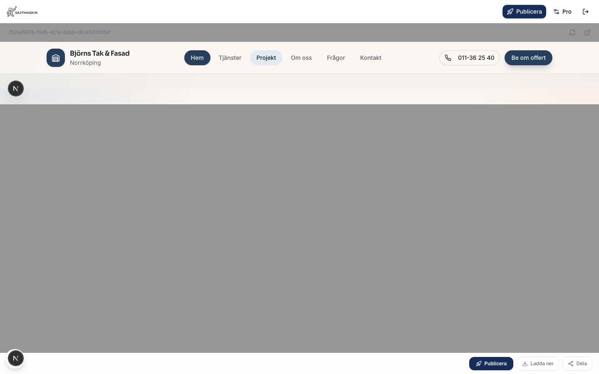
- 
- 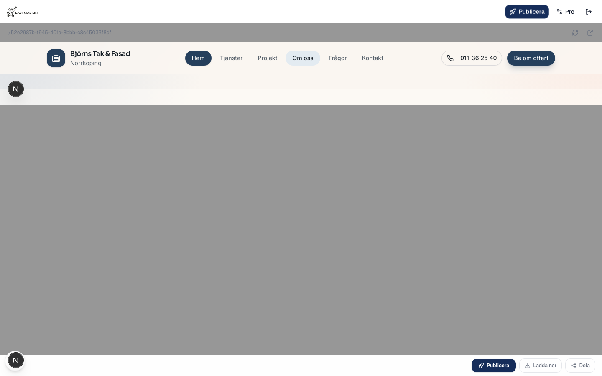
- 
- 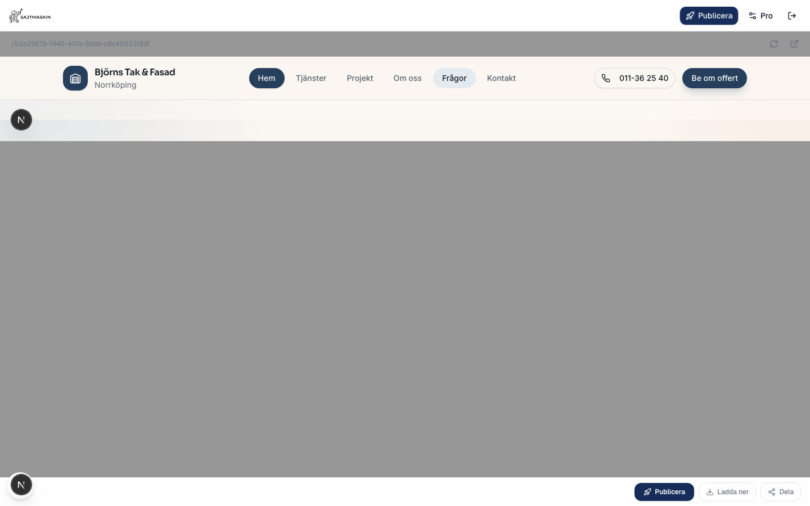
- 
- 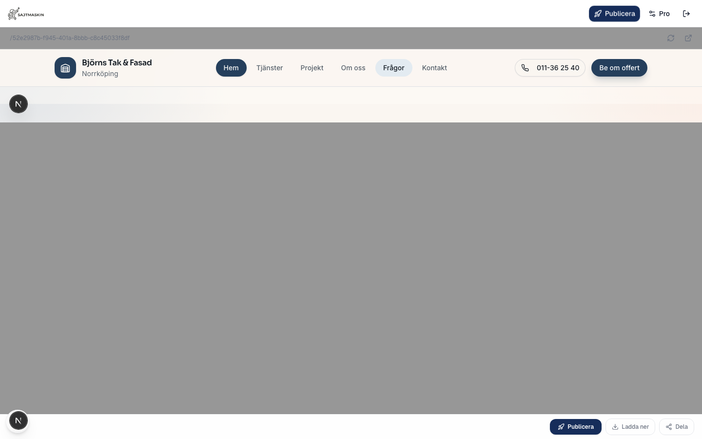
- 
- 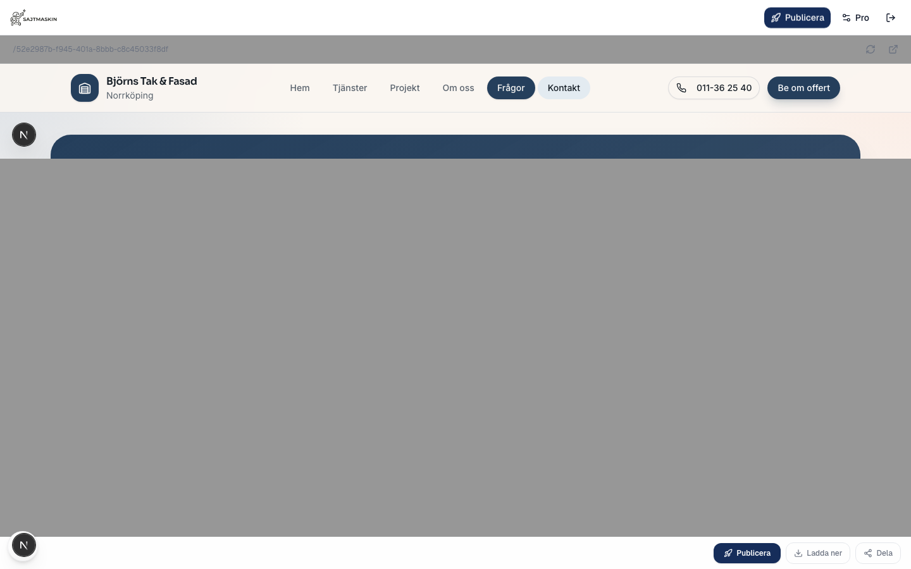
- 
- 