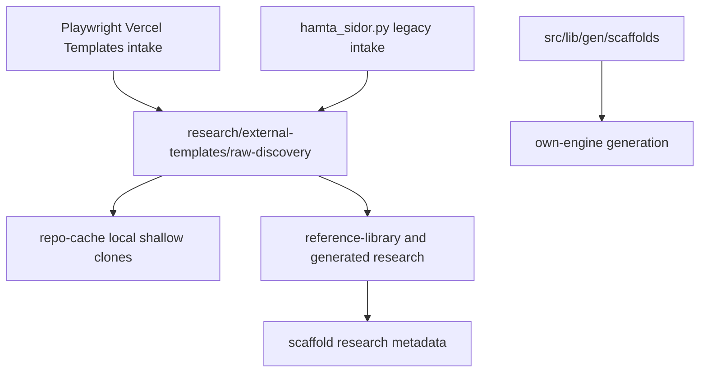

# Template Intake Policy

This document locks the intended intake policy for public Vercel Templates.

It exists to prevent three different concepts from bleeding into each other:

- Vercel Templates research intake
- v0 gallery templates
- runtime scaffolds used by the own engine

## Git and roadmap snapshot

Verified in this workspace:

- current branch: `egen-motor-v2`
- matching remote branch exists: `origin/egen-motor-v2`
- registered worktrees: one

Important roadmap note:

- do not infer roadmap truth from archive placement alone
- use `docs/plans/README.md` and `docs/architecture/agent-roadmap-and-handoff.md`
- current docs indicate `07` and `08` are closed/archived, while `06`, `09`,
  and `10` still act as active roadmap frames

## Default checkbox policy

Use this for the normal, non-sprawling intake pass on
`https://vercel.com/templates` or `https://vercel.com/templates/next.js`.

- `Framework`: `Next.js`
- `CSS`: `Tailwind`
- `Use Case`: `Starter`, `Ecommerce`, `SaaS`, `Blog`, `Portfolio`, `CMS`,
  `Authentication`, `Admin Dashboard`, `Marketing Sites`, `Documentation`

Leave off by default:

- `Backend`
- `Edge Functions`
- `Edge Config`
- `Cron`
- `Virtual Event`
- `Monorepos`
- `Web3`
- `Vercel Firewall`
- `Microfrontends`
- `CDN`

Use a separate second pass for:

- `AI`
- `Multi-Tenant Apps`
- `Realtime Apps`
- `Security`

Leave these groups unselected unless you are doing a targeted pass:

- `Database`
- `CMS`
- `Authentication`
- `Experimentation`

## Why this policy exists

- `Use Case` is the cleanest primary axis for intake
- `Framework=Next.js` keeps the lane aligned with the current product stack and
  the App Router-first direction from the Next.js docs
- `CSS=Tailwind` keeps the default pass closer to what Sajtmaskin is most likely
  to learn from without turning discovery into a massive compatibility crawl

See:

- [Next.js Docs](https://nextjs.org/docs?utm_source=create-next-app&utm_medium=appdir-template-tw&utm_campaign=create-next-app)
- [Vercel Next.js templates](https://vercel.com/templates/next.js)

## DevTools proof

`docs/old/2026-03-holding-area/next-sidan-skrapning.txt` confirms the left filter panel exposes these groups:

- `Use Case`
- `Framework`
- `CSS`
- `Database`
- `CMS`
- `Authentication`
- `Experimentation`

It also confirms useful DOM signals:

- group headers are clickable `button` elements
- filter choices are rendered as `label` rows with checkbox-related classes
- use-case choices map to `/templates/<slug>` routes
- template cards are links under `/templates/<category>/<template>`

That means DevTools should be used to calibrate selectors and query handling,
not to create a separate manual-only intake path.

## Three separate lanes

## Boundary reminders

- Vercel Templates are external research input.
- v0 templates are gallery/product templates and are a different concept.
- runtime scaffolds are internal own-engine starters and are a third concept.

These must not be treated as the same inventory.

## About `repo-cache`

`research/external-templates/repo-cache/` is expected to contain many folders.
That is normal.

It is not an application cache like Redis, Upstash, or Supabase caching.
It is a local, git-ignored shallow clone mirror of third-party repos so the
curation scripts can inspect code reproducibly without depending on `_sidor`
desktop paths.
