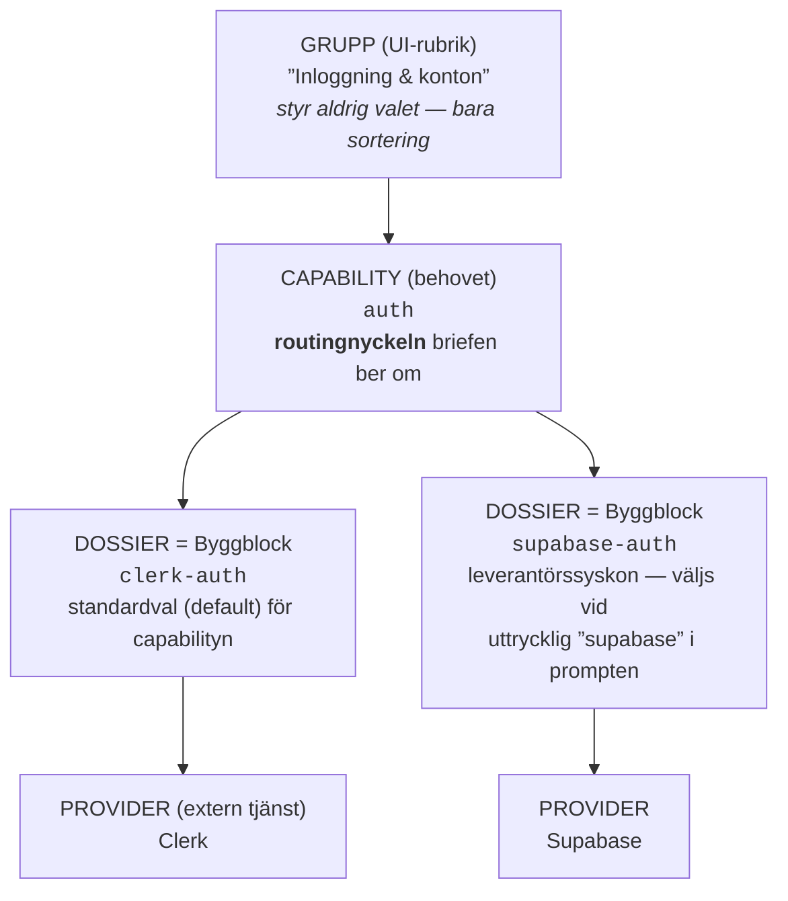

# Fusklapp: Byggblock (dossiers) — begreppen på en sida

> Kortaste korrekta modellen: **Prompt → capability → dossier → kod i användarsajten.**
> Gruppen hjälper människan att hitta. Capabilityn styr valet. Dossiern är det som byggs in.
>
> Denna lapp innehåller **medvetet inga antal** (antal dossiers, capabilities osv.) — de driftar.
> Aktuell katalog: `data/dossiers/{hard,soft}/` eller backoffice → Byggblock.

## Hierarkin, visuellt (auth som exempel)

- **Dossier-familj** = syskonen under samma capability (`clerk-auth` + `supabase-auth` är auth-familjen).
  Pedagogiskt ord — inget manifestfält. Exakt en i familjen är `defaultForCapability`.
- **Provider** = den externa tjänsten en **Kopplad** (`hard`) dossier ansluter till. Deklareras i `manifest.providers`.
- **Fristående** (`soft`) dossiers har ingen deklarerad integrationsprovider eller hemlighet. De kan använda
  lokala filer, publika nyckelfria resurser och **teknik** (npm-bibliotek som Embla, MapLibre, MiniSearch).
  Teknik är ett beroende, inte en leverantör.

## Orden — vad de är och inte är

| Ord | Är | Är INTE |
|---|---|---|
| Capability | Behovet/funktionen sajten ska ha (`auth`, `payments`) — det briefen ber om | En implementation |
| Dossier / Byggblock | Ett kuraterat implementationsrecept för en capability (manifest + instruktioner + filer) | En mall/template |
| Dossier-familj | Alla dossiers under samma capability | Ett fält i något schema |
| Provider | Extern tjänst med konto/nycklar (Clerk, Stripe, OpenAI) | Ett npm-paket |
| Teknik | Lokalt bibliotek i en Fristående dossier (Embla, Three.js) | En provider |
| Grupp/kategori | UI-rubrik som sorterar rader i panelen och backoffice | Något som påverkar vilket byggblock som väljs |
| Template (v0-mall) | Komplett färdig sajt i galleriet — separat system | En dossier |
| Scaffold | Runtime-startpunkt/grundstruktur för genererade sajter | En dossier eller mall |

## De tre oberoende axlarna (vanligaste felläsningen)

Ingen av dessa kan härledas ur någon annan:

| Axel | Fråga | Värden | Ägare |
|---|---|---|---|
| Klass | Har implementationen en deklarerad provider-/integrationskoppling? | Kopplad (`hard`) / Fristående (`soft`) | mappen `data/dossiers/{hard,soft}/` |
| Demoläge | Hur beter sig ytan i designläget utan livekonfiguration? | `canned` / `seed` / `success` / `visual` / `none` | `manifest.mock` |
| Kräver integrationsbygge | Måste riktiga integrationen byggas i eget steg? | ja / nej | `dossierRequiresF3()` — build-nyckel ELLER serverfil |

Exempel på oberoendet: `vercel-analytics` är Kopplad men kräver **inte** integrationsbygge.
`stripe-checkout` kräver integrationsbygge pga sin **serverfil** — inte pga nyckeln (den är `feature-runtime`).

## Vad ett manifest innehåller

Obligatoriskt: `id` (= mappnamnet), `label`, `capability` (exakt en), `codeFidelity`
(`verbatim` = byte-exakt / `rewritable` = får anpassas), `complexity`, `summary`, `lastVerified`.
Kopplade dossiers måste dessutom ha `providers` och (nästan alltid) `mock`.

Valfritt: `envVars[]` (med `enforcement` och `setupUrl`), `dependencies` (npm), `files[]`
(med `role: client/shared/server`), `exposes` (komponenter LLM:en får importera),
`summarySv` (svensk UI-text), `relevanceKeywords` (uttrycklig leverantörsträff),
`defaultForCapability` och `promptInstructionMode` (hur mycket av `instructions.md`
som når byggmodellen). Fullt schema:
[`docs/schemas/strict/dossier.schema.json`](../docs/schemas/strict/dossier.schema.json).

## Används schemat faktiskt?

Ja. `docs/schemas/strict/dossier.schema.json` är inte bara dokumentation:

1. `src/lib/gen/dossiers/validate-manifest.ts` importerar och kompilerar det med AJV.
2. Runtime-registret utesluter ett manifest som inte klarar valideringen.
3. Backoffice validerar mot samma fil före skrivning/promotion och läser enumvärden därifrån.
4. `$schema` i manifesten ger editor-autocomplete och inline-validering.
5. `npm run dossiers:validate-all` och CI lägger på korsmanifestregler som JSON Schema
   inte kan uttrycka, till exempel unikt defaultval och fungerande mock-fallback.

Schemat äger **formen**. TypeScript-typer, validatorns extraregler och runtimekod
äger den fulla semantiken. Vid motsägelse vinner körbar kod; driften ska sedan lagas.

## D2, D3 och D4 — den kvarvarande kvalitetskedjan

Det fungerande produktflödet behöver inte vänta på dessa. De är en strikt
sekventiell förbättring av manifest- och promptkontraktet:

| Steg | Vad det betyder | Varför |
|---|---|---|
| **D2** | Inför valfria `configInputs` (värden användaren fyller i hos Sajtmaskin) och `providerSetup` (handgrepp hos leverantören). `envVars` fortsätter äga configured/readiness tills en uttrycklig migration beslutas. | Skiljer fält från instruktioner utan att skapa en andra konfigurationssanning. |
| **D3** | Samla det en Kopplad dossier bidrar med till prompten i en intern representation, `HardDossierIntegration`. Ingen ny agent eller pipelinefas. | Gör provider-, env-, setup-, mock- och filinstruktioner läsbara och testbara på ett ställe. |
| **D4** | Ge alla aktiva hard-dossiers `selected-sections`, med verifierade rubrikerna `When to use`, `How to integrate` och `Avoid`. | Gör att de kuraterade gör/gör-inte-reglerna faktiskt når byggmodellen. |

Ordningen är **D2 → D3 → D4**. Knappen ”Bygg integrationer” ska inte tas bort,
och `SELECTED_SECTION_CHAR_CAP = 480` ska lämnas oförändrad: taket gäller per
rubrik så att `Avoid` inte svälts ut.

## Nycklarnas tre kravnivåer (`envVars[].enforcement`)

| Nivå | UI-ord | Betyder |
|---|---|---|
| `build` | krävs | Utan riktigt värde/godkänd placeholder stoppas ”Bygg integrationer” (innan kostnad) |
| `feature-runtime` | vid användning | Bygget går igenom; funktionen kör demo tills värdet sparas |
| `warn-only` | valfri | Funktionen stänger av sig själv tyst utan värde |

## Demolägen (vad besökaren ser i designläget utan livekonfiguration)

| `mock` | Besökaren får |
|---|---|
| `canned` | Trovärdigt påhittat svar (t.ex. förberedd chattström) |
| `seed` | Medskickad exempeldata + diskret notis |
| `success` | Formulär går igenom med ärlig demo-notis — inget skickas |
| `visual` | Full yta; handlingen öppnar ärlig demo-ruta i stället för riktig operation |
| `none` | Ingen demo-yta — självavstängning eller konfigurationsnotis |

## Status i Byggblock-panelen (per version, rapportering — inte deploybevis)

Statusen är en härledd projektion, inte en linjär state machine:

| Intern status | UI-label |
|---|---|
| `planned` | Inte byggd än |
| `blocked-build` | Nyckel krävs |
| `built-demo` | Demo |
| `built-live` | Live |
| `self-contained` | Klar |

Ägare: `resolveDossierLifecycle()` för status och `describeDossierStatus()` för orden.

## Beroenden mellan capabilities

En capability som bara fungerar med en följeslagare kan dra in den automatiskt
(`expandDependentCapabilities` i `select.ts`). Tabellen är **tom** i dag — mekanismen
finns kvar för framtida behov. Auth behöver t.ex. ingen databas-capability:
Kopplade auth-dossiers har sina användare hos providern (Clerk/Supabase), och
databas är en egen capability med eget byggblock.

## Vart sanningen bor

| Fakta | Kanonisk ägare |
|---|---|
| Allt om ett byggblock | `data/dossiers/<klass>/<id>/manifest.json` |
| Manifestets maskinläsbara form | `docs/schemas/strict/dossier.schema.json` + `validate-manifest.ts` |
| Vilka som väljs och varför | `src/lib/gen/dossiers/select.ts` |
| Kräver integrationsbygge-regeln | `dossierRequiresF3()` i `src/lib/gen/dossiers/types.ts` |
| Instruktioner som når modellen | `src/lib/gen/system-prompt/sections/dossiers.ts` + `promptInstructionMode` |
| Svenska UI-orden | `src/lib/builder/dossier-axes.ts` och `dossier-overview.ts` (+ spegel i backoffice) |
| Statusregeln | `src/lib/gen/dossiers/lifecycle.ts` |
| Grupperna | `src/lib/builder/dossier-groups.ts` |
| Hela kontraktet i prosa | [`docs/contracts/dossier-system.md`](../docs/contracts/dossier-system.md) |

Denna fusklapp är en läskarta, inte en sanningskälla — driftar den mot koden vinner koden.
