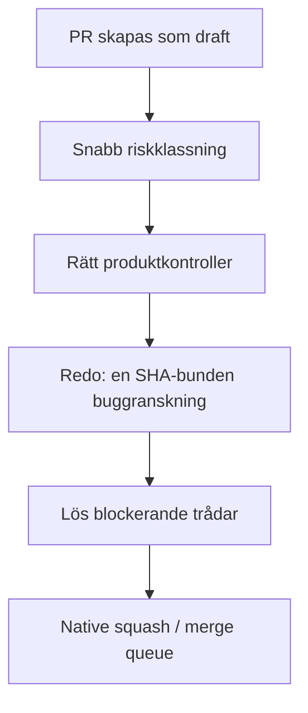

# Granskning av `sajtmaskin`: PR-flöde, buggranskning och CI

**Datum:** 2026-08-26  
**Repository:** [Jakeminator123/sajtmaskin](https://github.com/Jakeminator123/sajtmaskin)  
**Granskad revision:** [`master` @ `a9d86c68d`](https://github.com/Jakeminator123/sajtmaskin/commit/a9d86c68d5c01fcd9a24f6bfc0bde98a5e2d78a6)  
**Historisk referens:** [`4001d5df` från 2026-08-19](https://github.com/Jakeminator123/sajtmaskin/commit/4001d5dfdc316db095ce1e507a51c53673db27d3)

## Sammanfattning

Nuvarande `master` är inte generellt trasig. Den senaste revisionen klarar [produkt-CI](https://github.com/Jakeminator123/sajtmaskin/actions/runs/32853627884) och [DB/Blob-kontrollerna](https://github.com/Jakeminator123/sajtmaskin/actions/runs/32853627846). Den stora röda ytan i GitHub kommer främst från det egenbyggda PR-, review- och merge-systemet.

Min slutsats är:

- För ungefär en vecka sedan var flödet tydligt enklare och operativt bättre.
- Dagens modell har samtidigt flera verkligt bättre säkerhetsegenskaper: exakt SHA-bindning, bättre provenance, fail-closed-beteende och säkrare change detection.
- Problemet är därför inte att alla nya kontroller bör tas bort. Problemet är att bra säkerhetsidéer har byggts som ett andra regelsystem ovanpå GitHub, med polling, etiketter, kommentarer, specialkommandon och egen merge-logik.
- 20 av 22 röda öppna PR:er är primärt röda på grund av process-, infra- eller policyfel. Det finns ändå verkliga kod- och säkerhetsfel i kön, så en generell bypass vore fel.
- Buggranskning bör vara obligatorisk för mergebar kod, men ske en gång per relevant slutlig PR-head — inte på drafts, varje kommentar, varje etikettändring och varje push till `master`.

Den viktigaste akuta åtgärden är att pausa automatisk mergeexekvering tills ett test som verkar kunna mutera Git-checkouten har isolerats. Senaste squash-commiten på `master` innehåller oväntat `Co-authored-by: Test <test@example.com>`, trots att PR-headen inte gjorde det. Det stämmer med [#1188](https://github.com/Jakeminator123/sajtmaskin/pull/1188), där `backoffice:test` observerades skapa en främmande `baseline`-commit i checkouten.

## 1. Live-läget

### `master`

- Senaste revision: [`a9d86c68d`](https://github.com/Jakeminator123/sajtmaskin/commit/a9d86c68d5c01fcd9a24f6bfc0bde98a5e2d78a6), 25 augusti 2026 13:29 UTC.
- [Produkt-CI är grön](https://github.com/Jakeminator123/sajtmaskin/actions/runs/32853627884): `quality`, `quality-core`, `quality-contracts`, `build`, `backoffice-tests` och `schema-drift`.
- Samma push gav däremot ett rött [merge-ready-freshness-jobb](https://github.com/Jakeminator123/sajtmaskin/actions/runs/32853627850). Jobbet hann blockera #1161 och #1157 men dog sedan med GitHub 403 när det försökte ta bort en etikett på #1187.

Det betyder: produktkoden på `master` är grön, men kontrollplanet är rött.

### Öppen PR-kö

Vid granskningen fanns 25 öppna PR:er:

- 22 drafts och 3 markerade som redo.
- 22 hade röd `quality`.
- Alla 25 hade grön `backoffice-tests` och `schema-drift`.
- 23 hade grön `build`; två hade verkliga TypeScript-/buildfel.
- Ingen hade grön `review-window`: 12 var `action_required` och 13 saknade resultat.
- 20 PR:er, [#1163–#1182](https://github.com/Jakeminator123/sajtmaskin/pulls?q=is%3Apr+is%3Aopen+1163..1182), är en enda OpenClaw-prototypfanout som skapades på cirka 29 minuter från samma bas.

20 av 25 öppna PR:er, alltså 80 %, är därför inte 20 normala mergekandidater. Med de två överlappande workflow-reparationerna #1187–#1188 är 22 av 25, alltså 88 %, formade av arbetslogik snarare än normal produktleverans.

## 2. Vad är verkligt fel och vad är kontrollbrus?

| Klass | Omfattning | Exempel | Bedömning |
|---|---:|---|---|
| Policy-/processrött | 20 av 22 röda PR:er | `sand/ocb-*` skapades av agentflödet, medan CI bara accepterar `fix/`, `feat/`, `docs/` och `chore/` | Primär rödorsak är en intern motsägelse |
| Verkligt kompileringsfel | Minst 2 PR:er | [#1180](https://github.com/Jakeminator123/sajtmaskin/pull/1180) har TypeScriptfel i `candidate-checks.ts`; [#1187](https://github.com/Jakeminator123/sajtmaskin/pull/1187) har ett `user_message`-unionfel | Ska blockera merge |
| Skört test | [#1161](https://github.com/Jakeminator123/sajtmaskin/pull/1161) | 1 av 8 872 tester faller på exakt Markdown-spacing trots semantiskt samma tabellrad | Bör göras semantiskt, inte whitespace-exakt |
| Verkliga reviewfynd | 14 av 20 OpenClaw-drafts | Totalt 45 olösta reviewtrådar: bland annat budget-bypass, hemlighetsfiltrering, valideringsbypass och bruten idempotens | Prototyperna är inte mergebara bara för att primär CI-rödorsak är falsk |
| Workflow-/infrarött | Många körningar | GitHub App-rate-limit, worktree/cwd-fel, `threads` mot `process.chdir()`, 403 vid labelmutation | Ska inte presenteras som produktfel |

Det direkta svaret på frågan om “osynliga fel” är därför: **både och**.

- Många fel i den nya arbetslogiken passerade under den snabba utrullningen och upptäcks nu i efterhand.
- De nya kontrollerna har hittat verkliga trust-boundary-, worktree- och kodfel.
- Men den nuvarande mängden rött överdriver kraftigt hur mycket produktkod som faktiskt är trasig och gör de riktiga fynden svårare att se.
- Det äldre flödets höga genomströmning var inte samma sak som hög kvalitet: den 20 augusti var 16 av 19 mergade PR:er `fix:*`.

## 3. Varför en vecka sedan kändes bättre

Mellan [referensen 19 augusti](https://github.com/Jakeminator123/sajtmaskin/commit/4001d5dfdc316db095ce1e507a51c53673db27d3) och dagens `master` ligger [237 commits](https://github.com/Jakeminator123/sajtmaskin/compare/4001d5dfdc316db095ce1e507a51c53673db27d3...a9d86c68d5c01fcd9a24f6bfc0bde98a5e2d78a6). Ett snävt, fast urval review-/mergefiler växte från cirka 586 till 3 032 rader, ungefär **5,2 gånger**, på sex dagar. Nya verifierings-, guard-, config- och testfiler tillkommer ovanpå detta.

| Egenskap | 19 augusti | Nu |
|---|---|---|
| Review-window | Separat, cirka 104 rader; endast icke-drafts | Del av en stor controller som reagerar på PR-events, nästan alla kommentarer och `master`-pushar |
| Freshness | Separat, cirka 126 rader | Workflow cirka 300 rader plus controller-/testkod på flera tusen rader |
| Väntan | Enkel minimitid och bot-settle | Polling upp till cirka 10–14 minuter |
| Buggranskning | Enklare och svagare provenance | Exaktare head-/workflow-provenance, men global körgräns och fler terminala states |
| Merge | Närmare GitHubs normala modell | Etiketter, comments, receipts, `merge:execute`, invalidation och egen state machine |
| Path impact | Begränsad | Säkrare change detection, men okända och vanliga paths får ofta full profil |
| Lokal agent | Färre guards | Omfattande hooks/worktree-/commit-guards som själva har orsakat timeout och miljöfel |

Den operativa skillnaden är mätbar:

| Mått, jämförbara tvådygn UTC | 18–19 augusti | 24–25 augusti |
|---|---:|---:|
| Skapade PR:er | 40 | 44 |
| Mergade PR:er | 39 | 14 |
| Median skapad → merge | 84,7 min | 423 min |
| Mergade inom 60 minuter | 14 av 39 | 2 av 14 |
| Öppna PR:er vid periodslut/nu | 2 | 25 |
| Summerad Actions-tid | 1 831 min | 2 970 min |

PR-inflödet var nästan lika stort, men mediantiden till merge blev cirka fem gånger längre och Actions-tiden ökade med cirka 62 %.

Den gamla modellen var alltså mer användbar men hade riktiga svagheter:

- otillräcklig bindning till exakt PR-head och rätt workflow;
- change detection missade bland annat staged/deleted/renamed paths;
- privilegierad workflow kunde läsa olämplig PR-ref;
- sämre skydd mot stale eller förfalskad merge-evidens.

Den gamla `review-window` bedömde dessutom främst tid och botnärvaro, inte själva verdictet. Efter tio minuter kunde den bli grön även om ingen bot fanns. En stor del av den tidigare hastigheten kom alltså från mjuk eller fail-open enforcement.

Det vore därför fel att återställa allt till 19 augusti. Rätt väg är att behålla trust-boundary-förbättringarna men gå tillbaka till en mycket enklare orkestrering.

## 4. Grundorsaker

### 4.1 För stor kontrollplansändring på en gång

[PR #1144](https://github.com/Jakeminator123/sajtmaskin/pull/1144), [#1146](https://github.com/Jakeminator123/sajtmaskin/pull/1146) och [#1147](https://github.com/Jakeminator123/sajtmaskin/pull/1147) landade en mycket stor ombyggnad på kort tid. #1146 ensam ändrade 96 filer och lade till drygt 10 000 rader. #1146 och #1147 motsvarade tillsammans cirka +12 824/−2 447 rader i kontrollplanet.

Efteråt krävdes följdfixar för bland annat:

- Windows `npm.cmd` och PowerShell;
- fel checkout/worktree i commit-guarden;
- Git-aliasläsning på varje shellkommando;
- dokumentationsassets som startar full runtime-svit;
- `sand/*` kontra branchpolicyn;
- GitHub API-rate-limit orsakad av burst/fanout;
- Vitest `threads` kontra tester som använder `process.chdir()`;
- reviewkvot och externa agentbegränsningar;
- dependency-, `node_modules`- och DB-hook-isolering.

### 4.2 GitHubs inbyggda skydd är inte konfigurerade som avsett

Det aktiva rulesetet [Protect master](https://github.com/Jakeminator123/sajtmaskin/rules/17926309) kräver fem checks, men:

- `strict_required_status_checks_policy` är av;
- review thread resolution är inte obligatorisk;
- antal obligatoriska approvals är 0;
- stale reviews avfärdas inte på push;
- en repository-role har alltid-bypass.

Den egenbyggda controllern måste därför försöka återskapa sådant GitHub redan kan garantera.

### 4.3 För bred eventmodell

[`merge-ready-freshness.yml`](https://github.com/Jakeminator123/sajtmaskin/blob/a9d86c68d5c01fcd9a24f6bfc0bde98a5e2d78a6/.github/workflows/merge-ready-freshness.yml) kör på många PR-händelser, nästan alla issue comments och varje push till `master`. En representativ [körning](https://github.com/Jakeminator123/sajtmaskin/actions/runs/32860081633) väntade över elva minuter trots att `quality` redan var röd.

Av de 100 senaste Actions-körningarna i stickprovet var 50 `merge-ready-freshness`: 25 misslyckade, 23 avbrutna och bara 2 lyckade. De förbrukade ungefär 224 runner-minuter. “Inte redo ännu” har därmed blivit ett rött workflow-fel i stället för ett normalt PR-state.

### 4.4 Varje merge invalidiserar hela kön

Den nuvarande freshness-logiken kräver i praktiken att varje PR-head innehåller exakt senaste `master`. En merge startar därför om rebase, CI, review och signoff för alla andra PR:er. Det är en långsam, egenbyggd merge queue utan GitHubs kösemantik.

### 4.5 Buggranskningen kan nå en permanent återvändsgränd

Review-koden har en global `MAX_RUNS=3`. Efter tre körningar blir resultatet terminalt `action_required`/`run-limit` på bland annat #1154, #1157, #1161 och #1187. En PR som förbättras över flera heads kan alltså blockeras av historisk budget trots att den aktuella diffen är korrekt.

### 4.6 Testmiljön är inte tillräckligt isolerad

Det finns evidens för att `backoffice:test` kan skriva Git-state i den riktiga checkouten. Att `Test <test@example.com>` sedan dyker upp i en riktig squash-commit på `master` är en stark varningssignal. Tester ska aldrig kunna ändra HEAD, index, refs, Git-config eller commitmetadata i käll-checkouten.

### 4.7 Alla checks med “bugg” i namnet är inte buggranskning

- `review-window`/det framtida `bug-review` är evidens för faktisk granskning av PR-diffen.
- `check:bug-backlog` kontrollerar format och sanningshalt i `BUG-SWARM-BACKLOG.md`; den granskar inte PR-koden.
- `test:godnatt-bugg` testar godnatt-skillens script; den skannar inte PR-diffen efter buggar.

De två senare fanns även i det äldre flödet och är inte huvudorsaken till dagens kö. De kan path-filtreras för effektivitet, men de får inte räknas som den obligatoriska oberoende buggranskningen.

## 5. Vad som ska behållas

Följande delar av dagens modell är bra och bör inte backas ur:

- PR-kod körs inte i privilegierade merge-/label-workflows.
- Reviewevidens binds till exakt head-SHA och betrodd workflow-provenance.
- Live re-read/CAS precis före merge.
- `quality` har stabilt aggregatnamn medan core/contracts kan köras parallellt.
- Path impact tar med staged, untracked, deletes och båda sidor av renames.
- Okända high-risk-paths failar säkert.
- GitGuardian och misslyckade deployments kan blockera.
- Buggranskning är obligatorisk för relevant mergebar kod.

## 6. Rekommenderad målmodell

### Ansvarsfördelning

**GitHub ruleset**

- Sätt strict required checks till på.
- Kräv att reviewtrådar är lösta.
- Använd squash-only och linear history.
- Ta bort normal “always bypass”; behåll endast dokumenterad break-glass.
- Tillåt update branch och använd helst native merge queue/auto-merge.

**Produkt-CI**

- Behåll stabila required checks: `quality`, `build`, `backoffice-tests` och `schema-drift`.
- Gör profilerna verkligt path-baserade:
  - docs/assets: docs-, länk- och kontraktskontroller;
  - vanlig kod: relevanta tester, typecheck, lint och build;
  - auth/DB/CI/security/okänd: full svit.
- Ett okänt runtime-path ska fortfarande faila säkert, men kända vanliga paths ska inte både få runtime- och fullprofil av misstag.

**Buggranskning**

- Ha exakt ett required check-namn, exempelvis `bug-review`.
- Kör på `ready_for_review` och på ny `synchronize` endast när PR:n inte är draft.
- Bind receipt till aktuell head-SHA och relevant diff.
- Kör först när billiga deterministiska kontroller är gröna; vid röd precheck ska resultatet bli omedelbart och utan polling.
- Invalidera naturligt genom ny head-SHA — inte via labels/comments.
- Ta bort livstidsgränsen på tre heads. Budgetstopp ska eskalera till uttrycklig mänsklig review för den aktuella headen, inte skapa permanent generiskt rött.
- Docs-only kan få mekanisk eller lätt review. Auth, DB, CI, secrets och workflow-kod ska alltid få full buggranskning och ägarsignoff.
- Manuell full review på draft ska finnas som explicit kommando, men inte vara standard.

**Merge**

- Låt GitHub äga mergebarhet, uppdaterad bas, trådlösning och kö.
- Om custom merge måste behållas: gör bara en slutlig head/base-CAS och squash. Ta bort separat etikett-state, bred comment-polling och `master`-push-invalidation.

**Lokala hooks**

- Blockera destruktiva kommandon och direkt push till `master`.
- Gör `verify:pr --plan` snabb och deterministisk.
- Kör inte Git-config/alias-resolution för varje irrelevant shellkommando.
- Kör full verifiering i CI, inte som implicit bieffekt av varje lokal handling.

## 7. Rekommenderad hantering av nuvarande PR:er

| PR | Rekommendation |
|---|---|
| [#1154](https://github.com/Jakeminator123/sajtmaskin/pull/1154) | Behåll. Triagea GitGuardian, lös de kvarvarande trådarna och rebasea före en enda slutlig review. |
| [#1157](https://github.com/Jakeminator123/sajtmaskin/pull/1157) | Behåll. Rätta det olösta auth-scope-fyndet, uppdatera mot `master` och kör en ny head-bunden review. |
| [#1161](https://github.com/Jakeminator123/sajtmaskin/pull/1161) | Behåll. Byt skör whitespace-assertion mot semantisk kontroll och lös de sju reviewtrådarna. |
| [#1163–#1182](https://github.com/Jakeminator123/sajtmaskin/pulls?q=is%3Apr+is%3Aopen+1163..1182) | Mergas inte individuellt. Porta enligt [#1186](https://github.com/Jakeminator123/sajtmaskin/pull/1186) till få vertikala fas-PR:er, bevara relevanta reviewfynd och stäng sedan sand-draftsen. |
| [#1187](https://github.com/Jakeminator123/sajtmaskin/pull/1187) + [#1188](https://github.com/Jakeminator123/sajtmaskin/pull/1188) | Konsolidera till en workflow-fix eller landa strikt sekventiellt med rebase. Rätta #1187:s TypeScriptfel och isolera worktree-/Vitest-problemet före merge. |

`sand/*` bör vara prototypgrenar utan individuella merge-PR:er. Skapa först en vanlig `feat/*`-PR när en vertikal, testbar slice är portad och avsedd att mergas.

## 8. Prioriterad saneringsplan

### P0 — innan nästa automatiska merge

1. Pausa `merge:execute`/automatisk merge.
2. Reproducera och isolera `backoffice:test` i ett temporärt Git-repo.
3. Lägg en guard som verifierar oförändrad HEAD, index, refs och Git-config efter varje testjobb.
4. Utred hur `Test <test@example.com>` kom in i squash-commiten på `master`.

### P1 — minska rött brus inom en arbetsdag

1. Stoppa `trusted-review-window` från att köra på generella issue comments och drafts.
2. Avsluta direkt om required product checks redan är röda; ingen 10–14 minuters polling.
3. När ett custom `review-window = action_required` har publicerats på PR-headen ska controller-jobbet avslutas grönt/neutral; bara infra- och integritetsfel ska göra själva orchestratorn röd.
4. Rätta tokenbehörigheten eller ta bort labelmutationen som ger 403.
5. Ta bort den terminala globala `MAX_RUNS=3`-logiken.
6. Avveckla gammal Cursor “PR-mergare”-automation som fortfarande skapar neutralt/brusigt status.

### P2 — förenkla kontrollplanet

1. Härda GitHub-rulesetet enligt målmodellen.
2. Ersätt custom merge-state machine med ett enda SHA-bundet `bug-review`-check.
3. Flytta update/merge-kö till GitHub.
4. Dela path impact i tre tydliga profiler.
5. Gör tester helt checkout-rena och worktree-oberoende.

### P3 — städa PR-kön

1. Porta OpenClaw-arbetet till ett fåtal vertikala fas-PR:er.
2. Stäng de 20 sand-draftsen när reviewfynden är överförda.
3. Konsolidera #1187/#1188.
4. Tillåt högst en aktiv workflow-reparations-PR åt gången.

## 9. Mätetal för att se att flödet faktiskt blivit bättre

- 0 röda workflow-körningar på grön `master`.
- Under 10 % falskröda öppna PR:er.
- Ingen polling när en deterministisk required check redan är röd.
- En buggranskning per relevant slutlig head, inte per kommentar/event.
- Median buggranskning under 5 minuter.
- 5–8 verkliga mergekandidater öppna samtidigt, inte 20 prototypfanout-PR:er.
- 0 testjobb som ändrar Git-state i käll-checkouten.
- 0 permanenta `action_required` på grund av historisk reviewbudget.

## Slutbedömning

Skyddstanken i det nuvarande flödet är i grunden bra. Flera av de nya kontrollerna har hittat riktiga fel som det äldre flödet kunde ha missat. Men den samlade implementationen är för stor, för händelsedriven och för självberoende.

Det rekommenderade beslutet är därför:

> Behåll SHA/provenance, fail-closed, path-säkerhet och obligatorisk buggranskning. Flytta mergebarhet och kö tillbaka till GitHub, gör buggranskningen till ett enda check per slutlig head och ta bort polling-, label- och comment-state-maskinen.

Det ger ett säkrare flöde än den 19 augusti, men med ungefär samma begripliga operativa modell som då.
